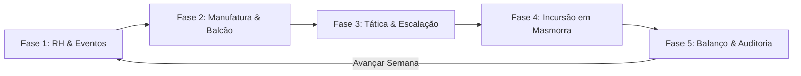
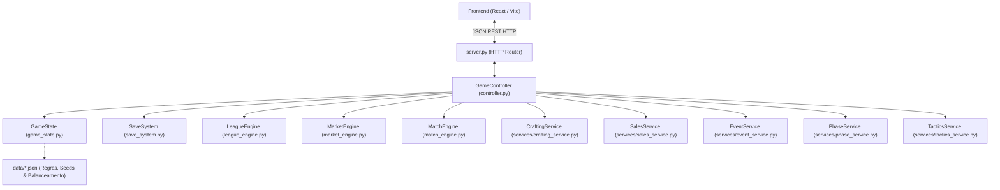

# 🏛️ HeroFoot — Documento Mestre de Contexto, Arquitetura & Lições Aprendidas

> **Destinatário Principal:** Modelos de Linguagem Avançados (ex: Google Gemini, Claude, etc.), Engenheiros de Software e Agentes Especializados do Projeto.  
> **Propósito do Documento:** Transferência completa de estado mental e arquitetural. Ao ingerir este arquivo, qualquer IA ou desenvolvedor deve compreender com precisão cirúrgica a alma do jogo, todas as mecânicas existentes, o padrão estrito de engenharia adotado, as lições aprendidas e o exato ponto de progresso no roadmap até o lançamento 1.0.  
> **Versão Vigente:** **v0.6.0 (Concluída e Mergeada na `main`)** — Rumo à **v0.7.0**.  
> **Data de Atualização:** 29 de Setembro de 2026.  
> **Status de Testes:** 198 testes unitários aprovados (100%) | Frontend Build: 0 erros de tipagem/lint.  

---

## 🧭 1. A Alma do Jogo: O Que É o HeroFoot?

### 1.1 Premissa Narrativa & Conflito Central
No passado distante, o heroísmo era romântico: profecias sagradas, espadas lendárias tiradas de pedras e guerreiros solitários salvando o reino em nome da honra. **Essa era acabou.**

O outrora "Herói Prometido" (Arthus Valente) derrotou o primeiro arauto das trevas, mas foi soterrado por processos trabalhistas movidos por famílias de plebeus afetados por danos colaterais, sinistros negados pela cúria clerical e impostos escorchantes sobre despojos de guerra não declarados. Hoje, Arthus trabalha como garçom no *Bistrô & Taberna do Javali Cansado*, cumprindo um rigoroso termo de recuperação judicial onde qualquer toque em uma espada quebrará seu acordo de parcelamento de dívidas.

A **Câmara dos Mercadores** e a **Nobreza Imperial da Coroa** perceberam que o combate ao Rei Demônio era instável demais para ficar nas mãos de fanáticos. O heroísmo foi **estatizado, privatizado e transformado em um esporte contábil de alta liquidez**:
- As guildas se tornaram **Pessoas Jurídicas (PJs)** registradas em cartório.
- A incursão a masmorras virou a **Liga das Guildas da Coroa**, estruturada em duas divisões profissionais: a **Divisão Nobre da Coroa** (elite) e a **Divisão de Acesso Mercante** (aspirantes).
- O jogador assume o cargo executivo de **Diretor Superintendente de Operações da Guilda**. Sua função não é empunhar espadas, mas gerenciar o RH dos heróis, forjar equipamentos nas oficinas, manter as contas no azul perante os Auditores Fiscais da Coroa e vencer a Liga semanal.

### 1.2 O Tom: Fantasia Corporativa 7/10
O jogo equilibra um mundo medieval sério e perigoso com a frieza hilária da burocracia contábil e trabalhista:
- **7/10:** O perigo é real (ferimentos, exaustão física, falência econômica e masmorras brutais). Não é uma paródia pastelão ou desenho infantil.
- **Sátira Corporativa:** A linguagem de interface e narrativa adota o jargão notarial e corporativo: *"Ordem de Serviço"*, *"Laudo Pericial"*, *"Auditoria Fiscal da Fase 5"*, *"Edital de Falência"*, *"Dano Colateral Homologado"*, *"Confiança da Contratante"*.

### 1.3 Termos Terminantemente Proibidos no Código e na Interface
Para preservar a ilusão de fantasia medieval com burocracia, **são proibidos termos esportivos modernos e anacronismos**:
| Termo Proibido | Equivalente Canônico no HeroFoot |
|---|---|
| `gol` | **Ponto de Expedição (PE)** ou **Abate Prioritário** |
| `estádio` / `campo` / `gramado` | **Câmara de Masmorra**, **Profundezas** ou **Bioma** |
| `escanteio` / `falta` / `pênalti` | **Incidente de Incursão**, **Emboscada** ou **Infração de Plantel** |
| `bilheteria` | **Cota de Transmissão da Câmara**, **Patrocínio Notarial** |
| `Brasfoot` | **Liga das Guildas** |
| Jargão tech moderno (`software`, `app`) | **Tomo Registrador**, **Edital**, **Arquivo Cartorário** |

### 1.4 Gênero & DNA Cruzado
O HeroFoot é a fusão simbiótica de 4 clássicos:
1. **Football Manager / Brasfoot:** Estrutura de rodadas semanais, divisão nobre/acesso, rebaixamento/acesso, moral de atletas, fadiga acumulada, transferências e salários.
2. **Recettear / Shop Titans:** Oficina de forja artesanal com ramos especializados, gestão de matérias-primas, precificação dinâmica de balcão (Promoção, Preço Justo, Abusivo), flutuações de demanda e ordens VIP.
3. **Darkest Dungeon:** Incursões por salas com dreno de Suprimentos (energia), penalidades severas de terreno e clima, necessidade de equipamentos de proteção individual (mitigações) e risco de exaustão.
4. **Papers, Please:** Auditorias fiscais semanais da Coroa, notificações burocráticas, carimbos notariais e editais judiciais.

---

## 🔄 2. O Ciclo Semanal: As 5 Fases do Jogo

O jogo avança semana a semana através de 5 fases sequenciais estritas coordenadas pelo `phase_service.py` e refletidas na interface gráfica:



### Fase 1: Gestão de Recursos Humanos & Bem-Estar Corporativo
- **Elenco:** Cada herói possui Classe, Nível, Salário semanal, Nível de Fadiga (0–100%) e Status (`Apto`, `Fatigado`, `Afastado`). Heróis com fadiga acima de 70% não podem ser escalados.
- **Instalações Médicas:** Níveis de enfermaria aceleram a recuperação de fadiga e tratam afastamentos por lesão.
- **Eventos Corporativos Semanais:** Disparo de dilemas administrativos com opções que afetam tesouraria, fadiga geral e reputação institucional (`CorporateEventModal`).

### Fase 2: Manufatura, Forja e Balcão Comercial (O Pilar Tycoon)
- **4 Oficinas de Produção:**
  - *Ferragem:* Armas pesadas e Armaduras metálicas de alto poder de impacto e mitigação física.
  - *Alquimia:* Consumíveis de suprimento, poções de restauração e itens de proteção química/tóxica.
  - *Joalheria:* Anéis e Amuletos arcanos de redução de dreno de energia e bônus de agilidade.
  - *Culinária:* Ração de viagem balanceada e mantimentos para extensão de suprimentos.
- **Progressão por XP de Bancada (v0.5.0):** Cada item forjado gera XP proporcional ao tier da receita. Subir de nível consome XP acumulada + ouro da Câmara, desbloqueando bônus de staff, novos tiers e qualidade *Lendário*.
- **Forja Experimental (*Tinkering* - v0.5.0):** Forjar receitas além do nível atual da filial sob risco estocástico. Em caso de falha mecânica, gera refugo comercializável (*Gororoba Experimental*), mas **homologa permanentemente a receita no catálogo da guilda**.
- **Balcão de Vendas de Ativos:**
  - O jogador anuncia artefatos do inventário selecionando a margem: *Promoção* (vende sempre rápido), *Preço Justo* (vende com alta chance) ou *Preço Abusivo* (risco de recusa ou contraproposta negociada).
  - *Boletim de Mercado Semanal:* Manchetes corporativas elevam a demanda de slots específicos (multiplicador x1.5 a x3.0).
  - *Encomendas VIP da Nobreza (v0.6.0):* Ordens régias de curto prazo (2 semanas) que pagam multiplicadores de 2.0x a 3.5x em ouro e concedem bônus de Confiança da Contratante ao entregar artefatos nos requisitos de slot e qualidade.
- **Mercado de Transferências:** Olheiros, rescisões e contratação de novos aventureiros para a guilda.

### Fase 3: Planejamento Tático, Loadout & Logística
- **Escalação de Titulares:** Exatamente 6 combatentes titulares. Vagas abertas geram penalidade proporcional severa no poder da força-tarefa.
- **Distribuição de Loadout:** Equipamento nos slots de combate (`Arma`, `Armadura`, `Joia`, `Inscrição`, `Consumível`).
- **Análise Prévia da Masmorra:** Verificação do Bioma Base (ex: Pântano Tóxico, Frio Glacial) e da Condição Climática (ex: Tempestade Elétrica, Névoa Ácida) para equipar mitigações que anulem penalidades de combate e custos extras de suprimentos.

### Fase 4: A Incursão Expedicionária (Simulação de Partida)
- **Simulação Simultânea:** A guilda do jogador e a guilda adversária entram na masmorra da rodada com sua reserva de Suprimentos (100 base + bônus de Consumíveis).
- **Consumo por Câmara (Salas 1 a 10):** A energia é drenada proporcionalmente à agilidade média do plantel, severidade do terreno e clima. Se os suprimentos zerarem, a guilda abandona a incursão e encerra a pontuação.
- **Resolução de Confrontos:**
  - *Mini-Bosses Intermediários:* Disputa resolvida pela razão de Poder Efetivo. Vitória rende +1 PE.
  - *Boss da Masmorra (Câmara 10):* Só é enfrentado por quem chega com energia. Se a diferença de poder for superior a 15%, o mais forte leva o **Abate Exclusivo (+2 PE)**; se a diferença for $\le 15\%$, ocorre o **Abate Conjunto (+1 PE para cada)**.
- **Perfis Permanentes de Rivais (v0.6.0):** Guildas adversárias possuem traços únicos que alteram seus poderes, desgaste e resistências naturais.

### Fase 5: Balanço Financeiro, Tabela da Liga & Auditoria Fiscal
- **Tabela de Classificação:** Divisão Nobre e Divisão de Acesso com pontos, vitórias, empates, derrotas, PE pró, PE contra e saldo de PE.
- **DRE Semanal (Demonstração do Resultado do Exercício):** Quadro transparente de receitas (vendas de balcão, cotas de expedição, prêmios) e despesas (folha salarial, compras de matérias-primas, taxas de inscrição).
- **Auditoria Fiscal da Coroa:** Avaliação periódica da saúde contábil. Auditorias aprovadas aumentam a Confiança da Contratante; inadimplência gera sanções e risco de intervenção régia.

---

## 🏗️ 3. Arquitetura de Software & Padrões Técnicos

### 3.1 Stack Tecnológica
- **Backend:** Python 3.10+ puro (sem frameworks pesados). Servidor HTTP construído sobre `http.server.BaseHTTPRequestHandler` com roteamento manual de endpoints REST JSON em `server.py`.
- **Frontend:** React 18, TypeScript, Tailwind CSS, Vite, Lucide React (ícones), Lucide SVG heráldico.
- **Comunicação:** REST local via `http://localhost:8000/api`.

### 3.2 Diagrama Arquitetural de Componentes



### 3.3 Regras Inegociáveis do Código (Contrato do Codebase)
1. **Zero Valores Hardcoded em `.py` ou `.tsx`:**
   - Preços, porcentagens, probabilidades, custos de upgrade, limites de suprimentos, textos narrativos e modificadores de traços residem exclusivamente nos arquivos de semente `data/*.json`. O código apenas lê e executa a lógica.
2. **Aleatoriedade Estritamente Determinística:**
   - Toda lógica estocástica deve receber uma instância de `random.Random` injetável, semeada com base em `hash((world_seed, week, context))`. É proibido usar `random.random()` global sem controle de semente nas regras do jogo.
3. **Persistência Atômica & Registro de Estado:**
   - Todo atributo de instância criado em `GameState.__init__` deve estar obrigatoriamente registrado em `SERIALIZED_FIELDS` ou `TRANSIENT_FIELDS`. O teste `test_save.py` falhará imediatamente se houver variáveis órfãs.
   - Saves são gravados de forma atômica via arquivo temporário `.tmp` e `os.replace`.
4. **Ambiente Operacional (Windows PowerShell):**
   - Nunca use `&&` para encadear comandos no shell do usuário. O separador correto do PowerShell é `;`.
5. **Critério de Aceite Técnico:**
   - `python -m unittest discover tests` deve rodar com 100% de aprovação (atualmente 198 testes).
   - `npm run build` dentro de `frontend/` deve compilar com 0 erros de tipagem e 0 avisos bloqueantes.

---

## 📂 4. Mapeamento das Pastas e Arquivos Chave

```
herofoot/
├── controller.py                 # Orquestrador in-place do estado, serviços e motores
├── server.py                     # Servidor HTTP REST (endpoints /api/*)
├── game_state.py                 # Modelo canônico GameState, SERIALIZED_FIELDS e to_dict/from_dict
├── league_engine.py              # Motor de ligas, divisões nobre/acesso, traços e liquidação
├── match_engine.py               # Motor de simulação de incursão por suprimentos e salas
├── market_engine.py              # Motor do mercado atacadista, boletim e encomendas VIP
├── save_system.py                # Sistema de gravação atômica em data/saves/
├── balance.py                    # Carregador cacheado de balance_seed.json
│
├── services/                     # Camada de serviços de domínio
│   ├── crafting_service.py       # Forja modular, XP de bancada e Tinkering
│   ├── sales_service.py          # Precificação de balcão, contrapropostas e encomendas VIP
│   ├── event_service.py          # Sorteio e resolução de eventos corporativos
│   ├── phase_service.py          # Transição e validação do fluxo das 5 fases
│   ├── tactics_service.py        # Escalação de plantel e loadout
│   ├── hero_service.py           # Gestão de heróis e contratos
│   └── medical_service.py        # Enfermarias e tratamentos de fadiga
│
├── data/                         # Sementes e parâmetros de balanceamento (JSON)
│   ├── balance_seed.json         # Constantes de economia, fadiga, combate e expedição
│   ├── workshops_seed.json       # Tabela de XP, benefícios de staff e probabilidades de forja
│   ├── recipes_seed.json         # Catálogo de receitas de forja por ramo e tier
│   ├── rival_traits_seed.json    # Matriz com 16 traços permanentes de rivais
│   ├── vip_orders_seed.json      # Catálogo com 10 encomendas VIP da nobreza
│   ├── events_seed.json          # Banco de eventos corporativos interativos
│   ├── dungeons_seed.json        # Masmorras e biomas
│   ├── climates_seed.json        # Condições climáticas semanais
│   ├── guilds_seed.json          # Guildas fundadoras da Liga
│   └── classes_seed.json         # Classes, especializações e habilidades de heróis
│
├── frontend/src/                 # Aplicação SPA React + TypeScript
│   ├── App.tsx                   # Roteador mestre, layout atmosférico e handlers globais
│   ├── api.ts                    # Cliente HTTP tipado para o backend
│   ├── mockData.ts               # Interfaces TypeScript canônicas e dados de fallback
│   ├── components/               # Componentes visuais reutilizáveis
│   │   ├── Header.tsx            # Cabeçalho com finanças, brasão e stepper de fases
│   │   ├── CorporateEventModal.tsx # Modal notarial de eventos corporativos
│   │   ├── RivalTraitBadge.tsx   # Insígnia de traço de guilda rival
│   │   ├── Tooltip.tsx           # Tooltips contextuais de termos corporativos
│   │   ├── OnboardingBanner.tsx  # Banners educativos de primeira visita
│   │   └── art/                  # Brasões em SVG (CrownSeal, GuildCrest, etc.)
│   └── pages/                    # Telas correspondentes às fases
│       ├── Dashboard.tsx         # Visão geral executiva da guilda
│       ├── Phase1HR.tsx          # Gestão de RH, instalações e eventos
│       ├── Phase2Workshop.tsx    # Oficinas de forja, balcão de vendas e transferências
│       ├── Phase3Tactics.tsx     # Escalação de plantel e tática
│       ├── Phase4Dungeon.tsx     # Incursão visual em masmorra e confronto
│       └── Phase5Results.tsx     # Tabela de liga, DRE contábil e auditoria
│
├── tests/                        # 198 testes unitários automatizados
│   ├── test_crafting.py          # Validação de forja, XP e Tinkering
│   ├── test_rival_traits.py      # Determinismo de traços e liquidação judicial
│   ├── test_vip_orders.py        # Validação de encomendas VIP da nobreza
│   ├── test_events.py            # Sorteio e efeitos de eventos corporativos
│   ├── test_match_engine.py      # Simulação de combate e conformidade estocástica
│   ├── test_sales.py             # Balcão comercial, boletim e precificação
│   └── test_save.py              # Serialização completa e cobertura de campos
│
├── scripts/                      # Scripts de auditoria Monte Carlo
│   ├── balance_audit_v050.py     # Auditoria de economia e forja da v0.5.0
│   └── balance_audit_v060.py     # Auditoria de confrontos de traços e ordens VIP da v0.6.0
│
└── docs/                         # Documentação canônica do projeto
    ├── CONTRACT.md               # Contrato das regras canônicas originais
    ├── LORE_BIBLE.md             # Bíblia narrativa do mundo e humor corporativo
    ├── MARKETING_MAPPING.md      # Pitch de vendas, personas e análise de mercado
    ├── ROADMAP_TODO.md           # Roadmap estruturado até o lançamento 1.0
    ├── DESIGN_SPEC_V050.md       # Especificação técnica da v0.5.0
    ├── DESIGN_SPEC_V060.md       # Especificação técnica da v0.6.0
    ├── BALANCE_REPORT_V050.md    # Laudo de calibração econômica da v0.5.0
    ├── BALANCE_REPORT_V060.md    # Laudo de confrontos de traços e VIP da v0.6.0
    ├── SOUND_IDENTITY.md         # Documento mestre de sonoplastia e áudio
    └── UX_AUDIT_V050.md          # Mapeamento de usabilidade e fluxos de tela
```

---

## 📈 5. Linha do Tempo de Implementações (O Que Já Foi Feito)

| Versão | Nome / Marco | Principais Entregas Realizadas |
|---|---|---|
| **v0.1 — v0.4** | Fundações da Engine | • Core Loop em 5 Fases.<br>• Motor de combate por suprimentos (`MatchEngine`).<br>• Sistema atômico de save/load.<br>• Forja modular v2 com afixos (prefixo + base + sufixo).<br>• DRE contábil e metas financeiras da Coroa.<br>• Dungeons modulares desacoplando Bioma Base e Condição Climática Semanal. |
| **v0.5.0** | Vida no Escritório & Forja v3 | • **XP de Bancada:** Cada filial acumula XP por forja, com subida de nível exponencial e bônus intercalados.<br>• **Forja Experimental (*Tinkering*):** Manufatura de alto risco que homologa receitas de tiers superiores mesmo em falha técnica com refugo *Gororoba*.<br>• **Eventos Corporativos Interativos:** `CorporateEventModal` com dilemas executivos.<br>• **Design & UX:** Banners de onboarding, tooltips contextuais, stepper de progresso de fase no Header e identidade sonora documentada. |
| **v0.6.0** | Rivais Vivos & Contratos VIP | • **Perfis Permanentes de Rivais:** Matriz com 16 traços únicos atribuídos deterministicamente via seed mundial aos times NPC.<br>• **Liquidação Judicial por Falência:** As 2 últimas colocadas da Divisão de Acesso são dissolvidas por insolvência e a Câmara funda 2 novas guildas.<br>• **Encomendas VIP da Nobreza:** Ordens de alto valor e prestígio no Boletim de Mercado com prazo de 2 semanas e despacho direto no balcão.<br>• **Auditoria Monte Carlo v0.6.0:** 8.500 partidas de confrontos simuladas garantindo calibragem sem arquétipos desequilibrados. |

---

## 🎯 6. Em Que Ponto Estamos Exatamente Agora?

### 6.1 Status Imediato
- A **v0.6.0 está 100% concluída**, com todas as frentes (Backend, Frontend, Testes e Laudos) mergeadas na branch `main`.
- O código está em estado **verde absoluto**:
  - `python -m unittest discover tests` → 198 testes aprovados em ~3.5 segundos.
  - `npm run build` → 1915 módulos compilados com 0 erros de tipagem.
- O [`CHANGELOG.md`](file:///c:/Users/Rafael/Documents/herofoot/CHANGELOG.md) e o [`ROADMAP_TODO.md`](file:///c:/Users/Rafael/Documents/herofoot/docs/ROADMAP_TODO.md) foram atualizados marcando a v0.6.0 como concluída.

### 6.2 O Próximo Marco no Roadmap: **v0.7.0 — Memorial, Glória & O Rei Demônio**

O objetivo da versão 0.7.0 é introduzir o clímax competitivo da temporada e a longevidade emocional do elenco:
1. **Mural da Glória & Memorial de Baixas:**
   - Registro de grandes feitos dos combatentes (bosses abatidos, títulos conquistados).
   - Memorial solene para heróis mortos em serviço ou aposentados com honras corporativas.
2. **Aposentados como Instrutores da Base:**
   - Heróis que encerram sua carreira de incursão podem ser contratados para a *Academia de Aprendizes*, transmitindo bônus passivos e elevando o potencial dos novatos.
3. **A Incursão à Cidadela do Rei Demônio (O "Mundial de Clubes"):**
   - Apenas o campeão da Divisão Nobre da Coroa recebe a *Autorização Régia de Incursão Imperial* para desafiar a Fortaleza do Rei Demônio no fechamento da temporada.
   - Uma mega-masmorra com regras épicas: se a guilda vence, novos contratos e patrocínios milionários são firmados; se perde, novas cotas de salvação pública são emitidas.

---

## 🧠 7. Lições Aprendidas de Engenharia & Gestão de Agentes

Ao longo do desenvolvimento deste projeto com agentes de inteligência artificial, foram consolidadas regras de ouro que devem guiar qualquer intervenção futura:

### Lição 1: O Contrato de Zero Hardcoding Protege a Escalabilidade
Sempre que um desenvolvedor ou agente tenta colocar números mágicos em `.py` (ex: `if quality == "Lendário": mult = 2.5`), o sistema quebra em cascata quando o balanceador ajusta o jogo. **A regra de ouro é inegociável:** Qualquer número de regra, custo, probabilidade ou texto DEVE ser lido de `data/*.json`.

### Lição 2: Determinismo Estrito Elimina Bugs Fantasmas
O jogo roda milhares de simulações em frações de segundo. Se uma função chamar `random.random()` da biblioteca global do Python, a mesma temporada produzirá resultados divergentes em máquinas diferentes e os saves ficarão corrompidos. O uso de `random.Random(seed)` atrelado a `hash((world_seed, week, entity_id))` garante que um save recarregado reproduza os mesmos eventos.

### Lição 3: Sincronização Prévia de Tipos TypeScript
Ao introduzir um novo campo no backend (ex: `active_vip_order` ou `rival_traits`), a primeira ação no frontend DEVE ser registrar a interface em `mockData.ts` e `api.ts`. Tentar programar componentes JSX antes de tipar o modelo resulta em cascatas de erros de compilação no Vite/TypeScript.

### Lição 4: Isolamento de Branches e Autonomia de Agentes
O fluxo mais eficiente é o de desenvolvimento paralelo em branches `feature/*`. Cada agente atua em sua especialidade (ex: `match_agent` em mecânicas de combate, `ui_agent` em páginas React, `balance_agent` em scripts Monte Carlo). O Tech Lead deve consolidar via merge limpo, resolver conflitos semânticos e validar a suíte completa de testes.

### Lição 5: Validação Monte Carlo Obrigatória para Novos Recursos
Nenhuma mecânica com aleatoriedade ou impacto orçamentário é promovida para a branch principal sem passar por simulação estocástica (scripts em `scripts/balance_audit_*.py`). Foi essa prática que garantiu que nenhum dos 16 traços permanentes de rivais ficasse com taxa de vitória acima de 60% e que as encomendas VIP funcionassem sem causar hiperinflação.

### Lição 6: Proteção do Save com Cobertura Estrita
O teste unitário `test_save.py` possui uma asserção reflexiva (`vars(GameState())` contra `SERIALIZED_FIELDS` + `TRANSIENT_FIELDS`). Qualquer variável adicionada ao estado que não for explicitamente classificada quebra os testes imediatamente, impedindo vazamento de memória ou corrupção de savegames.

---

*Documento homologado pelo Cartório da Câmara dos Mercadores do HeroFoot.*
