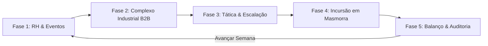
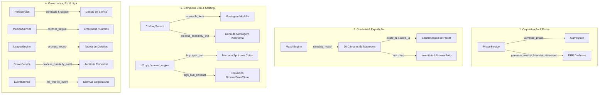

# 🏛️ HeroFoot — Documento Mestre de Contexto, Arquitetura & Lições Aprendidas

> **Destinatário Principal:** Modelos de Linguagem Avançados (Google Gemini, Claude, etc.), Engenheiros de Software, Arquitetos de Sistemas e Agentes Especializados do Projeto.  
> **Propósito do Documento:** Transferência completa e incondicional de estado mental, arquitetura, regras de negócio e processos em atividade. Ao ingerir este arquivo, qualquer IA ou desenvolvedor deve compreender com precisão cirúrgica a alma do jogo, todas as mecânicas existentes, os processos ativos em execução no loop, o padrão estrito de engenharia adotado, as lições aprendidas e o exato ponto de progresso no roadmap até o lançamento 1.0.  
> **Versão Vigente:** **v0.7.1 (Complexo B2B, DRE Dinâmico & Sincronização de Simulação)** — Rumo ao Beta Teste e Memorial do Rei Demônio.  
> **Data de Atualização:** 01 de Outubro de 2026.  
> **Status de Testes:** **223 testes unitários aprovados (100% OK)** em ~4.3s | **Frontend Build:** 0 erros de tipagem/lint (Vite + TypeScript).  

---

## 🧭 1. A Alma do Jogo: O Que É o HeroFoot?

### 1.1 Premissa Narrativa & Conflito Central
No passado distante, o heroísmo era romântico: profecias sagradas, espadas lendárias tiradas de pedras e guerreiros solitários salvando o reino em nome da honra. **Essa era acabou.**

O outrora "Herói Prometido" (*Arthus Valente*) derrotou o primeiro arauto das trevas, mas foi soterrado por processos trabalhistas movidos por famílias de plebeus afetados por danos colaterais, sinistros negados pela cúria clerical e impostos escorchantes sobre despojos de guerra não declarados. Hoje, Arthus bate ponto das 07h às 16h com carteira assinada como garçom no *Bistrô & Taberna do Javali Cansado*, cumprindo um rigoroso plano de recuperação judicial em que qualquer toque em uma espada quebrará seu acordo de parcelamento de dívidas.

A **Câmara dos Mercadores** e a **Nobreza Imperial da Coroa** perceberam que o combate ao Rei Demônio era instável demais para ficar nas mãos de fanáticos. O heroísmo foi **estatizado, privatizado e transformado em um esporte contábil de alta liquidez**:
- As guildas se tornaram **Pessoas Jurídicas (PJs)** registradas em cartório.
- A incursão a masmorras virou a **Liga das Guildas da Coroa**, estruturada em duas divisões profissionais: a **Divisão Nobre da Coroa** (elite) e a **Divisão de Acesso Mercante** (aspirantes).
- O jogador assume o cargo executivo de **Diretor Superintendente de Operações da Guilda**. Sua função não é empunhar espadas, mas gerenciar o RH dos heróis, coordenar a cadeia de suprimentos B2B, forjar e montar artefatos modulares nas oficinas, manter as contas no azul perante os Auditores Fiscais da Coroa e vencer a Liga semanal.

### 1.2 O Tom: Fantasia Corporativa 7/10
O jogo equilibra um mundo medieval sério e perigoso com a frieza hilária da burocracia contábil e trabalhista:
- **7/10:** O perigo é real (ferimentos, exaustão física, falência econômica e masmorras brutais). Não é uma paródia pastelão ou desenho infantil.
- **Sátira Corporativa:** A linguagem de interface e narrativa adota o jargão notarial e corporativo: *"Ordem de Serviço"*, *"Laudo Pericial"*, *"Auditoria Fiscal da Fase 5"*, *"Edital de Falência"*, *"Dano Colateral Homologado"*, *"Confiança da Contratante"*, *"Ágio Alfandegário"*.

### 1.3 Termos Terminantemente Proibidos no Código e na Interface
Para preservar a ilusão de fantasia medieval com burocracia, **são proibidos termos esportivos modernos e anacronismos**:
| Termo Proibido | Equivalente Canônico no HeroFoot |
|---|---|
| `gol` | **Ponto de Expedição (PE)** ou **Abate Prioritário** |
| `estádio` / `campo` / `gramado` | **Câmara de Masmorra**, **Profundezas** ou **Bioma** |
| `escanteio` / `falta` / `pênalti` | **Incidente de Incursão**, **Emboscada** ou **Infração de Plantel** |
| `bilheteria` | **Cota de Transmissão da Câmara**, **Patrocínio Notarial** |
| `Brasfoot` | **Liga das Guildas** |
| Jargão tech moderno (`software`, `app`) | **Tomo Registrador**, **Edital**, **Arquivo Cartorário** |

### 1.4 Gênero & DNA Cruzado
O HeroFoot é a fusão simbiótica de 4 clássicos:
1. **Football Manager / Brasfoot:** Estrutura de rodadas semanais, divisão nobre/acesso, rebaixamento/acesso, moral de atletas, fadiga acumulada, transferências e salários.
2. **Factorio / Recettear:** Cadeia de suprimentos corporativa B2B, contratos de fornecimento contínuo, linha de montagem com operários automáticos, mercado spot e precificação de balcão.
3. **Darkest Dungeon:** Incursões por salas com dreno de Suprimentos (energia), penalidades severas de terreno e clima, necessidade de equipamentos de proteção individual (mitigações) e risco de exaustão.
4. **Papers, Please:** Auditorias fiscais semanais da Coroa, notificações burocráticas, carimbos notariais, DRE rigoroso e editais judiciais.

---

## 🔄 2. O Ciclo Semanal: As 5 Fases do Jogo

O jogo avança semana a semana através de 5 fases sequenciais estritas coordenadas pelo `phase_service.py` e refletidas na interface gráfica:



### Fase 1: Gestão de Recursos Humanos & Bem-Estar Corporativo
- **Elenco:** Cada herói possui Classe, Nível, Salário semanal, Nível de Fadiga (0–100%) e Status (`Apto`, `Fatigado`, `Afastado`). Heróis com fadiga acima de 70% não podem ser escalados.
- **Instalações Médicas:** Níveis de enfermaria aceleram a recuperação de fadiga e tratam afastamentos por lesão.
- **Eventos Corporativos Semanais:** Disparo de dilemas administrativos com opções que afetam tesouraria, fadiga geral e reputação institucional (`CorporateEventModal`).
- **Academia de Base & Mercado de Transferências:** Captação de jovens aprendizes (com custo semanal de 40 ouro) e leilões de veteranos.

### Fase 2: Complexo Industrial B2B, Linha de Montagem & Mercado Spot
- **Cadeia de Fornecimento Corporativa (B2B):** Parcerias comerciais com 11 Corporações especializadas nos 5 papéis funcionais.
- **Convênios e Níveis de Marca (Brand Level):**
  - **Bronze (Nv. 1):** Livre contratação; concede remessas de peças Tier 1 e desconto de 10% no spot.
  - **Prata (Nv. 3 / 100 Brand XP):** Requer Bronze prévio e confiança >= 55; desbloqueia remessas Tier 2 e acesso spot a T2.
  - **Ouro (Nv. 7 / 300 Brand XP):** Requer Prata prévio e confiança >= 75; desbloqueia remessas Tier 3 e componentes lendários.
- **Montagem Modular (3 Componentes):**
  - Integração de 1 Modificador de Entrada (Prefixo) + 1 Chassi Principal (Base) + 1 Núcleo de Ajuste (Sufixo).
  - Regra de Concisão: Cada parte limitada a no máximo 1-2 palavras, gerando nomes elegantes (ex: *"Pesado Canhão de Aço"*).
  - *Tinkering Inter-Marcas:* Mistura de marcas rivais confere risco de falha (Gororoba/Refugo) vs. chance de *Overclock Não-Autorizado* (+15% Poder).
- **Linha de Montagem Automatizada:** Operários fabris contratados montam produtos *White-label* autonomamente a cada ciclo, gerando receita limpa no DRE.
- **Mercado Spot:** Compra de peças avulsas sujeita a cota anti-exploit (máximo 5 un./peça/semana) e ágio alfandegário de +50% para quem não possui convênio da marca.

### Fase 3: Planejamento Tático, Loadout & Logística
- **Escalação de Titulares:** Exatamente 6 combatentes titulares. Vagas abertas geram penalidade proporcional severa no poder da força-tarefa.
- **5 Compartimentos Canônicos de Equipamento (Loadout):**
  1. `Arsenal Ofensivo` (Armas, canhões, lâminas).
  2. `Blindagem Operacional` (Armaduras, couraças, mantos reforçados).
  3. `Dispositivo Tático` (Joias, anéis de foco, engrenagens cinéticas).
  4. `Alvará de Risco` (Inscrições cartorárias, licenças de exploração de bioma).
  5. `Provisão Logística` (Rações de campanha, elixires, kits de suprimentos).
- **Mitigação Tática:** Equipamentos neutralizam penalidades de terrenos hostis (pântano, cripta glacial, magma) e sobrecargas climáticas antes do envio da tropa.

### Fase 4: A Incursão Expedicionária (Simulação de Partida)
- **Simulação Simultânea:** A guilda do jogador e a guilda adversária entram na masmorra da rodada com sua reserva de Suprimentos (100 base + bônus de Consumíveis/Provisão).
- **Consumo por Câmara (Salas 1 a 10):** A energia é drenada proporcionalmente à agilidade média do plantel, severidade do terreno e clima. Se os suprimentos zerarem, a guilda abandona a incursão e encerra a pontuação.
- **Resolução de Confrontos:**
  - *Mini-Bosses Intermediários:* Disputa resolvida pela razão de Poder Efetivo. Vitória rende +1 PE.
  - *Boss da Masmorra (Câmara 10):* Só é enfrentado por quem chega com energia. Se a diferença de poder for superior a 15%, o mais forte leva o **Abate Exclusivo (+2 PE)**; se a diferença for $\le 15\%$, ocorre o **Abate Conjunto (+1 PE para cada)**.
- **Sincronização 100% Determinística:** Os pontos (`points_t1`, `points_t2`) e os placares acumulados (`score_t1`, `score_t2`) de cada câmara são emitidos diretamente pelo motor de cálculo (`match_engine.py`) e lidos pelo frontend, eliminando divergências entre a simulação visual e o resultado final da rodada.

### Fase 5: Balanço Financeiro, Tabela da Liga & Auditoria Fiscal
- **Tabela de Classificação:** Divisão Nobre e Divisão de Acesso com pontos, vitórias, empates, derrotas, PE pró, PE contra e saldo de PE.
- **DRE Semanal Dinâmico (Demonstração do Resultado do Exercício):**
  - **Receitas:** Cotas de Incursão, Vendas de Balcão, Receita da Linha de Montagem B2B, Subsídios da Coroa e Premiações de Temporada.
  - **Despesas Operacionais Fixas:** Salários do Elenco, Manutenções (Predial, Médica, Academia), Royalties B2B, Salários de Operários e Multas da Coroa.
  - **Despesas Variáveis Auditadas:** Compras no Mercado Spot, Taxas de Homologação de Contratos e Custos de Admissão de Operários.
  - **Resultado Líquido (`net`):** Liquidação transparente com reconciliação contábil em tempo real no caixa da guilda.
- **Condições de Vitória, Derrota e Encerramento:**
  - *Falência / Liquidação Judicial:* 2 ciclos consecutivos com caixa negativo perante o Tribunal da Coroa encerram a partida (*Game Over*).
  - *Acesso e Rebaixamento:* Ao fim de 28 rodadas, as 2 melhores da Divisão de Acesso sobem e as 2 piores da Nobre caem. As 2 últimas de Acesso são dissolvidas por insolvência.
  - *Cidadela do Rei Demônio:* O Campeão da Divisão Nobre recebe a Autorização Régia para disputar o confronto supremo de fim de temporada.

---

## ⚙️ 3. Processos Ativos em Execução no Jogo

Esta seção descreve a totalidade dos **processos computacionais ativos** que rodam no ecossistema do HeroFoot:



### Processo 1: Máquina de Estados e Loop de Fases (`PhaseService`)
- Coordena o avanço ordenado de Fase 1 a Fase 5.
- Ao entrar na Fase 4, executa a simulação de masmorra, resolve dreno de suprimentos e calcula as cotas de transmissão.
- Ao finalizar a Fase 4, invoca imediatamente `generate_weekly_financial_statement()`, garantindo que o DRE chegue à Fase 5 100% fresco e preenchido.
- Na transição de Fase 5 para Fase 1, liquida o resultado líquido (`net`), abate a fadiga passiva do elenco, incrementa a semana da temporada e sorteia o evento corporativo da rodada seguinte.

### Processo 2: Motor de Simulação de Confrontos (`MatchEngine`)
- Desacopla o **Bioma Base** (ex: *Pântano Pútrido*) da **Condição Climática Semanal** (ex: *Tempestade Elétrica*).
- Simula 10 câmaras sequenciais com disputa matemática:
  - Consumo de suprimentos: $C = \text{base\_drain} \times \text{mult\_terreno} \times \text{mult\_clima} \times \text{mitigação\_loadout}$.
  - Minibosses: disputa probabilística baseada na proporção de poder ($P_1 / (P_1 + P_2)$) concedendo +1 PE.
  - Boss final (Sala 10): disputa por abate exclusivo (+2 PE se margem > 15%) ou conjunto (+1 PE para cada se margem $\le 15\%$).
- Grava os deltas (`points_t1`, `points_t2`) e os totais acumulados (`score_t1`, `score_t2`) em cada `room_report`.

### Processo 3: Motor de Cadeia de Suprimentos B2B & Montagem Modular (`b2b.py`, `crafting_service.py`)
- **Catálogo de 11 Corporações:**
  - *Alvarás de Risco:* `corp_mercurius` (Cartório Arcano Mercurius) e `corp_crown_notarial` (Cartório da Coroa).
  - *Provisões Logísticas:* `corp_crown_rations` (Intendência da Coroa) e `corp_flamel` (Consórcio Alquímico Flamel).
  - *Arsenal Ofensivo:* `corp_valkyria` e `corp_goblin_eng`.
  - *Blindagem Operacional:* `corp_aethelgard` e `corp_dwarf_steel`.
  - *Dispositivo Tático:* `corp_chancellor` e `corp_elf_precision`.
- **Montagem Modular:** Valida que o conjunto possui exatamente 1 Prefixo, 1 Base e 1 Sufixo. Limita nomes a no máximo 2 palavras por componente.
- **Tinkering Inter-Marcas:** Se houver marcas concorrentes, rola chance de 60% para aplicar *Overclock Não-Autorizado* (+15% poder) vs. 40% de gerar refugo (*Ativo Não-Conforme*). Em ambos os casos, a receita é homologada.
- **Linha de Montagem Autônoma:** Processa ordens de produção dos operários assalariados, consumindo insumos do almoxarifado e gerando vendas seriais *White-label* consolidadas no DRE.

### Processo 4: Demonstração do Resultado do Exercício & Reconciliação Contábil (`DRE`)
- Apura semanalmente:
  - `expedition_revenue`: Cotas de transmissão das masmorras.
  - `sales_revenue`: Vendas avulsas no balcão da Fase 2.
  - `assembly_sales_revenue`: Vendas de prateleira da linha de montagem.
  - `salaries` & `total_maintenance`: Folha de pagamento e manutenções prediais.
  - `b2b_royalties_cost` & `assembly_workers_salaries`: Custos fixos industriais.
  - `market_expenses`, `contract_signing_expenses`, `hiring_expenses`: Gastos com investimentos spot e celebrações.
- Previne dupla contagem no caixa através do acumulador `weekly_sales_cash_collected`.

### Processo 5: Recursos Humanos, Fadiga & Medicina Ocupacional (`HeroService`, `MedicalService`)
- Rastreamento individual de fadiga (0–100%) para cada aventureiro.
- Desgaste físico na expedição mitigado por instalações médicas (Enfermaria Básica até Casa de Banhos Termais).
- Contratos plurianuais (1 a 3 anos); na virada de temporada, aventureiros com contratos expirando exigem luvas de assinatura e reajuste salarial de 25% a 45%.

### Processo 6: Academia de Aprendizes & Mercado de Transferências (`AcademyService`)
- Manutenção fixa de 40 ouro/semana para formação de jovens talentos.
- Relatório anual de desenvolvimento físico e técnico de aprendizes.
- Leilão e captação de novos heróis com pagamento de taxas sindicais da Câmara.

### Processo 7: Governança Régia & Auditorias da Coroa (`CrownService`)
- A cada 7 semanas (trimestre fiscal), a Junta da Coroa audita a guilda em 3 metas:
  1. *Solvência Econômica:* Saldo em ouro na tesouraria.
  2. *Performance Competitiva:* Pontos somados na Liga das Guildas.
  3. *Segurança no Trabalho:* Percentual de heróis sem afastamento médico.
- Auditorias aprovadas concedem subsídios fiscais régios; reprovações aplicam multas compulsórias debitadas no DRE.

### Processo 8: Liga das Guildas, Traços de Rivais & Liquidação Judicial (`LeagueEngine`)
- 2 divisões (Nobre e Acesso) com 8 times cada e 28 rodadas de turno e returno.
- 16 traços permanentes sorteados deterministicamente por semente mundial para cada guilda rival.
- No final da temporada:
  - 2 melhores de Acesso sobem para a Nobre; 2 piores da Nobre caem para o Acesso.
  - As 2 últimas colocadas da Divisão de Acesso entram em **Liquidação Judicial Compulsória** por insolvência e são dissolvidas, sendo refundadas pela Câmara com novas identidades e novos traços.

### Processo 9: Motor de Incidentes & Eventos Corporativos (`EventService`)
- Sorteio determinístico semanal (`roll_weekly_event`) de dilemas administrativos da Coroa, Cúria ou Guildas concorrentes.
- Resolução com escolhas de múltiplos caminhos afetando ouro, fadiga, moral ou a reputação institucional (`contractor_confidence`).

### Processo 10: Persistência Atômica & Integridade de Saves (`SaveSystem`)
- Serialização rigorosa do `GameState` utilizando `SERIALIZED_FIELDS`.
- Gravação atômica via escrita em arquivo temporário `.tmp` e substituição atômica (`os.replace`).
- Compactação inteligente sem armazenamento de logs prolixos, mantendo saves abaixo de 200 KB após 30 temporadas de simulação.

---

## 🏗️ 4. Arquitetura de Software & Padrões Técnicos

### 4.1 Stack Tecnológica
- **Backend:** Python 3.10+ puro (sem dependências de frameworks pesados como Django ou FastAPI). Servidor construído sobre `http.server.BaseHTTPRequestHandler` com roteamento REST JSON em `server.py`.
- **Frontend:** React 18/19, TypeScript, Tailwind CSS, Vite, Lucide React (ícones corporativos e medievais).
- **Comunicação:** REST local via `http://localhost:8000/api`.

### 4.2 Regras Inegociáveis do Código
1. **Zero Valores Hardcoded em `.py` ou `.tsx`:**
   - Preços, probabilidades, custos, multiplicadores de afixos e limites residem exclusivamente em `data/*.json`. O código Python e os componentes React apenas interpretam os parâmetros das sementes.
2. **Aleatoriedade Determinística:**
   - Funções estocásticas recebem instâncias injetáveis de `random.Random` semeadas por `hash((world_seed, week, entity_id))`. Proibido o uso de `random.random()` global descontrolado.
3. **Persistência Atômica com Proteção Reflexiva:**
   - Todo atributo em `GameState` deve estar listado em `SERIALIZED_FIELDS` ou `TRANSIENT_FIELDS`. O teste `test_save.py` possui inspeção reflexiva que falha se novos campos ficarem desprotegidos.
4. **Ambiente Operacional (Windows PowerShell):**
   - Nunca use `&&` para encadear comandos no shell do usuário. O separador correto do PowerShell é `;`.
5. **Critério de Aceite Técnico:**
   - `python -m unittest discover tests` deve rodar com 100% de aprovação (**223 testes**).
   - `npm run build` dentro de `frontend/` deve compilar com 0 erros de tipagem.

---

## 📂 5. Mapeamento das Pastas e Arquivos Chave

```
herofoot/
├── controller.py                 # Orquestrador in-place do estado, serviços e motores
├── server.py                     # Servidor HTTP REST (endpoints /api/*)
├── game_state.py                 # Modelo canônico GameState, SERIALIZED_FIELDS e to_dict/from_dict
├── league_engine.py              # Motor de ligas, divisões nobre/acesso, traços e liquidação
├── match_engine.py               # Motor de simulação de incursão por suprimentos e salas
├── market_engine.py              # Motor do mercado atacadista, boletim, VIP e mercado spot
├── b2b.py                        # Carregador cacheado de corporações, peças e contratos B2B
├── save_system.py                # Sistema de gravação atômica em data/saves/
├── balance.py                    # Carregador cacheado de balance_seed.json
├── item_resolver.py              # Resolução de fotos e atributos de artefatos
│
├── services/                     # Camada de serviços de domínio
│   ├── crafting_service.py       # Montagem modular, linha de automação e Tinkering
│   ├── sales_service.py          # Precificação de balcão, contrapropostas e encomendas VIP
│   ├── event_service.py          # Sorteio e resolução de eventos corporativos
│   ├── phase_service.py          # Orquestração das 5 fases e geração do DRE semanal
│   ├── tactics_service.py        # Escalação de plantel e loadout tático
│   ├── hero_service.py           # Gestão de heróis, salários e contratos
│   ├── medical_service.py        # Enfermarias e tratamentos de fadiga
│   ├── academy_service.py        # Academia de base e desenvolvimento de jovens
│   └── crown_service.py          # Metas da Coroa e auditorias fiscais trimestrais
│
├── data/                         # Sementes e parâmetros de balanceamento (JSON)
│   ├── corporations_seed.json    # As 11 corporações B2B especializadas nos 5 papéis
│   ├── parts_seed.json           # 107 peças modulares com nomes concisos de 1-2 palavras
│   ├── b2b_contracts_seed.json   # 33 convênios B2B com progressão Bronze, Prata e Ouro
│   ├── assembly_workers_seed.json# 6 operários de linha de montagem automatizada
│   ├── balance_seed.json         # Constantes de economia, fadiga, combate e expedição
│   ├── workshops_seed.json       # Tabela de multiplicadores de qualidade e staff
│   ├── recipes_seed.json         # Catálogo de receitas de forja por ramo e tier
│   ├── rival_traits_seed.json    # Matriz com 16 traços permanentes de rivais
│   ├── vip_orders_seed.json      # Catálogo com 10 encomendas VIP da nobreza
│   ├── events_seed.json          # Banco de eventos corporativos interativos
│   ├── dungeons_seed.json        # 8 biomas canônicos de masmorra
│   ├── climates_seed.json        # 6 condições climáticas semanais
│   ├── guilds_seed.json          # Guildas fundadoras da Liga
│   └── classes_seed.json         # Classes, especializações e habilidades de heróis
│
├── frontend/src/                 # Aplicação SPA React + TypeScript
│   ├── App.tsx                   # Roteador mestre, layout atmosférico e handlers globais
│   ├── api.ts                    # Cliente HTTP tipado para o backend
│   ├── mockData.ts               # Interfaces TypeScript canônicas e dados de fallback
│   ├── components/               # Componentes visuais reutilizáveis
│   │   ├── Header.tsx            # Cabeçalho com finanças, brasão e stepper de fases
│   │   ├── CorporateEventModal.tsx # Modal notarial de eventos corporativos
│   │   ├── RivalTraitBadge.tsx   # Insígnia de traço de guilda rival
│   │   ├── Tooltip.tsx           # Tooltips contextuais de termos corporativos
│   │   ├── OnboardingBanner.tsx  # Banners educativos de primeira visita
│   │   └── art/                  # Brasões em SVG (CrownSeal, GuildCrest, etc.)
│   └── pages/                    # Telas correspondentes às fases
│       ├── Dashboard.tsx         # Visão geral executiva da guilda
│       ├── Phase1HR.tsx          # Gestão de RH, instalações, academia e transferências
│       ├── Phase2Workshop.tsx    # Complexo Industrial B2B, montagem modular e spot market
│       ├── Phase3Tactics.tsx     # Escalação de 6 titulares e loadout nos 5 slots
│       ├── Phase4Dungeon.tsx     # Incursão visual em masmorra com placar sincronizado
│       └── Phase5Results.tsx     # Tabela de liga, DRE contábil dinâmico e auditoria
│
├── tests/                        # 223 testes unitários automatizados (100% OK)
│   ├── test_b2b_assembly.py      # Contratos B2B, montagem de 3 partes e operários
│   ├── test_crafting.py          # Validação de forja, XP e Tinkering
│   ├── test_rival_traits.py      # Determinismo de traços e liquidação judicial
│   ├── test_vip_orders.py        # Validação de encomendas VIP da nobreza
│   ├── test_events.py            # Sorteio e efeitos de eventos corporativos
│   ├── test_match_engine.py      # Simulação de combate e conformidade estocástica
│   ├── test_sales.py             # Balcão comercial, boletim e precificação
│   ├── test_academy_transfer.py  # Academia de base e mercado de transferências
│   ├── test_hr_contracts.py      # Contratos plurianuais e medicina ocupacional
│   ├── test_renaming_and_stakes.py# Condições de falência e encerramento de temporada
│   └── test_save.py              # Serialização completa e cobertura de campos
│
└── docs/                         # Documentação canônica do projeto
    ├── CONTRACT.md               # Contrato das regras canônicas originais
    ├── LORE_BIBLE.md             # Bíblia narrativa do mundo e humor corporativo
    ├── MARKETING_MAPPING.md      # Pitch de vendas, personas e análise de mercado
    ├── ROADMAP_TODO.md           # Roadmap estruturado até o lançamento 1.0
    ├── DESIGN_SPEC_V070_B2B.md   # Especificação técnica da cadeia de suprimentos B2B
    ├── BALANCE_REPORT_V070_B2B.md# Laudo de calibração do complexo industrial B2B
    ├── SOUND_IDENTITY.md         # Documento mestre de sonoplastia e áudio
    └── UX_AUDIT_V050.md          # Mapeamento de usabilidade e fluxos de tela
```

---

## 📈 6. Linha do Tempo de Implementações Realizadas

| Versão | Nome / Marco | Principais Entregas Realizadas |
|---|---|---|
| **v0.1 — v0.4** | Fundações da Engine | • Core Loop em 5 Fases.<br>• Motor de combate por suprimentos (`MatchEngine`).<br>• Sistema atômico de save/load.<br>• Forja modular v2 com afixos (prefixo + base + sufixo).<br>• DRE contábil e metas financeiras da Coroa.<br>• Dungeons modulares desacoplando Bioma Base e Condição Climática Semanal. |
| **v0.5.0** | Vida no Escritório & Forja v3 | • **XP de Bancada:** Cada filial acumula XP por forja, com subida de nível exponencial e bônus intercalados.<br>• **Forja Experimental (*Tinkering*):** Manufatura de alto risco que homologa receitas de tiers superiores mesmo em falha técnica com refugo *Gororoba*.<br>• **Eventos Corporativos Interativos:** `CorporateEventModal` com dilemas executivos.<br>• **Design & UX:** Banners de onboarding, tooltips contextuais, stepper de progresso de fase no Header e identidade sonora documentada. |
| **v0.6.0** | Rivais Vivos & Contratos VIP | • **Perfis Permanentes de Rivais:** Matriz com 16 traços únicos atribuídos deterministicamente via seed mundial aos times NPC.<br>• **Liquidação Judicial por Falência:** As 2 últimas colocadas da Divisão de Acesso são dissolvidas por insolvência e a Câmara funda 2 novas guildas.<br>• **Encomendas VIP da Nobreza:** Ordens de alto valor e prestígio no Boletim de Mercado com prazo de 2 semanas e despacho direto no balcão.<br>• **Auditoria Monte Carlo v0.6.0:** 8.500 partidas de confrontos simuladas garantindo calibragem sem arquétipos desequilibrados. |
| **v0.7.0** | Cadeia B2B & Montagem Modular | • **Transição para Peças Físicas Tangíveis:** Substituição da forja abstrata pelo Almoxarifado Fabril com peças de marcas corporativas.<br>• **Linha de Montagem Automatizada:** Operários assalariados produzindo lotes seriais *White-label*.<br>• **Mercado Spot com Cotas:** Aquisição avulsa de componentes com ágio de +50% e limite semanal de 5 un./peça.<br>• **Tinkering Inter-Marcas:** Risco de curto-circuito vs. *Overclock Não-Autorizado* (+15% PE). |
| **v0.7.1** | Calibração B2B, DRE & Sincronia | • **Sincronização 100% de Placar:** Registro e leitura direta de `score_t1` e `score_t2` da simulação, eliminando discrepâncias entre Fase 4 e Fase 5.<br>• **DRE Dinâmico em Tempo Real:** Apuração ao fim da Fase 4, reconciliação sem duplicação de caixa e exibição de despesas operacionais.<br>• **Novas Fornecedoras B2B:** Inclusão de parceiras de Alvarás de Risco (`corp_mercurius`) e Provisões/Consumíveis (`corp_crown_rations`), expandindo para 107 peças e 33 convênios.<br>• **Nomenclatura Concisa (1-2 Palavras):** Sanitização rigorosa eliminando nomes excessivamente longos.<br>• **Condições de Fim de Jogo:** Falência por 2 ciclos negativos consecutivos e encerramento de temporada estruturado. |

---

## 🎯 7. Em Que Ponto Estamos Exatamente Agora?

### 7.1 Status Imediato
- A **v0.7.1 está 100% implementada, testada e homologada**.
- O código está em estado **verde absoluto**:
  - `python -m unittest discover tests` → **223 testes aprovados (100% OK)** em ~4.3 segundos.
  - `npm run build` → 1915 módulos compilados com **0 erros de tipagem**.
  - Servidores ativos em `http://localhost:8000` (Backend) e `http://localhost:5173` (Frontend).

### 7.2 O Próximo Marco no Roadmap: **v0.8.0 — Memorial, Glória & O Rei Demônio**
1. **Mural da Glória & Memorial de Baixas:** Registro solene dos que caíram em combate ou foram condecorados.
2. **Aposentados como Instrutores da Base:** Heróis veteranos transferindo bônus passivos aos aprendizes da Academia.
3. **A Incursão à Cidadela do Rei Demônio (Endgame):** O campeão da Divisão Nobre disputa a mega-masmorra imperial de fim de temporada com regras climáticas extremas e contrato régio milionário.

---

## 🧠 8. Lições Aprendidas de Engenharia & Gestão de Agentes

1. **O Contrato de Zero Hardcoding Protege a Escalabilidade:**
   Qualquer número de regra, custo, probabilidade ou texto narrativo DEVE ser lido de `data/*.json`. O código Python e React nunca deve conter valores mágicos.
2. **Determinismo Estrito Elimina Bugs Fantasmas:**
   O uso de `random.Random(seed)` atrelado a `hash((world_seed, week, entity_id))` garante que um save recarregado reproduza os mesmos eventos e evita divergências na simulação em lote.
3. **Placar da Simulação Deve Ser Canônico:**
   Nunca recalcular eventos ou pontuações inspecionando strings de log no frontend. Os valores numéricos de pontuação de rodada e acumulados devem ser emitidos pelo motor de cálculo do backend (`match_engine.py`).
4. **DRE Não Pode Ser Congelado:**
   A apuração contábil deve refletir o ciclo vigente imediatamente ao final da expedição para que o jogador veja números fidedignos ao abrir a Fase 5.
5. **Proteção Reflexiva do Savegame:**
   Todo atributo criado em `GameState` deve estar obrigatoriamente registrado em `SERIALIZED_FIELDS` ou `TRANSIENT_FIELDS`, sob pena de falha imediata no teste de regressão `test_save.py`.
6. **Ambiente Windows PowerShell:**
   O separador correto para execução sequencial de comandos no terminal do Windows é `;` (nunca `&&`).

---

*Documento homologado pelo Cartório da Câmara dos Mercadores do HeroFoot.*
