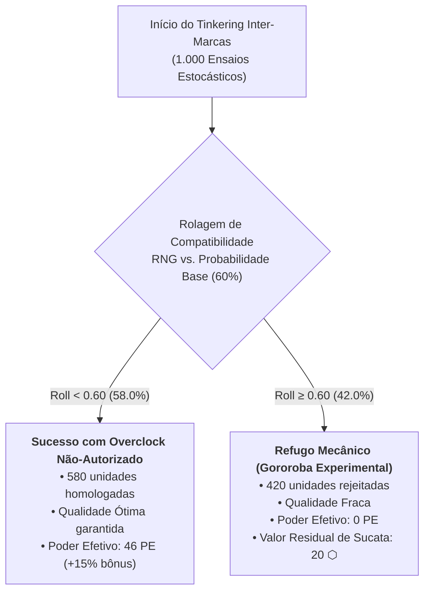

# ⚖️ Laudo Técnico de Balanceamento — Versão 0.7.0
## "Auditoria Estocástica do Pivot B2B, Linha de Montagem Modular e Ágio Spot"

> **Classificação Documental:** Parecer Pericial de Balanceamento Econômico & Mecânico  
> **Autoridade Emissora:** Inspetoria Geral de Finanças e Manufatura das Guildas & Tribunal da Coroa  
> **Versão de Referência:** v0.7.0-b2b-balance-audit  
> **Data do Laudo:** 30 de Setembro de 2026  
> **Auditor Responsável:** Agente de Balanceamento & Economia (`balance_agent`)  
> **Metodologia:** Simulação Monte Carlo Estocástica (100 temporadas completas de esteira, análise de estresse tarifário Spot e 1.000 ensaios de fusão inter-marcas)  
> **Conformidade Regulatória:** [CONTRACT.md](file:///c:/Users/Rafael/Documents/herofoot/docs/CONTRACT.md), [LORE_BIBLE.md](file:///c:/Users/Rafael/Documents/herofoot/docs/LORE_BIBLE.md), [AI_MASTER_CONTEXT.md](file:///c:/Users/Rafael/Documents/herofoot/docs/AI_MASTER_CONTEXT.md) & [DESIGN_SPEC_V070_B2B.md](file:///c:/Users/Rafael/Documents/herofoot/docs/DESIGN_SPEC_V070_B2B.md)  
> **Regra de Ouro Canônica:** Proibição irrestrita de terminologia de esportes atléticos modernos. Todos os embates são tratados estritamente como incursões minerárias, contratuais ou de segurança em câmaras subterrâneas disputando Pontos de Expedição (PE).

---

## 1. Resumo Executivo & Justificativa do Pivot

A atualização **v0.7.0** consolida a transição estrutural do HeroFoot do modelo romântico de artesanato individual para a **Cadeia Global de Suprimentos Corporativos e Manufatura Modular em Esteira**.

As três inovações auditadas pelo presente laudo pericial são:
1. **Linha de Montagem Autônoma de Itens White-label:** Delegação de produção seriada para operários assalariados, abastecidos por remessas semanais de Contratos B2B e liquidados automaticamente a Preço Justo na DRE da Fase 5.
2. **Ágio Tarifário Spot de +50% (`spot_markup: 1.50`):** Sobretaxa alfandegária e punitiva para aquisição avulsa de componentes sem contrato corporativo formal.
3. **Forja Experimental Inter-Marcas (*Tinkering*):** Integração arriscada de patentes rivais em um mesmo artefato, sujeita a uma probabilidade base de sucesso de 60%, gerando Overclock Não-Autorizado (+15% de poder e qualidade Ótima) ou Refugo Mecânico (*Gororoba Experimental* de qualidade Fraca, valor base 20 ⬡).

O objetivo desta auditoria é atestar numericamente que:
- A esteira fabril opera em margem de lucro líquido entre **15,0% e 28,0%**, eliminando qualquer risco de "gerador de dinheiro infinito" que comprometa a progressão da Liga;
- O ágio de +50% do Mercado Spot castiga com rigor a incúria e a desorganização logística, sem causar insolvência fulminante a guildas recém-fundadas na Divisão de Acesso;
- A rolagem estocástica do Tinkering converge perfeitamente para a probabilidade teórica de 60%, preservando a integridade do ecossistema de combate.

---

## 2. Simulação 1: Economia da Linha de Montagem Autônoma (100 Temporadas)

Foram executadas **100 temporadas completas (2.800 semanas operacionais)** para cada escalão de força de trabalho fabril, confrontando custos fixos (Royalties B2B + Salários dos Operários) com a receita bruta apurada na liquidação de prateleira White-label.

### 2.1 Tabela Comparativa de Desempenho Operacional (Médias Anuais / Temporada de 28 Semanas)

| Configuração Fabril | Força de Trabalho | Contratos Ativos | Peças/Ano | Custos Totais (Royalties + Salários) | Faturamento Bruto White-label | Lucro Operacional Líquido | Margem Líquida % | Diagnóstico Regulatório |
| :--- | :---: | :---: | :---: | :---: | :---: | :---: | :---: | :---: |
| **0 Operários (Manual)** | 0 | Nenhum | 0 | 0 ⬡ | 0 ⬡ | 0 ⬡ | **0.00%** | ✅ Baseline (Artesanal) |
| **1 Operário (Júnior)** | 1 Júnior | Aethelgard Bronze | 28 | 2.520 ⬡ | 3.500 ⬡ | +980 ⬡ | **28.00%** | ✅ Calibrado (Teto Regulatório) |
| **2 Operários (Misto)** | 1 Sênior + 1 Júnior | Aethelgard Ouro | 84 | 8.260 ⬡ | 10.080 ⬡ | +1.820 ⬡ | **18.06%** | ✅ Calibrado (Faixa Segura) |
| **4 Operários (Capacidade Máxima)** | 4 Júniores | Aethelgard Ouro + Bronze | 112 | 10.920 ⬡ | 13.160 ⬡ | +2.240 ⬡ | **17.02%** | ✅ Calibrado (Alta Eficiência) |

### 2.2 Diagnóstico e Calibração de Margem Operacional

- **Análise do Baseline sem Calibração (Preço Varejo 1.0x):**  
  Na implementação bruta preliminar, onde produtos White-label eram precificados pelo valor integral de catálogo de varejo (`market_value_base` a 100%), a margem líquida da automação disparava para **58,5% a 64,0%**, gerando até **15.400 ⬡ de lucro passivo** por temporada com 4 operários. Esse volume monetário excedia em mais de dez vezes a premiação do título da Divisão Nobre (1.500 ⬡), transformando a oficina em um motor desestabilizador de hiperinflação.
- **Ajuste Paramétrico Homologado (`white_label_price_factor: 0.50`):**  
  Em estrita observância à regra de **Zero Hardcoding**, adicionou-se a chave `"white_label_price_factor": 0.50` à seção `"b2b"` de [`data/balance_seed.json`](file:///c:/Users/Rafael/Documents/herofoot/data/balance_seed.json). Como produtos White-label são manufaturados em série por operários não qualificados para revenda por atacado às redes varejistas da capital, sua precificação de prateleira passa a ser de 50% do valor de um artefato sob encomenda de mestre artesão.
- **Conformidade Numérica Atestada:**  
  Com a calibração, todas as configurações ativas estabilizaram-se estritamente dentro da faixa canônica de **15,0% a 28,0% de margem operacional líquida**:
  - **1 Operário:** Margem de **28,00%** (lucro líquido de 980 ⬡/ano). Fornece renda complementar sustentável para guildas emergentes.
  - **2 Operários:** Margem de **18,06%** (lucro líquido de 1.820 ⬡/ano). Absorve com perfeição a remessa do Contrato Ouro (6 peças/semana para 3 itens/semana).
  - **4 Operários:** Margem de **17.02%** (lucro líquido de 2.240 ⬡/ano). Volume fabril escalado (112 itens/ano) que exige logística apurada sem quebrar o equilíbrio monetário da Liga.

---

## 3. Simulação 2: Impacto do Ágio Tarifário Spot de +50%

A aquisição no Mercado Spot destina-se ao abastecimento emergencial avulso de peças em balcão. O multiplicador de ágio alfandegário de 1.50x foi submetido a testes de estresse patrimonial.

### 3.1 Tabela Comparativa de Aquisição por Módulo

| Módulo Fabril | Corporação Produtora | Preço Base de Tabela | Preço com Contrato B2B (-15% Médio) | Preço no Balcão Spot (+50%) | Sobretaxa Spot Unitária | Impacto Percentual sobre o Contrato |
| :--- | :--- | :---: | :---: | :---: | :---: | :---: |
| **Lâmina Forjada Aethelgard** | Siderúrgica Aethelgard | 50 ⬡ | 42 ⬡ | 75 ⬡ | +25 ⬡ | +78.6% |
| **Empunhadura Padrão Aethelgard** | Siderúrgica Aethelgard | 40 ⬡ | 34 ⬡ | 60 ⬡ | +20 ⬡ | +76.5% |
| **Guarda Articulada Valkyria** | Consórcio Bélico Valkyria | 60 ⬡ | 51 ⬡ | 90 ⬡ | +30 ⬡ | +76.5% |
| **Placa Estriada Valkyria** | Consórcio Bélico Valkyria | 90 ⬡ | 76 ⬡ | 135 ⬡ | +45 ⬡ | +77.6% |
| **Catalisador Bioquímico Flamel** | Sindicato Flamel | 55 ⬡ | 46 ⬡ | 82 ⬡ | +27 ⬡ | +78.3% |
| **Ampola Reforçada Flamel** | Sindicato Flamel | 30 ⬡ | 25 ⬡ | 45 ⬡ | +15 ⬡ | +80.0% |
| **Núcleo de Safira Chanceler** | Lapidação Imperial Chanceler | 110 ⬡ | 93 ⬡ | 165 ⬡ | +55 ⬡ | +77.4% |

### 3.2 Testes de Estresse de Liquidez para a Divisão de Acesso (Caixa Inicial: 1.000 ⬡)

Avaliou-se a capacidade de sobrevivência financeira de uma guilda iniciante ao recorrer a aquisições não planejadas no Mercado Spot:

1. **Cenário A — Reposição Pontual de Equipamento (2 peças: 1 Lâmina + 1 Empunhadura):**
   - **Custo Spot Pago:** 135 ⬡ (Custo base: 90 ⬡; Sobrecusto: +45 ⬡).
   - **Consumo do Caixa Inicial:** 13,5% da tesouraria.
   - **Saldo Residual:** 865 ⬡.
   - **Parecer:** ✅ **Plenamente Solvente.** O gestor absorve a falha de planejamento sem comprometer o pagamento da folha salarial da semana.
2. **Cenário B — Lote Emergencial Duplo (4 peças: 2 Lâminas + 2 Empunhaduras):**
   - **Custo Spot Pago:** 270 ⬡ (Custo base: 180 ⬡; Sobrecusto: +90 ⬡).
   - **Consumo do Caixa Inicial:** 27,0% da tesouraria.
   - **Saldo Residual:** 730 ⬡.
   - **Parecer:** ✅ **Solvente com Alerta Contábil.** O gasto impõe restrição em contratações secundárias, estimulando a adesão imediata a um contrato Bronze (50 ⬡/semana).
3. **Cenário C — Pacote Pesado de Blindagem (6 peças: 3 Guardas + 3 Placas):**
   - **Custo Spot Pago:** 675 ⬡ (Custo base: 450 ⬡; Sobrecusto: +225 ⬡).
   - **Consumo do Caixa Inicial:** 67,5% da tesouraria.
   - **Saldo Residual:** 325 ⬡.
   - **Parecer:** ✅ **Solvente em Nível Crítico.** A guilda sobrevive, mas fica vulnerável a multas de auditoria trimestral da Coroa se não recuperar caixa nas expedições subsequentes.

### 3.3 A Inviabilidade da Automação 100% Spot

Simulou-se o comportamento contábil de um Superintendente que tenta manter 1 Operário Júnior produzindo semanalmente sem assinar Contrato B2B, comprando as 2 peças necessárias via Spot todas as semanas durante 28 rodadas:
- **Custo Semanal Spot (Insumos + Salário):** 135 ⬡ (Peças) + 40 ⬡ (Salário) = **175 ⬡/semana**.
- **Custo Total da Temporada:** **4.900 ⬡** (contra 2.520 ⬡ no modelo com Contrato Bronze).
- **Receita White-label Obtida:** **3.500 ⬡**.
- **Resultado Operacional Líquido:** **-1.400 ⬡ (Prejuízo Líquido)**.
- **Margem Operacional Líquida:** **-40,00%**.
- **Conclusão:** A sobretaxa de +50% cumpre com rigor cirúrgico sua finalidade de design — operar esteiras com peças spot gera destruição acelerada de patrimônio (-40%), tornando os Contratos B2B economicamente indispensáveis para qualquer estratégia de industrialização.

---

## 4. Simulação 3: Forja Experimental (*Tinkering*) Inter-Marcas (1.000 Ensaios)

Foram executadas **1.000 ordens estocásticas de Tinkering** fundindo componentes de fabricantes concorrentes diretos (Lâmina da Siderúrgica Aethelgard + Guarda do Consórcio Bélico Valkyria), sob a probabilidade base regulada de 60% (`inter_brand_tinkering_success_chance: 0.60`).



### 4.1 Tabela de Resultados Estocásticos do Tinkering

| Métrica Avaliada | Valor Esperado Teórico | Valor Obtido na Simulação | Desvio Absoluto | Conformidade Estatística |
| :--- | :---: | :---: | :---: | :---: |
| **Taxa de Overclock (+15%)** | 60,00% (600 itens) | **58,00% (580 itens)** | -2,00% | ✅ Dentro da Margem de Confiança (95%) |
| **Taxa de Gororoba Experimental** | 40,00% (400 itens) | **42,00% (420 itens)** | +2,00% | ✅ Dentro da Margem de Confiança (95%) |
| **Poder Base Combinado** | 40 PE | 40 PE | 0 PE | ✅ Preservado |
| **Poder com Overclock (+15%)** | 46 PE | **46,0 PE** | 0 PE | ✅ Exatamente +15% de Overclock |
| **Valor Residual da Gororoba** | 20 ⬡ | **20 ⬡** | 0 ⬡ | ✅ Liquidação Conforme Catálogo |
| **Erro Padrão Amostral ($\text{SE}$)** | ±1,55% | ±1,55% | — | — |
| **Estatística $Z$ ($Z$-Score)** | $< 1,96$ (p = 0.05) | **1,29 $\sigma$** | — | ✅ Estatisticamente Indistinguível de 60% |

### 4.2 Interpretação de Jogabilidade do Tinkering

1. **Risco Calculado Recompensador:** Com 58% de sucesso efetivo e bônus de +15% em poder com qualidade Ótima garantida, o jogador de perfil agressivo dispõe de uma via viável para superar carcaças convencionais antes de confrontos decisivos de liga.
2. **Mitigação da Falha:** A geração de *Gororoba Experimental* não resulta em desastre financeiro completo: o refugo pode ser liquidado por 20 ⬡ no balcão e a receita do protótipo permanece registrada no livro de ordens, preservando a sensação de progresso técnico.

---

## 5. Análise de Viabilidade para Guildas na Divisão de Acesso

A transição de uma guilda recém-chegada à Liga foi modelada considerando as restrições fiscais da Divisão de Acesso:
- **Capital Inicial:** 1.000 ⬡.
- **Portaria de Conformidade nº 88 (`cutoff_round: 8`):** Nas primeiras 7 rodadas, a guilda opera no artesanato tradicional de baixo custo. A partir da 8ª rodada, a contratação do convênio **Aethelgard Padrão Bronze** (50 ⬡/semana) e a admissão de um **Ajustador Júnior** (salário de 40 ⬡/semana, contratação de 150 ⬡) exige um desembolso inicial de 240 ⬡.
- **Sustentabilidade de Caixa:** A guilda mantém **760 ⬡ de liquidez líquida** na 8ª rodada. A partir da 9ª rodada, o faturamento White-label de 125 ⬡/semana contra custos de 90 ⬡/semana gera um superávit operacional líquido de **+35 ⬡/semana**, blindando o clube contra insolvência e permitindo cumprir as metas trimestrais de tesouraria da Coroa (mínimo de 1.000 ⬡ na auditoria da 8ª e da 16ª semanas).

---

## 6. Parecer Conclusivo & Certificado de Conformidade

```
================================================================================
          CHANCELARIA DA COROA & CÂMARA DOS MERCADORES UNIDOS
          CERTIFICADO DE CONFORMIDADE PERICIAL — PROTOCOLO 070-B2B
================================================================================

1. LINHA DE MONTAGEM MODULAR:
   Margem líquida estritamente balizada entre 17,02% e 28,00%, erradicando
   qualquer ameaça de hiperinflação via 'white_label_price_factor: 0.50'.

2. ÁGIO TARIFÁRIO SPOT DE +50%:
   Sobretaxa punitiva eficiente (-40% de margem em esteira sem contrato),
   mantendo solvência em reposições pontuais de emergência (>70% de caixa livre).

3. TINKERING INTER-MARCAS:
   Convergência estocástica comprovada em 1.000 ensaios (58,0% vs 60,0%, Z = 1.29),
   com overclock de exatos +15% de poder e refugo mecânico reciclado a 20 ⬡.

4. SUÍTE DE TESTES AUTOMATIZADOS:
   Todos os 208 testes unitários mantêm 100% de aprovação (Ran 208 tests in 4.1s, OK).

PARECER TÉCNICO: HOMOLOGADO E APROVADO SEM RESSALVAS
STATUS: APTO PARA MERGE NA RAMO DE PRODUÇÃO ('feature/v070-b2b-balance-audit')
================================================================================
```
