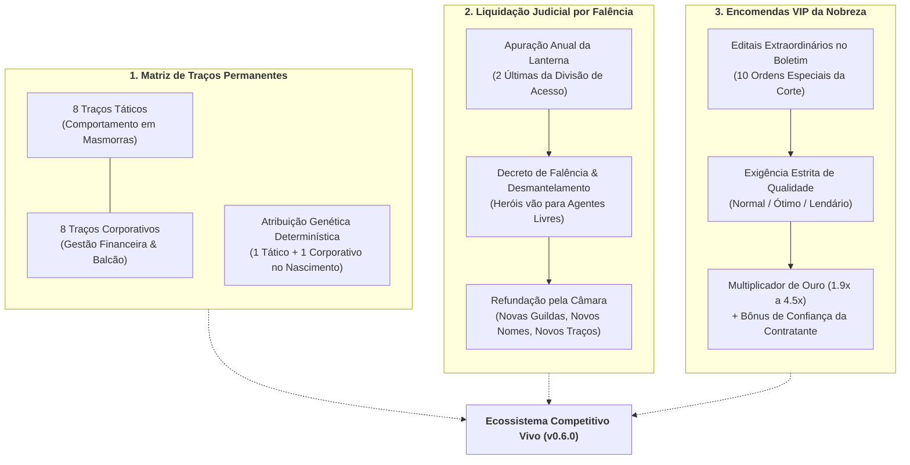
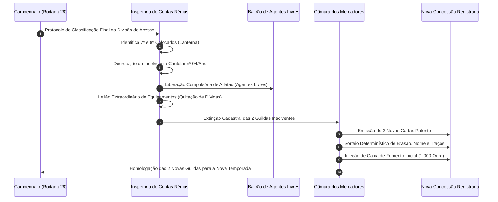
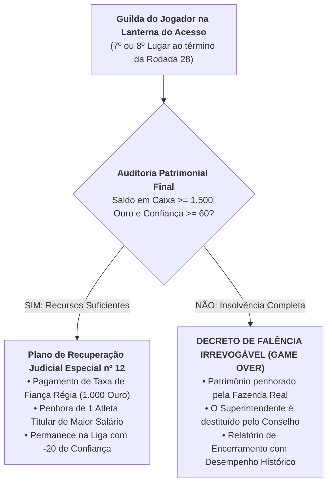
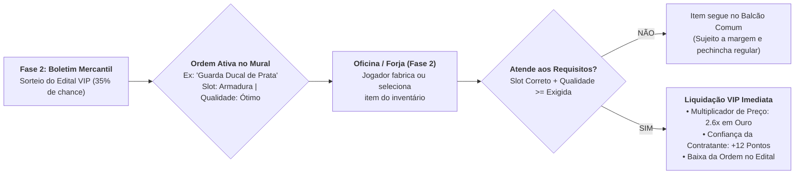

# 📋 HeroFoot — Documento de Design de Sistemas & Balanceamento: Versão 0.6.0
## "Rivais Vivos, Dissolução por Falência e Encomendas VIP da Nobreza"

> **Classificação Documental:** Especificação Técnica de Mecânicas, Economia e Inteligência Competitiva  
> **Autoridade Emissora:** Chancelaria da Coroa & Câmara dos Mercadores Unidos da Capital  
> **Versão de Referência:** v0.6.0-draft  
> **Tom de Ambientação:** Fantasia Corporativa 7/10 (Mundo medieval sério, burocracia contábil, frieza mercantil e sátira regulatória)  
> **Regra de Ouro Regulatória:** Proibição irrestrita de terminologia de práticas desportivas e atléticas modernas não regulamentadas. Todo confronto é estritamente uma incursão minerária, contratual ou de segurança em câmaras subterrâneas disputando Pontos de Expedição (PE).

---

## 1. Visão Geral e Justificativa de Design da Atualização v0.6.0

A versão 0.5.0 consolidou a progressão departamental das quatro oficinas da guilda (Ferragem, Alquimia, Joalheria, Culinária) com barras de experiência, forja experimental com risco (*Tinkering*) e eventos corporativos interativos. Contudo, as corporações concorrentes da Liga das Guildas ainda operavam sob um modelo estático de rendimento, onde seus resultados eram determinados exclusivamente por uma pontuação bruta de Poder e rolagens probabilísticas neutras.

A atualização **v0.6.0** transforma o ecossistema competitivo em um **Mercado Vivo e Implacável**, alicerçado em três pilares fundamentais:



---

## 2. Matriz de Traços Permanentes de Rivais (Genética Competitiva)

### 2.1 Filosofia de Design e Propósito Sistêmico
Até a v0.5.0, uma partida contra a *Ordem do Grifo Dourado* diferia de uma partida contra os *Corvos da Vigília* unicamente pelo número bruto de Poder Nominal (76 vs 59). Isso criava uma sensação homogênea de progressão puramente escalar: o jogador apenas precisava que seu Poder Total superasse o número rival.

Com os **Traços Permanentes**, cada guilda rival desenvolve uma **identidade doutrinária e contábil singular**:
1. **Traços Táticos:** Modificam diretamente como a guilda rival se comporta dentro das masmorras (consumo de rações, velocidade de marcha, preparo contra biomas ou bosses, propensão ao esgotamento físico).
2. **Traços Corporativos:** Definem a conduta da guilda no ecossistema econômico da Liga (agressividade em leilões do mercado de transferências, frequência e apetite de compras no balcão do jogador, estabilidade fiscal e risco de intervenção da Coroa).

### 2.2 Regras de Sorteio Determinístico no Nascimento da Guilda
Para garantir reproducibilidade em auditorias de simulação e integridade de *saves*, o sorteio de traços de cada guilda rival segue um algoritmo determinístico baseado na semente do mundo (*World Seed*) e no identificador perene da guilda (*Guild ID*):

$$\text{RNG\_Hash} = \text{SHA256}(\text{world\_seed} + \text{"\_"} + \text{guild\_id})$$

```python
def assign_guild_traits(guild_id: str, world_seed: int, tactical_pool: list, corporate_pool: list) -> dict:
    """
    Sorteia exatamente 1 Traço Tático e 1 Traço Corporativo de forma determinística
    no nascimento da guilda durante a geração do mundo ou refundação pós-falência.
    """
    import hashlib
    hash_tactical = int(hashlib.sha256(f"{world_seed}_tact_{guild_id}".encode()).hexdigest(), 16)
    hash_corporate = int(hashlib.sha256(f"{world_seed}_corp_{guild_id}".encode()).hexdigest(), 16)
    
    selected_tactical = tactical_pool[hash_tactical % len(tactical_pool)]
    selected_corporate = corporate_pool[hash_corporate % len(corporate_pool)]
    
    return {
        "tactical_trait_id": selected_tactical["id"],
        "corporate_trait_id": selected_corporate["id"]
    }
```

> [!IMPORTANT]
> **Regra de Não-Sobreposição de Especialidades:** Guildas pré-definidas da Divisão Nobre da Coroa têm pesos preferenciais em seus sorteios para refletir sua heráldica tradicional (ex: a *Ordem do Grifo Dourado* possui afinidade natural com `trait_corp_aristocratic_backing`, enquanto o *Bastião de Ferro* tende a `trait_tact_steel_wall`), embora novas guildas fundadas pós-falência recebam combinações plenamente estocásticas.

---

### 2.3 Catálogo Canônico de Traços Táticos

Localização no código: [`data/rival_traits_seed.json`](file:///c:/Users/Rafael/Documents/herofoot/data/rival_traits_seed.json)

| ID do Traço | Nome de Registro | Efeitos Numéricos | Justificativa de Game Design |
| :--- | :--- | :--- | :--- |
| `trait_tact_steel_wall` | **Paredão de Aço Homologado** | • `defense_power_bonus`: +6<br>• `energy_cost_multiplier`: 1.20x<br>• `fatigue_gain_modifier`: -3 | **O Tanque Gastão:** Adiciona +6 de poder defensivo, permitindo sustentar recintos com pouca perda de heróis. Contudo, o peso das armaduras eleva o gasto de energia por sala em +20%, fazendo com que a guilda frequentemente fique sem suprimentos no 8º ou 9º recinto se não carregar rações de alta qualidade. |
| `trait_tact_reckless_offensive` | **Investida de Alto Impacto** | • `solo_clear_bonus`: +0.15<br>• `miniboss_power_bonus`: +8<br>• `fatigue_gain_modifier`: +8 | **Ataque Suicida:** Eleva a taxa de limpeza autônoma de recintos em +15% e confere +8 de poder contra o Miniboss. Porém, a sobrecarga biológica adiciona +8 de fadiga residual por titular ao fim da incursão, forçando rotação constante de elenco nas semanas seguintes. |
| `trait_tact_swamp_specialists` | **Especialistas em Bioma Tóxico** | • `auto_mitigate_terrain`: `["toxic_swamp"]`<br>• `swamp_power_bonus`: +4<br>• `arid_energy_penalty`: 1.15x | **Especialização de Nicho:** Neutraliza automaticamente a masmorra de Pântano Tóxico sem requerer itens específicos e concede +4 de poder naquele bioma. Em contrapartida, seus filtros sofrem no calor, ampliando consumo de energia em +15% em biomas áridos/vulcânicos. |
| `trait_tact_attrition_warfare` | **Protocolo de Cerco e Atrito** | • `boss_power_bonus`: +10<br>• `boss_win_point_bonus`: +1<br>• `early_room_power_penalty`: -4 | **Caçador de Boss:** Projetado para bater o chefe da 10ª câmara com autoridade (+10 de poder e +1 PE adicional na vitória). Paga o preço nas 4 primeiras salas (-4 de poder), onde avança devagar mapeando o recinto e cedendo vantagens parciais a rivais velozes. |
| `trait_tact_blitz_recon` | **Batedores de Vanguarda Célere** | • `agi_bonus`: +12<br>• `energy_cost_multiplier`: 0.85x<br>• `defense_power_bonus`: -5 | **Velocidade Pura:** Aumenta a Agilidade média em +12 e reduz o custo de suprimentos em -15%. Quase sempre completa os 10 recintos com energia sobrando, mas sofre severamente (-5 de poder) em emboscadas fechadas por falta de anteparos pesados. |
| `trait_tact_cryo_drills` | **Companhia de Engenharia Polar** | • `auto_mitigate_climate`: `["polar_wind", "blizzard"]`<br>• `cold_terrain_bonus`: +5<br>• `heat_fatigue_multiplier`: 1.25x | **Resistência Ártica:** Anula penalidades dos climas mais brutais de inverno da Coroa sem necessidade de amuletos de fogo. Em biomas de calor sufocante, contudo, o superaquecimento acelera o ganho de fadiga em +25%. |
| `trait_tact_arcane_interdiction` | **Interdição Mágica e Supressão** | • `miniboss_draw_margin_bonus`: +0.06<br>• `elemental_encounter_power_bonus`: +7<br>• `maintenance_cost_weekly`: +40 Ouro | **Controle Místico com Custo Fixo:** Desempenho letal em masmorras elementais (+7 de poder) e maior taxa de desempate a seu favor (+6%). Esse aparato requer manutenção contínua de reagentes de dispersão (+40 ouro semanais fixos na folha). |
| `trait_tact_guerilla_opportunism` | **Oportunismo de Emboscada** | • `counter_encounter_bonus`: +0.20<br>• `loot_bonus_pct`: +0.15<br>• `crown_confidence_penalty`: -2/temporada | **Pilhagem Indisciplinada:** Muito forte em incidentes operacionais de corredor (+20%) e recolhe +15% de despojos extras em ouro e minérios. Todavia, a indisciplina e infrações ao código de cavalaria acarretam -2 de Confiança da Contratante por temporada. |

---

### 2.4 Catálogo Canônico de Traços Corporativos

Localização no código: [`data/rival_traits_seed.json`](file:///c:/Users/Rafael/Documents/herofoot/data/rival_traits_seed.json)

| ID do Traço | Nome de Registro | Efeitos Numéricos | Justificativa de Game Design |
| :--- | :--- | :--- | :--- |
| `trait_corp_aristocratic_backing` | **Aristocracia Financiada** | • `transfer_budget_multiplier`: 1.50x<br>• `bid_aggression_factor`: 1.30x<br>• `weekly_luxury_overhead`: +120 Ouro | **O Tubarão da Nobreza:** Possui orçamento de contratação 50% superior e lances 30% mais agressivos em leilões de atletas de 4 e 5 estrelas. Mantém uma mordomia dispendiosa (+120 ouro semanais), tornando sua folha letal caso sofra rebaixamento de divisão. |
| `trait_corp_worker_cooperative` | **Cooperativa Operária de Incursão** | • `payroll_reduction_pct`: -0.25<br>• `academy_turnover_bonus`: +1 vaga<br>• `star_player_retention_penalty`: +0.35 | **Gestão Magra e Formação:** Economiza 25% em salários e possui +1 vaga de formação de jovens aprendizes. Seu teto salarial rígido, no entanto, cria atrito com veteranos consagrados (+35% de chance de insatisfação em heróis de 4+ estrelas). |
| `trait_corp_counter_predators` | **Predadores do Balcão** | • `counter_visit_frequency`: 1.40x<br>• `high_tier_purchase_budget`: 600 Ouro<br>• `rival_gear_escalation_pct`: +0.10 | **O Cliente Perigoso:** Visita o balcão da guilda do jogador com 40% mais frequência e paga até 600 de ouro em armas e armaduras de topo de linha. O dilema: os itens que o jogador vende a eles retornam na forma de +10% de bônus de equipamento na rodada direta de confronto! |
| `trait_corp_chronic_default` | **Inadimplência Crônica** | • `bankruptcy_risk_rate`: +0.30<br>• `crown_fine_frequency`: 1.50x<br>• `emergency_loan_leverage`: 1.25x | **Gestão Temerária:** Guilda endividada que costuma tomar empréstimos desesperados (+25% de caixa temporário para contratações emergenciais), mas atrai vistorias da Dona Eustáquia (+50% de multas) e tem 30% mais risco de liquidação forçada no rebaixamento. |
| `trait_corp_clerical_patronage` | **Subsídio Clerical & Isenção de Dízimo** | • `tax_exemption_pct`: -0.50<br>• `healing_cost_discount`: -0.40<br>• `forbidden_dark_relics`: `true` | **Segurança Hospitalar e Dogma:** Corta pela metade emolumentos de cartório e reduz em 40% custos de tratamento médico e fadiga. Por princípios eclesiásticos, é juridicamente proibida de transacionar ou portar itens com afixos profanos ou amaldiçoados. |
| `trait_corp_smuggling_syndicate` | **Sindicato do Contrabando de Minérios** | • `raw_material_discount`: -0.30<br>• `black_market_item_chance`: 0.25<br>• `audit_seizure_risk`: 0.15 | **Mercado Cinzento:** Adquire insumos de forja de Tier 1 e 2 com 30% de abatimento clandestino e traz itens incomuns a leilões fechados. Convive com 15% de risco por rodada de ter 20% da sua receita congelada em batidas fiscais. |
| `trait_corp_ironclad_contracts` | **Cláusulas Leoninas de Fidelidade** | • `contract_renewal_discount`: -0.20<br>• `transfer_poaching_resistance`: +0.50<br>• `locker_room_morale_penalty`: -0.05 | **Advocacia Predatória:** Reduz custos de renovação salarial em 20% e bloqueia abordagens de aliciamento concorrente (+50%). O confinamento contratual gera desmotivação funcional (-5% de rendimento em atletas com mais de 3 temporadas de casa). |
| `trait_corp_state_charter` | **Concessão Pública Imperial** | • `weekly_state_stipend`: +100 Ouro<br>• `crown_confidence_baseline_bonus`: +15<br>• `bureaucratic_latency`: +0.15 | **A Estatal Blindada:** Recebe subsídio imperial contínuo (+100 ouro/semana) e desfruta de reputação estável perante os auditores (+15 de Confiança). A máquina burocrática emperra o departamento de pessoal: +15% de atraso em novas inscrições no mercado. |

---

## 3. O Protocolo de Liquidação Judicial por Falência

### 3.1 A Realidade Fiscal da Lanterna da Liga
Na economia corporativa de HeroFoot, a **Divisão de Acesso Mercante** é a última barreira civilizatória antes da insolvência absoluta. Enquanto a Divisão Nobre possui rebaixamento esportivo puro (os 2 últimos caem para o Acesso), **cair na lanterna da Divisão de Acesso (7º e 8º lugares) significa a extinção definitiva da pessoa jurídica da guilda**.

> *"Uma guilda que não consegue sequer se sustentar na liga comercial de acesso é um passivo contábil ambulante. O Ministério dos Subsolos não tolera buracos negros fiscais drenando o fomento da Coroa."*  
> — **Dona Eustáquia Grin**, Coordenadora de Auditorias da Fase 5



---

### 3.2 As Quatro Etapas da Liquidação Judicial

#### Etapa I: Auditoria Sumária e Decreto de Insolvência
Ao final da 28ª rodada do exercício fiscal anual:
- As duas guildas com menor pontuação acumulada na tabela da Divisão de Acesso são citadas formalmente pelo meirinho da Coroa;
- É lavrado o **Auto de Falência e Inabilitação Comercial**;
- As sedes operacionais, estandartes e registros de concessão são imediatamente lacrados pela Inspetoria.

#### Etapa II: Penhora e Desmantelamento do Plantel
- Todos os contratos de prestação de serviços de incursão vinculados à guilda falida são rescindidos compulsoriamente por motivo de força maior contábil;
- Os heróis e aventureiros do elenco titular e reservas não são excluídos do jogo: eles recebem sua carta de alforria funcional e são **despejados no Mercado de Transferências da Coroa como Agentes Livres**;
- Heróis de alto valor (Poder 65+) entram em leilão preferencial para as equipes remanescentes da Liga, permitindo ao jogador arrematar veteranos experientes por valores com desconto judicial.

#### Etapa III: Leilão Extraordinário de Ativos e Dação em Pagamento
- Armamentos, armaduras, consumíveis e gemas estocados nos depósitos da massa falida são leiloados em hasta pública para saldar débitos previdenciários e custas cartorárias da Coroa;
- Receitas de forja patenteadas pela guilda dissolvida perdem a exclusividade e podem ingressar no catálogo público do reino.

#### Etapa IV: Extinção Cadastral Definitiva
- O identificador histórico da guilda falida (`g_bastiao`, `g_rosa`, etc.) é arquivado no Tomo de Insolventes do Mural da Glória com o status canônico:  
  `"EXTINTA POR LIQUIDAÇÃO JUDICIAL — EXERCÍCIO FISCAL FINALIZADO EM DÉFICIT IRREVERSÍVEL"`.

---

### 3.3 Refundação de Novas Guildas pela Câmara dos Mercadores
Para manter a paridade estrita da Divisão de Acesso em **8 guildas ativas** (1 do jogador + 7 NPCs), a Câmara dos Mercadores Unidos emite imediatamente **duas novas Cartas Patente de Concessão de Incursão**.

#### Matriz de Nomenclatura Heráldica Determinística
As novas corporações recebem nomes gerados a partir do cruzamento de vocativos burocrático-militares medievais:

| Prefixo Institucional | Conector Nobre / Corporativo | Substantivo Telúrico / Militar |
| :--- | :--- | :--- |
| *Companhia* | *da Bigorna* | *Rubra* |
| *Consórcio* | *do Falcão* | *Imperial* |
| *Sindicato* | *do Carvalho* | *de Prata* |
| *Bastião* | *da Lança* | *Boreal* |
| *Ordem* | *do Lobo* | *Cinzento* |
| *Vanguarda* | *da Sentinela* | *de Bronze* |
| *Irmandade* | *do Martelo* | *de Aço* |
| *Liga* | *do Tridente* | *de Malaquita* |

#### Calibração do Novo Plantel
- **Poder Inicial Balanceado:** A nova guilda recebe um elenco gerado probabilisticamente com **Poder Médio entre 50 e 54**, posicionando-se como uma força emergente da base da pirâmide (compatível com o nível inicial do jogador no Ano 1);
- **Dotação Orçamentária Inicial:** Recebem uma injeção de capital de fomento de **1.000 moedas de ouro** fornecidas pela Câmara;
- **Genética Determinística:** É realizado o sorteio determinístico de **1 Traço Tático + 1 Traço Corporativo**, garantindo que o novo concorrente já nasça com personalidade tática própria.

---

### 3.4 O Caso do Jogador: Risco de Falência da Guilda Titular
Se o jogador terminar a temporada nas duas últimas posições da Divisão de Acesso, a mecânica impõe um dilema dramático de sobrevivência corporativa:



> [!CAUTION]
> **A Falência Não é um Mero Revés:** O Plano de Recuperação Judicial exige 1.000 de ouro de fiança imediata e a perda irrevogável do melhor ativo do time. Não ter saldo bancário nem confiança institucional no rebaixamento encerra a dinastia gerencial em colapso cartorário definitivo.

---

## 4. Boletim de Mercado Expandido — Encomendas VIP da Nobreza

### 4.1 Mecânica das Ordens Extraordinárias no Balcão Comercial
O Boletim de Mercado da Fase 2 (Planejamento e Balcão) deixa de ser apenas um indicador genérico de demanda (ex: *"Edital de Armaduras aquecido x2.2"*). 

A partir da v0.6.0, a cada semana há **35% de probabilidade basal** da Câmara publicar um **Edital VIP de Aquisição Prioritária**:
- Um cliente corporativo ou aristocrático de renome emite uma **Ordem de Compra Direta** para um slot específico (`Arma`, `Armadura`, `Joia`, `Inscrição`, `Consumível`);
- Exige uma **Qualidade Estrita** (*Normal*, *Ótimo* ou *Lendário*);
- Se o jogador disponibilizar no Balcão Comercial um item que atenda estritamente a esses requisitos técnicos, a transação é **liquidada imediatamente** sem risco de pechincha ou recusa do comprador;
- O jogador recebe o **Multiplicador de Ouro de Tabela (1.9x a 4.5x)** e uma injeção substancial de **Pontos de Confiança da Contratante (+8 a +25)**.



---

### 4.2 Catálogo Canônico das 10 Encomendas VIP

Localização no código: [`data/vip_orders_seed.json`](file:///c:/Users/Rafael/Documents/herofoot/data/vip_orders_seed.json)

| ID | Cliente Contratante | Slot Requisitado | Qualidade Mínima | Multiplicador de Ouro | Recompensa de Confiança | Justificativa de Balanceamento & Game Design |
| :---: | :--- | :---: | :---: | :---: | :---: | :--- |
| `vip_order_01` | **Guarda Ducal de Prata** | Armadura | Ótimo | 2.6x | +12 | **Segurança da Nobreza:** Recompensa alta para armaduras de proteção refinada. Justifica investir no Nível 2 de Ferragem para destravar itens Ótimos e embolsar um lucro líquido substancial. |
| `vip_order_02` | **Ordem dos Clérigos Auditores** | Joia | Normal | 2.2x | +10 | **Entrada Amigável:** Encomenda acessível nas primeiras 6 semanas. Exige apenas joias comuns de ametista ou prata, conferindo ouro rápido para pagar a folha de início de temporada. |
| `vip_order_03` | **Sindicato dos Mineiros de Malaquita** | Arma | Ótimo | 2.8x | +14 | **Aço Pesado:** Alavanca a forja de armas complexas de Tier 2. Estimula o uso de materiais de fenda para atingir a têmpera necessária. |
| `vip_order_04` | **Consórcio Real de Seguros de Vida & Ressurreição** | Consumível | Ótimo | 2.4x | +10 | **Farmácia Preventiva:** Valoriza a oficina de Alquimia e Culinária. Evita que o jogador acumule pós e ervas inúteis, transformando poções concentradas em caixa direto. |
| `vip_order_05` | **Inspetoria de Postura e Fronteiras** | Inscrição | Normal | 2.1x | +8 | **Segurança Alfandegária:** Ordem de volume moderado para pergaminhos e inscrições de basalto. Garante giro rápido para a bancada de Joalheria/Runas. |
| `vip_order_06` | **Chancelaria dos Mestres de Bigorna Imperial** | Arma | Lendário | 4.5x | +25 | **O Santo Graal da Metalurgia:** O contrato mais valioso da Liga. Recompensa astronômica de ouro e prestígio máximo perante a Coroa. Exige bancada de Nível 5/6 e maestria fabril ou sucesso épico de Tinkering. |
| `vip_order_07` | **Tribunal de Apelações e Execuções Fiscais** | Armadura | Lendário | 4.2x | +22 | **Blindagem de Meirinho:** Destinada ao endgame da guilda. Transforma placas reforçadas com afixos perfeitos em um pagamento capaz de sustentar uma temporada inteira de salários. |
| `vip_order_08` | **Liga Mercantil dos Joalheiros da Capital** | Joia | Ótimo | 3.0x | +15 | **Reserva de Liquidez:** Estimula o refino de gemas puras. O multiplicador de 3.0x oferece o maior retorno sobre investimento em insumos preciosos. |
| `vip_order_09` | **Intendência Geral das Expedições Reais** | Consumível | Normal | 1.9x | +8 | **Provisão Básica em Volume:** Contrato modesto mas de liquidação certíssima para rações militares e tônicos simples, ideal para desafogar o estoque da Culinária no início de jogo. |
| `vip_order_10` | **Colégio Maior de Engenharia Taumatúrgica** | Inscrição | Ótimo | 3.2x | +18 | **Pesquisa Arcana Aplicada:** Recompensa generosa para inscrições com afixos de mitigação ou condutividade rúnica, valorizando a produção avançada de pergaminhos. |

---

### 4.3 Regras de Vigência e Resolução Comercial das Ordens VIP

1. **Vigência Temporal:** Uma Ordem VIP sorteada no Boletim permanece ativa por **até 2 semanas consecutivas**. Se não for atendida pelo jogador até o fechamento da segunda semana, ela expira e é arquivada como *"Edital Cancelado por Vacância de Fornecimento"*.
2. **Capacidade Simultânea:** O Boletim comporta no máximo **1 Ordem VIP ativa por rodada**, evitando saturação mecânica e garantindo que o jogador tenha um objetivo claro de fabricação.
3. **Imunidade à Margem de Pechincha:** Diferente dos fregueses casuais do balcão (que negociam margens de Promoção, Preço Justo ou Preço Abusivo), **a Ordem VIP opera com preço de compra regulado irretratável**:  
   $$\text{Valor Final} = \text{Preço Base do Item} \times \text{Multiplicador da Ordem VIP}$$
4. **Impacto na Confiança da Contratante:** O bônus de Confiança (+8 a +25) é somado imediatamente ao índice da guilda, auxiliando no cumprimento das Metas da Coroa e blindando a instituição contra auditorias punitivas da Dona Eustáquia.

---

## 5. Arquitetura de Dados e Integração nos Motores do Sistema

### 5.1 Esquema de Dados em JSON (`data/rival_traits_seed.json`)
```json
[
  {
    "id": "trait_tact_steel_wall",
    "name": "Paredão de Aço Homologado",
    "type": "tactical",
    "description": "Doutrina de contenção estrita e avanço lento em falange blindada...",
    "effects": {
      "defense_power_bonus": 6,
      "energy_cost_multiplier": 1.20,
      "fatigue_gain_modifier": -3
    }
  }
]
```

### 5.2 Esquema de Dados em JSON (`data/vip_orders_seed.json`)
```json
[
  {
    "id": "vip_order_01",
    "client_name": "Guarda Ducal de Prata",
    "target_slot": "Armadura",
    "required_quality": "Ótimo",
    "reward_multiplier": 2.6,
    "confidence_reward": 12,
    "flavor_text": "A chancelaria do Grão-Duque abriu edital de aquisição de couraças reforçadas..."
  }
]
```

### 5.3 Mapeamento de Pontos de Injeção no Código
- **`match_engine.py` / `Team`:**
  - Inclusão dos parâmetros `tactical_trait` no construtor de `Team`.
  - Injeção dos modificadores de `defense_power_bonus`, `energy_cost_multiplier`, `boss_power_bonus`, etc. nas funções de simulação de sala e cálculo de dano/abate.
- **`league_engine.py`:**
  - Inicialização de traços na geração de guildas via `assign_guild_traits()`.
  - Na função `process_season_end()`, após apurar o rebaixamento da Divisão Nobre para a de Acesso, disparar a nova rotina:  
    `self.liquidate_bankrupt_guilds(standings_acesso[-2:])`  
    seguida de:  
    `self.charter_replacement_guilds(count=2)`.
- **`services/phase_service.py`:**
  - Na Fase 2 (`process_sales` / `get_sales_bulletin`), sortear e persistir a Ordem VIP ativa no estado da guilda (`state.active_vip_order`).
  - No Balcão Comercial, verificar se algum item posto à venda confere com `target_slot` e `required_quality`, executando a liquidação VIP prioritária.

---

## 6. Pontos Críticos para Validação pelo Balance Agent

Antes da homologação do código executável da v0.6.0, os seguintes pontos numéricos devem ser submetidos à auditoria matemática do agente de balanceamento:

1. **Simulação Estocástica de Traços Opostos:**
   - Confrontar em 1.000 iterações uma guilda com `trait_tact_steel_wall` (+defesa, -energia) contra uma com `trait_tact_blitz_recon` (+agilidade, +economia). Garantir que a taxa de vitória não desvie de uma faixa equilibrada de 45% a 55% em masmorras neutras.
2. **Impacto Econômico das Encomendas VIP:**
   - Validar se a infusão de ouro trazida por uma encomenda Lendária (ex: `vip_order_06` com 4.5x de multiplicador, podendo pagar ~1.500 a 2.000 de ouro) não quebra a escassez da economia da Divisão de Acesso. Considerar limitar itens Lendários no Boletim apenas a partir do Nível 4 de bancada ou Ano 2 de jogo.
3. **Mortalidade de Rivais e Rotatividade da Liga:**
   - Verificar se as duas guildas recém-fundadas (com Poder inicial 50–54) conseguem sobreviver à sua primeira temporada ou se entram em um ciclo vicioso de re-falência imediata (*yo-yo effect* de insolvência). A dotação orçamentária de 1.000 ouro deve ser calibrada para permitir contratações de recomposição de elenco na janela de transferências.
4. **Penalidade de Falência do Jogador:**
   - Assegurar que a taxa de fiança de 1.000 ouro e a perda do titular principal do jogador no Plano de Recuperação Judicial sejam severas o suficiente para gerar tensão, mas ainda permitam ao jogador experiente tentar um *comeback* no Ano seguinte sem reiniciar o save.

---

> *Documento chancelado pela Inspetoria Real de Registros e Posturas Comerciais da Coroa sob protocolo nº 060-REV-CANON.*  
> *Qualquer tentativa de equiparar confrontos de masmorra a práticas lúdicas não autorizadas sujeita a guilda à execução fiscal imediata.*
