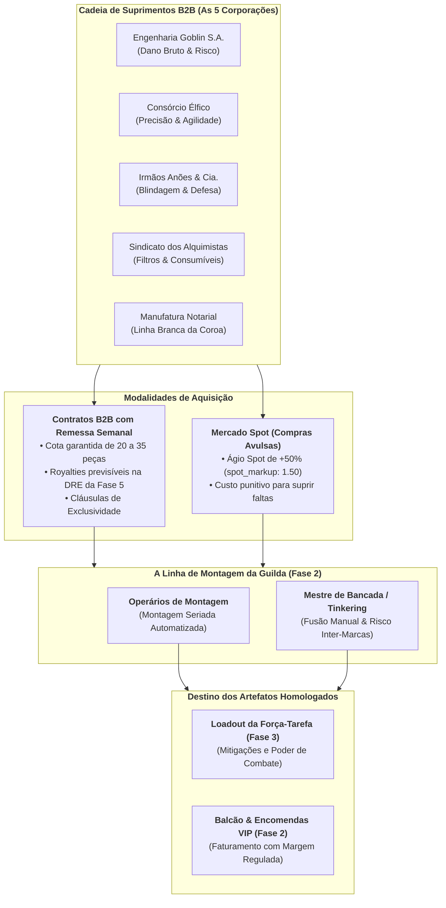
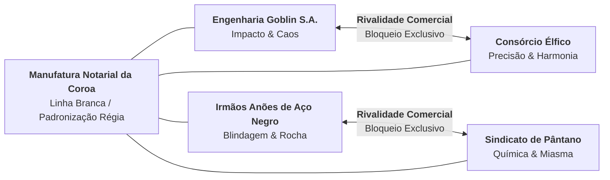
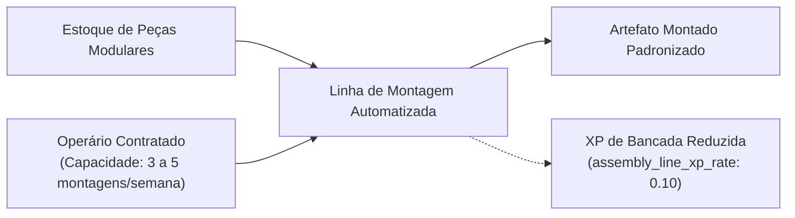
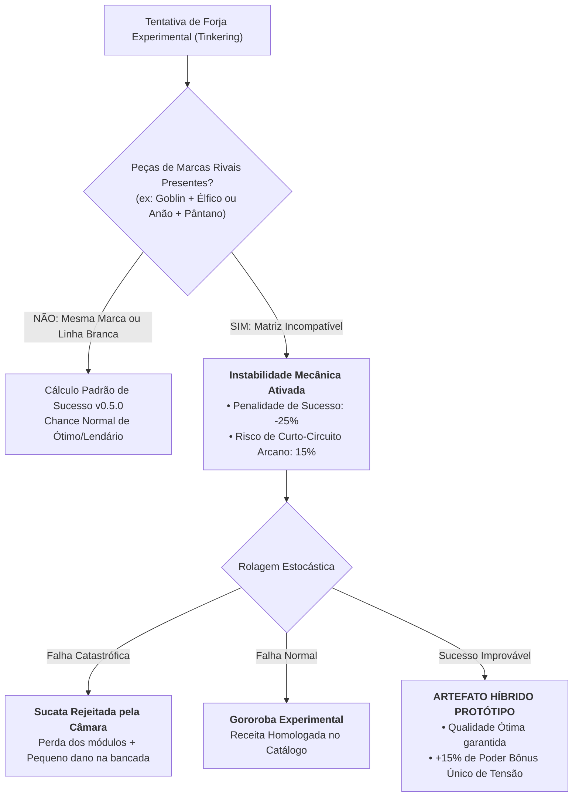

# 📋 HeroFoot — Documento de Design de Sistemas & Engenharia B2B: Versão 0.7.0
## "Pivot B2B, Cadeia Global de Suprimentos & Manufatura Modular em Esteira"

> **Classificação Documental:** Especificação Técnica de Sistemas Industriais, Logística e Integração B2B  
> **Autoridade Emissora:** Chancelaria da Coroa & Câmara dos Mercadores Unidos da Capital  
> **Versão de Referência:** v0.7.0-b2b-spec  
> **Tom de Ambientação:** Fantasia Corporativa 7/10 (Mundo medieval sério, burocracia contábil, frieza mercantil e sátira regulatória)  
> **Conformidade Canônica:** [CONTRACT.md](file:///c:/Users/Rafael/Documents/herofoot/docs/CONTRACT.md), [LORE_BIBLE.md](file:///c:/Users/Rafael/Documents/herofoot/docs/LORE_BIBLE.md) & [AI_MASTER_CONTEXT.md](file:///c:/Users/Rafael/Documents/herofoot/docs/AI_MASTER_CONTEXT.md)  
> **Regra de Ouro Regulatória:** Proibição irrestrita de terminologia de práticas desportivas e atléticas modernas não regulamentadas. Todo confronto é estritamente uma incursão minerária, contratual ou de segurança em câmaras subterrâneas disputando Pontos de Expedição (PE).

---

## 1. Visão Geral & Racionalidade do Pivot B2B

### 1.1 A Crise do Artesanato Individual & A Revolução Industrial de Masmorra
Até a versão 0.6.0, o fluxo de manufatura da guilda operava sob um modelo de **artesanato romântico-feudal**: o próprio Superintendente (ou seu mestre forjador) precisava minerar cada pepita de minério, carregar sacos de carvão até a bigorna e bater martelo peça por peça. 

Esse paradigma provou-se **economicamente inviável** para as exigências da Divisão Nobre da Coroa:
1. **Gargalo Logístico de Extração:** Explorar masmorras apenas para recolher cascalho limitava a capacidade operacional da tropa titular;
2. **Incompatibilidade de Escala:** O Boletim de Mercado e as Encomendas VIP passaram a exigir lotes volumosos e peças de alta precisão que oficinas manuais não conseguiam entregar a tempo;
3. **Ascensão dos Conglomerados Fabricantes:** Cinco corporações monopolistas dominaram a extração e a pré-fabricação de módulos, transformando as guildas em **Montadoras de Artefatos de Alta Complexidade**.

No modelo **v0.7.0 B2B**, a guilda deixa de ser uma ferraria de beira de estrada e assume a posição de **Linha de Montagem Homologada**:
- Peças, lâminas, placas, filtros e gemas chegam semanalmente via **Contratos de Remessa B2B**;
- A montagem seriada de itens de linha pode ser delegada a **Operários de Montagem** assalariados;
- O artesanato experimental manual fica reservado à inovação de alto risco: a **Forja Experimental (*Tinkering*) com Mistura Inter-Marcas**.



---

### 1.2 Justificativa Numérica do Ágio Spot (`spot_markup: 1.50`)
O jogador que não planeja sua cadeia de suprimentos e fica sem peças recorre ao **Mercado Spot (aquisição avulsa imediata no balcão fornecedor)**.

- **Valor Calibrado:** **1.50x (+50% de ágio)** sobre o preço base de tabela da peça (`data/parts_seed.json`).
- **Racional de Balanceamento:** 
  - Um ágio draconiano de 300% (4.0x) asfixiava o fluxo de caixa de guildas iniciantes, tornando um erro de cálculo fatal na 3ª ou 4ª rodada.
  - Um ágio de apenas 10% a 20% tornaria os contratos B2B irrelevantes, incentivando o jogador a comprar apenas o que precisa na hora exata (*just-in-time* sem custo de compromisso).
  - O valor de **+50% (`1.50`)** impõe um custo contábil nítido na DRE da Fase 5, punindo a falta de visão contratual sem paralisar as operações fabris da guilda.

---

### 1.3 Ponto de Corte da Transição Industrial (`cutoff_round: 8`)
- Durante as **Rodadas 1 a 7** (o primeiro terço da temporada inaugural), a guilda opera em regime artesanal misto, consumindo sobras coloniais e aprendendo a dinâmica das masmorras.
- A partir da **Rodada 8 (`cutoff_round: 8`)**, a Câmara dos Mercadores emite a **Portaria de Conformidade Fabril nº 88**, extinguindo as feiras livres de minério bruto e tornando obrigatória a estruturação em **Contratos B2B** ou sujeição ao ágio do Mercado Spot.

---

## 2. As Cinco Corporações Fabricantes do Continente

Localização no código: [`data/corporations_seed.json`](file:///c:/Users/Rafael/Documents/herofoot/data/corporations_seed.json)



### 2.1 Perfil Detalhado das Entidades Corporativas

#### 1. Engenharia Goblin S.A. (`corp_goblin_eng`)
- **Tagline Institucional:** *"Se não explodir na montagem, corta qualquer armadura."*
- **Especialidade Fabril:** Peças de corte agressivo, módulos de detonação e propulsores a vapor de alta volatilidade.
- **Rival Corporativo Histórico:** `corp_elf_precision` (Consórcio Élfico de Alta Precisão).
- **Bônus de Parceria:** +5% de poder de impacto em armas; +10% de probabilidade de instabilidade mecânica em forjas experimentais.

#### 2. Consórcio Élfico de Alta Precisão (`corp_elf_precision`)
- **Tagline Institucional:** *"Perfeição micrométrica homologada em pergaminho velino."*
- **Especialidade Fabril:** Joias arcanas de fluxo estrito, gemas lapidadas para redução de atrito energético e componentes de luxo para a alta corte.
- **Rival Corporativo Histórico:** `corp_goblin_eng` (Engenharia Goblin S.A.).
- **Bônus de Parceria:** +8% de agilidade média em peças montadas; +15% de ágio aceito pelo mercado consumidor no balcão comercial.

#### 3. Irmãos Anões de Aço Negro & Cia. (`corp_dwarf_steel`)
- **Tagline Institucional:** *"Fundido no fundo do abismo, forjado para a eternidade fiscal."*
- **Especialidade Fabril:** Blindagens pesadas, chapas maciças de ferro fundido, escudos balísticos e âncoras contra instabilidade tectônica.
- **Rival Corporativo Histórico:** `corp_swamp_alchemy` (Sindicato dos Alquimistas de Pântano).
- **Bônus de Parceria:** +10% de poder defensivo em couraças; +5% de economia de suprimentos em masmorras rochosas e cavernas.

#### 4. Sindicato dos Alquimistas de Pântano (`corp_swamp_alchemy`)
- **Tagline Institucional:** *"O miasma de hoje é o lucro líquido de amanhã."*
- **Especialidade Fabril:** Filtros respiratórios contra miasmas, concentrados energéticos de biomassa e dosadores farmacológicos contínuos.
- **Rival Corporativo Histórico:** `corp_dwarf_steel` (Irmãos Anões de Aço Negro & Cia.).
- **Bônus de Parceria:** +1 carga de uso operacional a todos os consumíveis montados; +20% de mitigação contra gases venenosos.

#### 5. Manufatura Notarial da Coroa (`corp_crown_notarial`)
- **Tagline Institucional:** *"Padronização régia, carimbos invioláveis e estabilidade tributária."*
- **Especialidade Fabril:** Peças genéricas de linha branca (*white-label*), alvarás gravados, laudos periciais e armações universais.
- **Rival Corporativo Histórico:** `null` (Entidade reguladora estatal neutra; compatível com todas as parcerias).
- **Bônus de Parceria:** +1 ponto de Confiança da Contratante a cada duas semanas de contrato vigente; -10% no ágio do Mercado Spot.

---

## 3. Catálogo Modular de Peças & Preservação Exata de Afixos

Localização no código: [`data/parts_seed.json`](file:///c:/Users/Rafael/Documents/herofoot/data/parts_seed.json)

### 3.1 Arquitetura de Conversão: Afixo Místico → Peça Física Modular
Para garantir conformidade cirúrgica com o balanceamento de combate das versões v0.1.0–v0.6.0, **as 41 entradas de afixos de `data/affixes_seed.json` e `data/affix_effects_seed.json` foram convertidas 1:1 em peças modulares físicas**, preservando exatamente os mesmos efeitos numéricos:

```json
{
  "id": "part_gob_blade_03",
  "name": "Gume Guilhotina de Demissão Sumária",
  "brand_id": "corp_goblin_eng",
  "part_type": "blade",
  "compatible_slots": ["Arma"],
  "tier": 3,
  "market_price_base": 380,
  "catalog_description": "Peça de impacto massivo projetada para encerrar discussões contratuais em um único golpe.",
  "affix_id_source": "suf_rescisao_imediata",
  "effects": [
    { "effect": "power_flat", "value": 7 },
    { "effect": "power_pct", "value": 0.2 },
    { "effect": "value_pct", "value": 0.35 },
    { "effect": "power_pct", "value": 0.15, "requires_quality": "Lendário" }
  ]
}
```

### 3.2 Tabela Mestra de Mapeamento das 41 Peças Modulares

| ID da Peça | Nome Comercial | Marca | Tipo | Slot Compatível | Tier | Preço Base | Fonte do Afixo | Efeitos Preservados |
| :--- | :--- | :---: | :---: | :---: | :---: | :---: | :---: | :--- |
| `part_gob_blade_01` | Lâmina Dentada de Fricção Rápida | Goblin | blade | Arma | 1 | 75 Ouro | `pref_afiada` | +10% poder, +10% valor |
| `part_gob_blade_02` | Lâmina Predatória de Aço Farpado | Goblin | blade | Arma | 2 | 180 Ouro | `pref_predatorio` | +18% poder, +40% valor |
| `part_gob_blade_03` | Gume Guilhotina de Demissão Sumária | Goblin | blade | Arma | 3 | 380 Ouro | `suf_rescisao_imediata` | +7 poder flat, +20% poder, +35% valor (+15% poder se Lendário) |
| `part_gob_hilt_01` | Empunhadura Sem Guarda de Risco | Goblin | hilt | Arma | 2 | 160 Ouro | `suf_acidente_trabalho` | +5 poder flat, +10% valor (+10% poder se Lendário) |
| `part_gob_core_01` | Câmara de Detonação Magmática | Goblin | core | Inscrição | 3 | 320 Ouro | `pref_vulcanico` | +20% poder, +4 poder flat, +35% valor |
| `part_gob_core_02` | Disjuntor de Sobrecarga Calculada | Goblin | core | Arma | 2 | 210 Ouro | `suf_risco_calculado` | +4 poder flat, +20% valor (+12% poder se Lendário) |
| `part_gob_core_03` | Injetor de Adrenalina de Turno Dobrado | Goblin | core | Consumível | 3 | 340 Ouro | `suf_turno_extraordinario` | +12 energia flat, +1 carga, +25% valor (+15 energia se Lendário) |
| `part_gob_filter_01` | Compressor de Porções Industriais | Goblin | filter | Consumível | 2 | 150 Ouro | `pref_farta` | +1 carga flat, +30% valor |
| `part_elf_blade_01` | Lâmina Temperada a Frio Élfico | Élfico | blade | Arma | 2 | 190 Ouro | `pref_temperada` | +15% poder, +15% valor |
| `part_elf_gem_01` | Gema Focalizadora de Cristal Élfico | Élfico | gem | Joia | 1 | 130 Ouro | `pref_encantada` | +12% poder, +40% valor |
| `part_elf_gem_02` | Safira Penitencial de Alta Frequência | Élfico | gem | Joia | 2 | 240 Ouro | `pref_penitente` | +22% poder, +40% valor |
| `part_elf_gem_03` | Topázio de Turno Noturno | Élfico | gem | Joia | 2 | 190 Ouro | `suf_adicional_noturno` | +8% poder, +25% valor (+8% poder se Lendário) |
| `part_elf_gem_04` | Gema Lapidada de Isenção Fiscal | Élfico | gem | Joia | 3 | 370 Ouro | `suf_eficiencia_tributaria` | +50% valor, +3 poder flat (+30% valor se Lendário) |
| `part_elf_core_01` | Núcleo Criogênico Boreal | Élfico | core | Inscrição | 3 | 330 Ouro | `pref_glacial` | Mitiga Frio Glacial, +3 poder flat, +30% valor |
| `part_elf_core_02` | Matriz Rúnica de Compliance Arcano | Élfico | core | Inscrição | 2 | 230 Ouro | `suf_compliance_magico` | +5 poder flat, +35% valor (+10% poder se Lendário) |
| `part_elf_filter_01` | Refinador Gustativo Nobre | Élfico | filter | Consumível | 1 | 110 Ouro | `pref_saborosa` | +10 energia flat, +35% valor |
| `part_dwarf_plating_01` | Placa Reforçada de Aço Anão | Anão | plating | Armadura | 1 | 85 Ouro | `pref_reforcada` | +10% poder, +15% valor |
| `part_dwarf_plating_02` | Lamelas Robustas de Granito Vulcânico | Anão | plating | Armadura | 1 | 95 Ouro | `pref_robusta` | +4 poder flat, +20% valor |
| `part_dwarf_plating_03` | Couraça Maciça de Minério Negro | Anão | plating | Armadura | 2 | 210 Ouro | `pref_macico` | +6 poder flat, +20% valor |
| `part_dwarf_plating_04` | Blindagem Impenetrável da Cidadela | Anão | plating | Armadura | 3 | 390 Ouro | `pref_impenetravel` | +8 poder flat, +12% poder, +40% valor |
| `part_dwarf_plating_05` | Revestimento Galvanizado Anti-Ácido | Anão | plating | Arma / Arm. | 3 | 350 Ouro | `pref_galvanizado` | +5 poder flat, +10% poder, +50% valor |
| `part_dwarf_plating_06` | Reforço Torácico com Apólice Integrada | Anão | plating | Armadura | 2 | 230 Ouro | `suf_seguro_vida` | +6 poder flat, +35% valor (+12% poder se Lendário) |
| `part_dwarf_core_01` | Âncora Gravitacional de Minas | Anão | core | Inscrição | 1 | 125 Ouro | `pref_firme` | Mitiga Mina Instável, +20% valor |
| `part_dwarf_core_02` | Estrutura de Responsabilidade Limitada | Anão | core | Armadura | 2 | 220 Ouro | `suf_responsabilidade_limitada` | +6 poder flat, +30% valor (+10% poder se Lendário) |
| `part_swamp_filter_01` | Filtro Decantador Concentrado | Pântano | filter | Consumível | 1 | 75 Ouro | `pref_concentrada` | +8 energia flat, +25% valor |
| `part_swamp_filter_02` | Prensa de Suplemento Nutritivo | Pântano | filter | Consumível | 1 | 65 Ouro | `pref_nutritiva` | +5 energia flat, +15% valor |
| `part_swamp_filter_03` | Dosador Graduado de Prontuário | Pântano | filter | Consumível | 2 | 175 Ouro | `suf_prontuario` | +1 carga flat, +25% valor (+10 energia se Lendário) |
| `part_swamp_filter_04` | Válvula de Produtividade Contínua | Pântano | filter | Consumível | 2 | 165 Ouro | `suf_produtividade` | +6 energia flat, +15% valor (+1 carga se Lendário) |
| `part_swamp_core_01` | Filtro Neutralizador de Miasma | Pântano | core | Inscrição | 1 | 120 Ouro | `pref_purificada` | Mitiga Pântano Tóxico, +15% valor |
| `part_swamp_core_02` | Injetor Químico de Evacuação | Pântano | core | Consumível | 2 | 185 Ouro | `suf_evacuacao` | +8 energia flat, +35% valor (+1 carga se Lendário) |
| `part_swamp_core_03` | Difusor Balsâmico de Eucalipto | Pântano | core | Inscrição | 2 | 195 Ouro | `suf_antidoto_eucalipto` | +3 poder flat, +15% valor (+10% poder se Lendário) |
| `part_swamp_gem_01` | Âmbar de Adicional de Insalubridade | Pântano | gem | Joia | 2 | 215 Ouro | `suf_insalubridade` | +2 poder flat, +40% valor (+8% poder se Lendário) |
| `part_crown_plating_01` | Couro Escamado Padrão Fazenda Real | Coroa | plating | Armadura | 1 | 90 Ouro | `pref_escamada` | +15% poder, +20% valor |
| `part_crown_plating_02` | Braçadeira Chancelada por Laudo | Coroa | plating | Armadura | 2 | 200 Ouro | `suf_laudo_pericial` | +4 poder flat, +20% valor (+10% poder se Lendário) |
| `part_crown_gem_01` | Ágata Notarial de Vigor Funcional | Coroa | gem | Joia | 1 | 110 Ouro | `pref_vigorosa` | +3 poder flat, +25% valor |
| `part_crown_gem_02` | Quartzo de Austeridade Orçamentária | Coroa | gem | Joia | 2 | 195 Ouro | `pref_economico` | +45% valor, +2 poder flat |
| `part_crown_core_01` | Inscrição Ígnea de Calefação Regulatória | Coroa | core | Inscrição | 1 | 130 Ouro | `pref_ignea` | Mitiga Frio Glacial, +20% valor |
| `part_crown_core_02` | Selo Rúnico de Alvará de Funcionamento | Coroa | core | Inscrição | 2 | 220 Ouro | `suf_alvara` | +5 poder flat, +35% valor (+10% poder se Lendário) |
| `part_crown_core_03` | Condutor Térmico Anti-Hipotermia | Coroa | core | Inscrição | 2 | 190 Ouro | `suf_prevencao_hipotermia` | +3 poder flat, +20% valor (+10% poder se Lendário) |
| `part_crown_hilt_01` | Pomo de Termo de Responsabilidade | Coroa | hilt | Arma | 1 | 115 Ouro | `suf_termo_responsabilidade` | +3 poder flat, +25% valor (+8% poder se Lendário) |
| `part_crown_hilt_02` | Guarda-Mão de Cláusula Rescisória | Coroa | hilt | Arma | 2 | 185 Ouro | `suf_rescisao` | +12% poder, +15% valor (+12% poder se Lendário) |

---

## 4. Contratos de Fornecimento B2B & Regras de Exclusividade

Localização no código: [`data/b2b_contracts_seed.json`](file:///c:/Users/Rafael/Documents/herofoot/data/b2b_contracts_seed.json)

### 4.1 Estrutura Contratual
Cada contrato B2B é firmado na **Fase 2 (Manufatura & Balcão)** e incide diretamente sobre o caixa e a DRE da guilda na **Fase 5 (Balanço & Auditoria)**:
- **Taxa de Adesão (*Signing Fee*):** Custo de cartório pago uma única vez na homologação do contrato.
- **Royalties Semanais (*Weekly Royalty*):** Despesa fixa lançada na rubrica de custos operacionais semanais.
- **Cota de Remessa Semanal (*Weekly Parts Count*):** 20 peças (Contrato Básico Tier 1) ou 35 peças (Contrato Parceiro Ouro Tier 2). As peças são entregues automaticamente no depósito da guilda ao iniciar a Fase 2 de cada semana.

### 4.2 A Cláusula de Exclusividade Mercantil (`is_exclusive: true`)
A assinatura de um contrato **Parceiro Ouro** confere acesso aos módulos mais refinados e letais de uma corporação, mas exige submissão a um embargo econômico severo:

$$\text{Assinar Contrato Ouro}(\text{Corp}_A) \implies \text{Bloqueio Cautelar}(\text{Corp}_{B = \text{rival\_corp\_id}})$$

1. Se a guilda firmar a **Aliança Estratégica Élfica de Platina (`b2b_elf_gold`)**, todos os acordos com a **Engenharia Goblin S.A.** são cancelados sumariamente e novas contratações com os goblins tornam-se juridicamente bloqueadas.
2. Se a guilda firmar o **Pacto Subterrâneo Ouro de Aço Negro (`b2b_dwarf_gold`)**, o **Sindicato dos Alquimistas de Pântano** interrompe imediatamente todas as entregas.
3. Para revogar um contrato de exclusividade e restabelecer laços com o rival, a guilda deve pagar uma **Multa de Rescisão de Parceria** equivalente a 2x o valor da taxa de adesão original perante a Câmara dos Mercadores.

---

## 5. Operários de Montagem & Linha de Produção Automatizada

Localização no código: [`data/assembly_workers_seed.json`](file:///c:/Users/Rafael/Documents/herofoot/data/assembly_workers_seed.json)



### 5.1 O Fim da Microgestão Repetitiva
Na v0.5.0, forjar 10 espadas comuns exigia 10 cliques e confirmações manuais na bigorna. Com a chegada dos **Operários de Montagem**:
- A guilda pode manter até **4 operários contratados simultaneamente** (`worker_max_hired: 4`);
- Cada operário possui um salário semanal fixo, especialidade em uma das 4 oficinas (`Ferragem`, `Alquimia`, `Joalheria`, `Culinária`), um limite de produção semanal (3 a 5 peças/semana) e um teto de receita (`recipe_tier_cap`: Tier 1 ou Tier 2);
- O jogador define ordens de montagem contínuas (ex: *"Produzir 4 Cotas de Malha Básicas toda semana"*), e o operário consome os módulos do estoque automaticamente.

### 5.2 Penalidade de Aprendizado em Esteira (`assembly_line_xp_rate: 0.10`)
- **Justificativa de Balanceamento:** A montagem seriada automatizada não pode substituir o mérito do mestre artesão no avanço técnico da filial.
- Itens produzidos por operários em linha concedem apenas **10% da XP nominal da receita** para a barra de progresso da oficina (`assembly_line_xp_rate: 0.10`).
- Para subir do Nível 4 para os Níveis 5 e 6, o jogador ainda precisará operar a bancada pessoalmente e arriscar forjas de alta complexidade.

---

## 6. Matriz de Incompatibilidade Inter-Marcas no Tinkering

Uma das maiores inovações de gameplay da v0.7.0 é a tensão fabril gerada ao combinar componentes de fabricantes concorrentes na mesma carcaça durante o **Tinkering (Forja Experimental)**.

### 6.1 A Tensão da Engenharia Concorrente
O encaixe de uma lâmina goblin serrilhada em uma gema élfica de alta precisão viola todos os manuais técnicos do continente. Quando o jogador tenta forçar componentes de marcas rivais no mesmo item:

$$\text{Risco de Falha Adicional} = \text{Penalty Base} + \text{Incompatibility Tax}$$



### 6.2 Matriz de Interações de Marcas

| Componente Base | Componente Adicional | Efeito de Compatibilidade | Veredito Técnico |
| :--- | :--- | :--- | :--- |
| **Engenharia Goblin** | **Consórcio Élfico** | **Instabilidade Extrema (-25% sucesso)** | A ressonância élfica quebra com as vibrações brutas goblin. Se tiver sucesso, cria o lendário *Híbrido Caótico-Preciso* (+20% dano). |
| **Irmãos Anões** | **Alquimistas de Pântano** | **Corrosão Galvânica (-20% sucesso)** | Os ácidos do pântano corroem as soldas de ferro anão. Em caso de sucesso, gera artefato imune a choque térmico. |
| **Manufatura Notarial** | **Qualquer Marca** | **Harmonia Perfeita (+0% penalidade)** | Peças da Coroa possuem tolerâncias neutras e encaixam em qualquer arquitetura fabril sem risco adicional. |
| **Mesma Marca (Monocultura)** | **Mesma Marca** | **Bônus de Afinação (+5% sucesso)** | Utilizar carcaça e peças do mesmo fabricante concede +5% de chance de atingir qualidade *Ótimo* ou *Lendário*. |

---

## 7. Conformidade Regulatória & Zero Hardcoding

Em estrita obediência às lições aprendidas de engenharia documentadas no [AI_MASTER_CONTEXT.md](file:///c:/Users/Rafael/Documents/herofoot/docs/AI_MASTER_CONTEXT.md):
1. **Nenhum valor numérico de taxa, bônus ou custo está fixo em código fonte Python ou TypeScript.**
2. Todos os preços, multiplicadores, marcas e limites derivam exclusivamente de:
   - [`data/corporations_seed.json`](file:///c:/Users/Rafael/Documents/herofoot/data/corporations_seed.json)
   - [`data/parts_seed.json`](file:///c:/Users/Rafael/Documents/herofoot/data/parts_seed.json)
   - [`data/b2b_contracts_seed.json`](file:///c:/Users/Rafael/Documents/herofoot/data/b2b_contracts_seed.json)
   - [`data/assembly_workers_seed.json`](file:///c:/Users/Rafael/Documents/herofoot/data/assembly_workers_seed.json)
   - [`data/balance_seed.json`](file:///c:/Users/Rafael/Documents/herofoot/data/balance_seed.json)
3. **Ausência Absoluta de Termos Desportivos Modernos:** A narrativa trata cada operação estritamente como *incursão*, *expedição*, *ordem de montagem*, *concessão pública*, *cota de suprimentos* e *pontos de expedição (PE)*.

---

> *Documento chancelado pela Inspetoria Real de Registros e Manufatura das Guildas sob protocolo nº 070-B2B-SUPPLY-CANON.*  
> *A violação de termos de exclusividade corporativa sujeita o infrator a arresto cautelar de bigornas pelo meirinho da comarca.*
