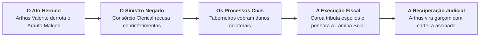
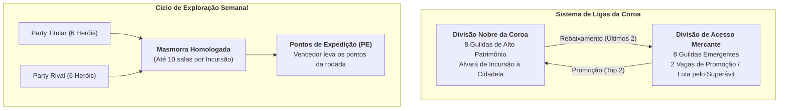
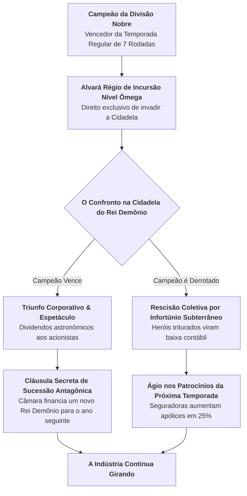

# HeroFoot — A Bíblia Oficial de Lore & Ambientação Canônica

> **Classificação Documental:** Códice Institucional, Histórico & Regulatório da Liga das Guildas  
> **Autoridade Emissora:** Chancelaria da Coroa & Câmara dos Mercadores Unidos da Capital  
> **Nível de Sátira Corporativa:** 7/10 (Humor burocrático, mordaz, cínico e impiedosamente mercantil)  
> **Conformidade Técnica:** [CONTRACT.md](file:///c:/Users/Rafael/Documents/herofoot/docs/CONTRACT.md)  
> **Regra de Ouro da Linguagem:** Proibição irrestrita de termos esportivos modernos literais (*gol*, *gramado*, *estádio*, *bilheteria*, *pênalti*). Todo fenômeno de competição é tratado como protocolo de incursão, expedição, auditoria de rendimento, disputa de concessão pública ou conformidade fiscal.

---

## Preâmbulo: O Edito de Conversão Mercantil nº 01/742

Nos primórdios da Primeira Era, poetas e trovadores cantavam baladas sobre bravos guerreiros que partiam em jornadas solitárias movidos por noções abstratas de honra, justiça e sacrifício. Essa fase da civilização foi posteriormente catalogada pelos economistas da Coroa como o **"Período do Heroísmo Improdutivo"**.

O modelo romântico de heroísmo provou-se financeiramente insustentável. Paladinos que salvavam aldeias costumavam devastar plantações durante os combates; magos que expurgavam abominações deixavam para trás terrenos baldios saturados de miasma arcano irrecuperável; e a Coroa arcava com os custos funerários de combatentes voluntários que sequer possuíam registro em cartório ou herdeiros tributáveis.

A partir do advento da **Grande Portaria de Regularização das Atividades de Risco (Ano 742)**, a salvação do reino deixou de ser um chamado vocacional e foi convertida no setor econômico mais rentável da história continental: a **Indústria de Incursão em Masmorras**.

---

## Capítulo 1: O Fim do Heroísmo Romântico — O Martírio Fiscal de Arthus Valente

### 1.1 A Batalha das Planícies da Primeira Queda
Quando as fendas abissais se abriram e o Primeiro Arauto do Rei Demônio — o titânico general abissal Malgok, o Devorador de Províncias — marchou sobre os campos centrais, as antigas profecias clericais se manifestaram. Os oráculos apontaram para o jovem **Arthus Valente**, um espadachim provinciano com sangue abençoado, cabelos dourados e uma devoção ingênua à Coroa.

Empunhando a lendária *Lâmina Solar do Alvorecer*, Arthus liderou uma investida épica de quarenta e oito horas ininterruptas. Ele degolou a besta gigante, dispersou as hordas das trevas e salvou a capital de uma aniquilação iminente. Ensanguentado, exausto e apoiado sobre o cabo de sua espada fumegante, Arthus aguardou a consagração real, o banquete no palácio e a canção de glória eterna prometida pelos textos sagrados.

Ele não recebeu nada disso. Em vez de trombetas, ouviu o bater seco de carimbos.

### 1.2 O Cerco Cartorário
Enquanto Arthus ainda cuspia cinzas do monstro abatido, foi abordado por três oficiais de justiça acompanhados por dois meirinhos da Fazenda Real. As cinzas ainda nem haviam esfriado quando ele foi citado formalmente em quatro autos de infração e dois processos de execução cautelar:

1. **Processo nº 00412-DF/738 (Responsabilidade Civil Subjetiva):** Movido conjuntamente pela *Associação dos Taberneiros e Estalajadeiros do Vale Central*. Durante a batalha, a onda de choque sagrada desferida pelo golpe final de Arthus estilhaçou cento e oitenta vitrais de tabernas em um raio de três léguas, rachou dezessete tonéis de cerveja preta importada e derrubou a chaminé do celeiro comunal. Valor da indenização pleiteada: 45.000 moedas de ouro por lucros cessantes e danos materiais emergentes.
2. **Negação de Sinistro nº 88/CLR (Consórcio Clerical de Seguros de Vida & Ressurreição):** Arthus solicitou a cobertura securitária para o tratamento de seu pulmão perfurado por presas demoníacas e a recomposição de três costelas fraturadas. O consórcio clerical indeferiu a solicitação com base na **Cláusula 14, Parágrafo 3º, Alínea 'b'**:  
   > *"Estão expressamente excluídos da cobertura básica os sinistros decorrentes de exposição voluntária e não comissionada a garras de categoria arqui-demoníaca sem o prévio preenchimento do Formulário Rúnico de Aptidão Ocupacional e sem o uso de Cota de Malha dotada de Certificado de Conformidade Técnica emitido pela Inspetoria Real."*
3. **Execução Fiscal nº 10.992 (Tributação sobre Ganho de Capital em Espólio de Guerra):** A Fazenda Real tributou a carcaça de Malgok em 65% a título de *Imposto sobre Importação Não Homologada de Matéria Orgânica Interplanar* e exigiu taxa de licenciamento retroativo pela utilização do espaço aéreo continental para a queda da lâmina sagrada.

### 1.3 A Penhora da Glória e o Acordo de Recuperação Judicial
Sem reservas monetárias e orientado por um defensor público cansado, Arthus Valente viu seus bens sagrados serem penhorados um a um na praça central:

- A armadura forjada pelos deuses ancestrais foi arrematada em leilão por um colecionador da guilda mercante por um terço do valor de mercado;
- A lendária *Lâmina Solar do Alvorecer* foi desmontada por oficiais da Casa da Moeda para a extração do fio de platina destinado a quitar custas cartorárias pendentes;
- O próprio Arthus, após declarar insolvência civil irretratável, foi enquadrado no **Plano de Recuperação Judicial de Ex-Aventureiros nº 12**.

Pelo acordo homologado pelo Tribunal de Contas da Coroa, Arthus foi obrigado a abandonar imediatamente a profissão de combatente. Qualquer tentativa de empunhar armas de guerra, manifestar auras luminosas ou combater anomalias cósmicas caracteriza descumprimento de obrigação judicial de não fazer, implicando reabertura da falência e prisão civil por desacato financeiro.

### 1.4 A Rotina no Bistrô & Taberna do Javali Cansado
Hoje, Arthus Valente acorda diariamente às 06h15 da manhã, coloca seu avental de algodão engomado e bate ponto às 07h00 no **Bistrô & Taberna do Javali Cansado**, estabelecimento de classe média localizado no Segundo Distrito da Capital.

- **Cargo:** Garçom Pleno de Balcão e Salão (com carteira profissional assinada e recolhimento previdenciário régio em dia).
- **Desempenho Funcional:** Seu atributo de Agilidade (AGI 95), residual de suas bênçãos celestiais, faz dele o colaborador mais produtivo da região: Arthus consegue transportar seis canecas de caldo de costela de javali e quatro bandejas de ensopado de nabo em terrenos irregulares sem verter uma única gota de gordura.
- **Filosofia de Vida:** Se um grupo de novatos empolgados entra no bistrô falando sobre "profecias", "honra" ou "o chamado dos justos", Arthus entrega o cardápio em silêncio, aponta para a taxa de serviço de 10% já inclusa na conta e adverte com olhar vítreo:  
  > *"Pede o refogado e não quebra a cadeira, garoto. Se essa perna de madeira lascar, o conselho dos estalajadeiros vai penhorar o sapato da sua mãe até a terceira geração."*

Arthus jamais aceita gorjetas em espadas ou amuletos. Ele só aceita moeda corrente com chancela fiscal visível.

---

## Capítulo 2: A Câmara dos Mercadores e o Capitalismo de Masmorra

### 2.1 A Grande Descoberta: O Apocalipse como Ativo Circulante
Após a ruína financeira de Arthus Valente, os monstros continuaram emergindo das fendas tectônicas e das catacumbas abandonadas. A Coroa estava à beira do colapso econômico. Foi nesse vácuo de poder e bom senso que a **Câmara dos Mercadores Unidos** interveio com a proposta mais audaciosa da história política:

> *"Monstros não são um castigo divino para sermos pranteados; são matérias-primas de alta densidade que se recusam a comparecer ao abatedouro por conta própria. Masmorras não são antros de trevas; são concessões públicas subterrâneas com altíssimo potencial de retorno operacional."*

Em questão de semanas, o combate a monstros foi formalmente privatizado e estruturado sob o modelo de **Ligas Corporativas de Guildas**:

1. **A Divisão Nobre da Coroa (Tier 1):** Composta por oito grandes conglomerados militares de elite (como a portentosa *Ordem do Grifo Dourado*, a aristocrática *Vanguarda do Dragão Real* e a blindada *Legião de Aço Eterno*). Possuem patrocinadores da alta corte, sedes palacianas e direito exclusivo a disputar as bonificações régias de fim de temporada.
2. **A Divisão de Acesso Mercante (Tier 2):** O circuito de combate da classe média comercial e novos empreendedores (onde atua a guilda do jogador, ao lado de corporações operárias como os *Corvos da Vigília*, a *Milícia de Prata*, o *Bastião de Ferro* e os artesãos da *Ordem da Pedra*). O objetivo vital aqui é obter uma das duas vagas de promoção e escapar do abismo do endividamento.
3. **O Sistema de Rodadas e Incursões:** A cada semana, as guildas são convocadas pelo Ministério dos Subsolos para explorar masmorras homologadas. A competição não ocorre no sangue direto entre as guildas (o que violaria os tratados anti-trust e geraria custos hospitalares redundantes), mas sim em uma **corrida paralela de produtividade sala a sala**, onde ambas enfrentam a mesma masmorra e disputam **Pontos de Expedição (PE)**.

### 2.2 Os Atletas-Aventureiros: Recursos Humanos Armados
No ecossistema do HeroFoot, heróis não são lendas míticas: são colaboradores técnicos de alto risco regidos por contratos de trabalho de temporada (1 a 3 temporadas):

- **O Recrutamento:**
  - **Academia de Aprendizes:** Centro de estágio e capacitação juvenil mantido pela guilda. Aqui o potencial de crescimento (1 a 5 Estrelas) é límpido e auditável. O custo de formação é baixo, mas exige tempo e investimento predial em dormitórios e instrutores.
  - **Mercado de Transferências da Coroa:** O balcão aberto de compra e venda de contratos profissionais entre guildas. Heróis chegam prontos com Poder calibrado, porém seu real potencial é mantido sob sigilo comercial com ponto de interrogação (`[???]`). O Superintendente assume o risco financeiro de contratar uma estrela consolidada ou pagar caro por um ativo já em declínio biológico.
- **A Dinâmica da Degradação Biológica:**
  - Combatentes atingem o auge físico aos 26–28 anos.
  - Ao alcançarem os 31 anos de idade, inicia-se o **declínio estrutural involuntário**: atributos como Força e Agilidade sofrem depreciação anual sistemática. Aposentadorias compulsórias e rescisões amigáveis passam a ser a pauta prioritária do departamento de Recursos Humanos.
- **Fadiga e Atestados Médicos:**
  - Cada incursão gera acúmulo de fadiga física e estresse metabólico.
  - Heróis com fadiga acima de 70 pontos passam ao estado funcional de **Fatigado**, sofrendo uma penalidade de rendimento de até 30% em seu Poder Efetivo.
  - Se a guilda ignorar a exaustão e insistir na escalação forçada, o colaborador corre o risco de sofrer lesões graves, sendo enquadrado pelo Conselho de Saúde no status de **Afastado**, exigindo repouso remunerado na Tenda de Curativos ou cirurgias caras no Complexo Médico-Hospitalar da Coroa.

### 2.3 A Tensão das Rações: A Logística de Incursão
Diferente dos romances de cavalaria onde heróis cavalgam indefinidamente sem comer, no HeroFoot **a duração de qualquer combate é estritamente delimitada pela Barra de Suprimentos**:

- Toda expedição autorizada recebe uma cota padrão de **100 unidades operacionais de Suprimentos** (rações secas, tochas seladas e unguentos básicos).
- Cada câmara subterrânea percorrida consome uma quantidade de energia dependente da severidade do terreno (lama tóxica, frio congelante, fendas sísmicas) e atenuada pela Agilidade média da Party.
- Se uma guilda atingir 0 de Suprimentos antes de alcançar a décima câmara, sua expedição é declarada **"Encerrada por Desabastecimento Logístico"**: os aventureiros empacam no corredor, recusam-se a avançar sem almoço e abandonam a disputa dos pontos restantes da sala.
- O cobiçado **Abate do Boss Final** na décima sala não é conquistado apenas com espadas afiadas, mas com o cálculo meticuloso de reservas energéticas e o uso estratégico do slot de **Consumível** (que confere cargas extras de ração militar fortificada e elixires calóricos).

### 2.4 As Quatro Oficinas da Liga e a Economia do Balcão
A manufatura de itens no HeroFoot obedece a uma regra imutável da administração pública medieval: **não existe milagre na bigorna**. A qualidade de um equipamento (*Fraco*, *Normal*, *Ótimo* ou *Lendário*) não depende da oração do ferreiro nem da pureza da gema, mas sim do nível de homologação institucional de suas oficinas:

1. **Ferragem:** Responsável por espadas, machados de duas mãos, couraças de placas e elmos de proteção.
2. **Alquimia:** Destilamento de tônicos energéticos, óleos térmicos e filtros anti-tóxicos para expedições em pântanos e caldeiras.
3. **Joalheria:** Encantamento de anéis de precisão, pingentes de amortecimento e amuletos de condutividade rúnica.
4. **Culinária:** Formulação de rações operacionais com alta densidade calórica e estabilizadores mágicos de prazo de validade.

No **Balcão Comercial da Guilda**, o Superintendente enfrenta o dilema capitalista perpétuo: equipar sua própria Party para vencer a próxima masmorra ou comercializar o artefato recém-forjado para atender à demanda anunciada no **Boletim Mercantil da Coroa**?

As margens de lucro são regulamentadas:
- *Promoção (0.8x):* Venda imediata e desespero de caixa para pagar salários de sexta-feira.
- *Preço Justo (1.0x):* Equilíbrio comercial perante os fregueses da guilda.
- *Preço Abusivo (1.35x):* Aposta na ganância pura e na tolerância oculta do comprador — correndo o risco de receber uma contraproposta humilhante ou de ver o item mofar na prateleira.

---

## Capítulo 3: A Final de Temporada — O Confronto Contra a Cidadela do Rei Demônio

### 3.1 A Concessão do 'Mundial de Clubes' Feudal
O Rei Demônio não é mais considerado um inimigo militar do Estado; ele é classificado pela Procuradoria Real como **"Ator Estratégico de Fomento Mercantil Contínuo"**.

O Soberano das Sombras reside confortavelmente nas profundezas da **Cidadela do Abismo Central**. Sua fortaleza foi devidamente demarcada pela Inspetoria de Obras Públicas, com rotas de acesso iluminadas, saídas de emergência padronizadas e fiscais de postura acompanhando a manutenção do fosso de magma.

O direito de marchar contra a Cidadela do Rei Demônio não pertence ao povo, nem à Igreja, nem a heróis voluntários. Esse privilégio épico — o equivalente monárquico ao maior evento desportivo do mundo — é **a propriedade comercial exclusiva do Campeão da Divisão Nobre da Coroa**.

### 3.2 O Ciclo Perpétuo: O Negócio Nunca Pode Morrer
O confronto de fim de temporada foi desenhado para ser matematicamente infalível para os cofres da aristocracia e da burguesia mercantil, independente do resultado físico nas masmorras:

#### Cenário A: O Campeão Triunfa e Destrói o Rei Demônio
Se a Party campeã executa o Rei Demônio com louvor técnico:
- Os arautos anunciam o "Triunfo da Ordem e da Produtividade Privada";
- O campeão recebe a **Taça Imperial de Platina**, a bonificação máxima da Coroa e uma isenção tributária de três meses em compras de minério de ferro;
- **A Operação dos Bastidores:** Imediatamente após a aclamação pública, a Câmara dos Mercadores convoca uma reunião sigilosa. Sem um Rei Demônio na cidadela, a indústria de armaduras, poções, contratos de aventureiros e transmissões de arautos colapsaria em menos de dois trimestres. Portanto, ativa-se o **Fundo de Preservação do Perigo Coletivo**: a Câmara financia, incuba e aloca um novo lorde das trevas (muitas vezes um lorde renegado, um demônio importado de além-mar ou um experimento de laboratório alquímico) na cidadela vaga. O contrato do novo monstro inclui cláusula de permanência de doze meses e exigência de manter o fosso de magma operacional.

#### Cenário B: O Campeão é Devorado na Sala do Trono
Se a Party campeã sucumbe perante os horrores da Cidadela:
- O departamento jurídico da guilda derrotada protocola instantaneamente a declaração de **"Rescisão Funcional Involuntária por Força Maior Subterrânea"**, cancelando o pagamento de bônus de performance aos familiares dos combatentes caídos;
- A Bolsa de Valores da Capital reage com euforia: o fracasso heroico prova à sociedade que "o perigo ainda é real e exige investimentos maciços";
- As cotas de patrocínio para a temporada seguinte sobem 25%, as mensalidades do Consórcio Clerical de Seguros sofrem reajuste preventivo, e o Rei Demônio emite uma nota de agradecimento aos patrocinadores pelo respeito às regras de conduta na arena.

A máquina nunca para. A paz definitiva seria a pior catástrofe fiscal que o reino poderia enfrentar.

---

## Capítulo 4: As Figuras do Reino

### 4.1 Lord Barnaby Vane, O Escriba-Chefe da Coroa
*Presidente do Conselho Regulador das Guildas & Secretário de Arrecadação de Incursões*

- **Perfil:** Homem de cinquenta anos, compleição magra, túnica de veludo cinza-chumbo com bordados de arminho e dedos permanentemente manchados com tinta indelével de chancela real.
- **Histórico:** Antigo chefe da Contabilidade Imperial de Suprimentos durante as guerras antigas. Foi o arquiteto da tese de que *um dragão morto que não gera arrecadação tributária representa desvio de finalidade do erário público*.
- **Postura:** Extremamente cortês, fala em tom pausado e professoral. Jamais empunhou uma adaga na vida, mas tem o poder de dissolver um esquadrão inteiro de berserkers com um único parágrafo em pergaminho oficial.
- **Frase Famosa:**  
  > *"O sangue seca em vinte minutos no chão de calcário. Uma glosa fiscal mal justificada na prestação de contas, por sua vez, ressoa na eternidade."*

---

### 4.2 Dona Eustáquia Grin, Coordenadora de Auditorias da Fase 5
*Inspetora-Chefe de Conformidade Patrimonial da Inspetoria de Contas Régias*

- **Perfil:** Senhora idosa com postura implacavelmente ereta, óculos redondos presos por correntes de ferro fundido e uma bolsa de couro repleta de carimbos de tinta escarlate com os dizeres: **INDEFERIDO**, **GLOSADO** e **MULTA FISCAL APLICADA**.
- **Função no Jogo:** É o terror absoluto do jogador ao final de cada semana (Fase 5). Enquanto o Superintendente está comemorando a vitória na masmorra, Dona Eustáquia bate à porta da guilda para inspecionar cada recibo de manutenção predial, folha salarial dos heróis e cumprimento dos KPIs das Metas da Coroa.
- **Postura:** Totalmente imune a carisma, subornos rústicos ou histórias dramáticas sobre aventureiros órfãos. Se a despesa com rações não tiver carimbo da vigilância bromatológica, o subsídio régio é retido sem hesitação.
- **Frase Famosa:**  
  > *"Não me venha falar de 'heroísmo perante o abismo', meu jovem. Mostre-me a nota fiscal da pomada cicatrizante e o comprovante de recolhimento previdenciário do clérigo. Sem comprovante, sem fomento."*

---

### 4.3 Barão Cassian Voss, Grão-Mestre da Câmara dos Mercadores
*Empreendedor de Concessões Subterrâneas & Presidente da Bolsa de Metais de Guerra*

- **Perfil:** Aristocrata robusto, barba impecavelmente aparada e anéis de rubi maciço em sete dos dez dedos. Usa mantos forrados com pele de urso invernal e exala aroma adocicado de tabaco élfico importado.
- **Histórico:** Herdou três minas de ferro decadentes e as transformou em masmorras de treinamento privado com cobrança de pedágio rúnico. Dono de redes de ferragens, manufaturas têxteis de capas para aventureiros e concessões de arautos de rua.
- **Modus Operandi:** Financia guildas endividadas na Divisão de Acesso com taxas de juros que beiram a extorsão legalizada. Quando uma guilda não consegue honrar o pagamento, o Barão aceita heróis talentosos ou receitas de forja como dação em pagamento.
- **Frase Famosa:**  
  > *"O Rei Demônio é o melhor sócio comercial que este reino já teve. Ele fornece a demanda por aço e nós fornecemos a oferta de lâminas. Quem pensar em matá-lo definitivamente estará cometendo traição à economia nacional."*

---

### 4.4 Arthus Valente, O Ex-Herói & Garçom Pleno
*Titular da Mesa 4 e Mestre da Bandeja no Bistrô & Taberna do Javali Cansado*

- **Perfil:** Homem de trinta e quatro anos, cabelos dourados com mechas prematuramente brancas nas têmporas, cicatriz no queixo em forma de meia-lua (decorrente do confronto contra o Primeiro Arauto) e um olhar calmo de quem já sobreviveu a deuses cósmicos e agora não teme nenhum cliente mal-humorado.
- **Equipamento Atual:** Avental de brim reforçado, abridor de garrafas de ferro batido e bloco de comandas com papel carbono triplo.
- **Status Jurídico:** Sujeito aos termos da Recuperação Judicial nº 12/738. Se tocar em qualquer objeto perfurocortante que ultrapasse o tamanho de uma faca de filé de salmão, recebe notificação do meirinho em quarenta e oito horas.
- **Rotina:** Atende com excelência mecânica. É o colaborador mais rápido da capital ao servir bebidas.
- **Frase Famosa:**  
  > *"Não tem destino manifesto aqui, senhor. O javali acompanha batatas rústicas e o pão de alho é cobrado à parte. Quer a comanda com o número da sua inscrição tributária ou vai pagar no dinheiro vivo?"*

---

### 4.5 Dr. Klaus Hollen, Médico Perito-Chefe do Conselho de Saúde das Guildas
*Presidente da Junta de Avaliação de Incapacidade Laboral das Ligas*

- **Perfil:** Médico-cirurgião de meia-idade, com olheiras profundas, guarda-pó com manchas de iodo e um estetoscópio rúnico pendurado no pescoço.
- **Função:** É o responsável por emitir ou negar atestados médicos e laudos periciais de incapacidade funcional (Fase 1). Tem a reputação de considerar costelas trincadas como "desconforto postural passageiro" e recomendar repouso de apenas 24 horas para heróis mordidos por basiliscos.
- **Filosofia:** "O aventureiro moderno reclama de qualquer espasmo necrótico. No meu tempo, arrancava-se o braço podre e voltava-se para o turno da tarde."
- **Frase Famosa:**  
  > *"O laudo diz 'Apto com Restrições'. A restrição é simples: tente não sangrar sobre o carpete da guilda rival."*

---

## Capítulo 5: Glossário de Conformidade Regulatória (Léxico Feudal-Corporativo)

Para preservar o rigor da ambientação e garantir a total observância ao [CONTRACT.md](file:///c:/Users/Rafael/Documents/herofoot/docs/CONTRACT.md), fica estabelecida a equivalência oficial de terminologia. O uso de jargões desportivos modernos crus em relatórios ou comunicações institucionais sujeita o autor a advertência formal do Conselho das Guildas:

| Termo Esportivo Proibido | Equivalente Canônico HeroFoot | Definição no Contexto Feudal-Corporativo |
|---|---|---|
| **Gol** | **Ponto de Expedição (PE)** | Unidade métrica de rendimento operacional conquistada pela purificação de uma câmara ou abate de criatura perante os auditores da rodada. |
| **Gramado / Campo** | **Câmara de Masmorra / Recinto de Incursão** | Instalação subterrânea ou via hostil concessionada pela Coroa para as operações semanais da Liga. |
| **Estádio** | **Complexo de Masmorras / Arena da Concessão** | Estrutura geológica homologada pelo Ministério dos Subsolos onde as guildas disputam a prioridade de avanço. |
| **Escanteio / Falta** | **Fricção Tática / Incidente Operacional** | Desentendimento entre grupos de batedores ou necessidade de recomposição de formação defensiva em corredor estreito. |
| **Bilheteria** | **Prebenda de Audiência / Taxa de Arauto** | Remuneração recolhida pelas prefeituras e guildas pela presença de público nas praças e postos de transmissão mística de resultados. |
| **Brasfoot / Fantasy** | **Simulador de Gestão de Concessões Heroicas** | O próprio HeroFoot: ferramenta de contabilidade gerencial, RH de risco e tática de guildas armadas. |
| **Contrato de Jogador** | **Contrato de Prestação de Serviços de Incursão** | Acordo comissionado por temporadas estipulando salário semanal, cláusula de rescisão e bônus de assinatura. |
| **Técnico / Treinador** | **Superintendente de Expedições / Mestre de Guilda** | O jogador: responsável pela estratégia, forja, finanças, compras e escalação de pessoal. |
| **Torcida Organizada** | **Liga de Patronos & Claque das Tabernas** | Associação de burgueses e arruaceiros que apostam moedas nas praças e cobram a demissão da diretoria. |

---

> *Registrado e chancelado no Grande Arquivo da Chancelaria Real sob a guarda de Lord Barnaby Vane. Qualquer alteração não homologada constitui crime de lesa-majestade contábil.*
