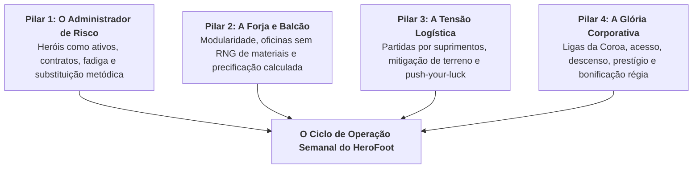
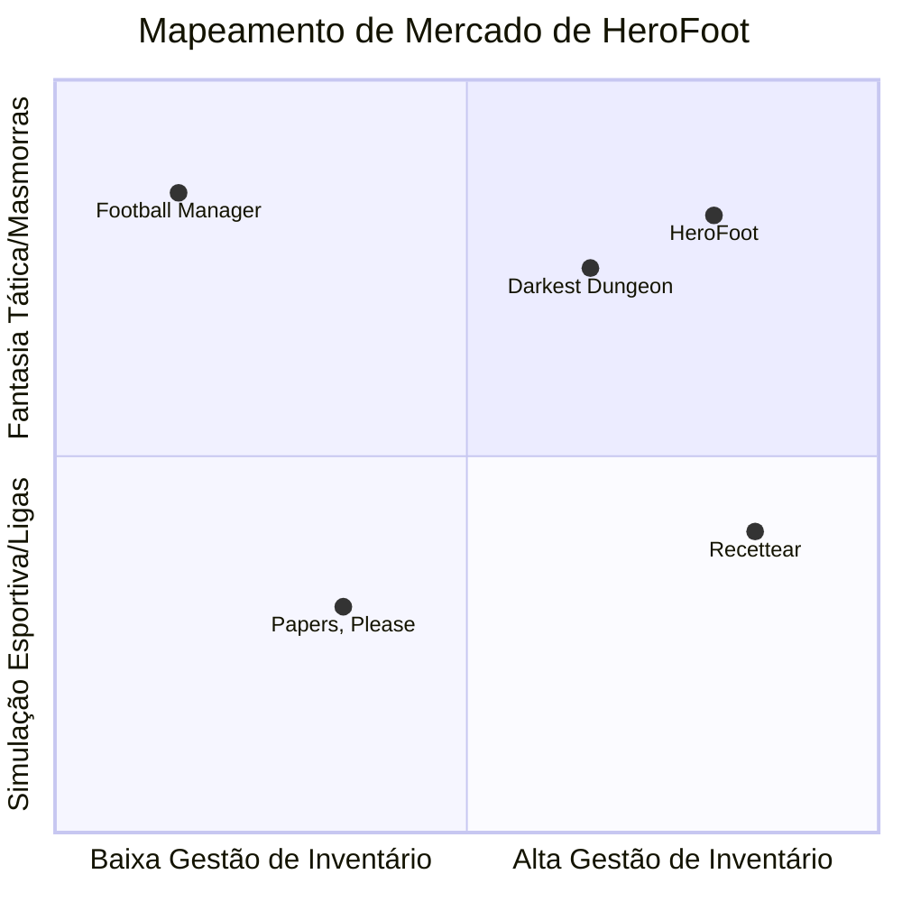

# HeroFoot — Documento de Posicionamento de Marca & Mapeamento de Produto

> **Classificação de Documento:** Estratégia de Marca, Comunicação & Posicionamento Comercial  
> **Responsável:** Diretoria de Marketing & Brand Lead  
> **Alinhamento Canônico:** Conforme [CONTRACT.md](file:///c:/Users/Rafael/Documents/herofoot/docs/CONTRACT.md) e [ORCHESTRATOR_INSTRUCTIONS.md](file:///c:/Users/Rafael/Documents/herofoot/ORCHESTRATOR_INSTRUCTIONS.md)  
> **Tom Institucional:** Fantasia Corporativa (Nível 7/10)

---

## 1. Pitches de Posicionamento

### 1.1 O Pitch de Elevador (30 a 45 segundos)
Em um reino onde a glória é tributada e masmorras são tratadas como concessões públicas de alto risco, liderar uma guilda de aventureiros não é uma jornada romântica sobre destino ou heroísmo: é um exercício impiedoso de gestão de recursos humanos, logística de suprimentos e margens operacionais. Na Liga da Coroa, o heroísmo é medido em laudos de produtividade, e cada expedição é uma auditoria de campo onde monstros devoram o despreparado e a morte de um combatente é registrada friamente como rescisão de contrato por força maior.

Como Superintendente-Geral da sua guilda, você opera na interseção entre a forja e a câmara de guerra: forje equipamentos modulares em quatro oficinas especializadas, decida se vende artefatos raros no balcão da loja para pagar os custos de manutenção ou se os equipa em sua Party de elite, e envie seus seis titulares para masmorras brutais administrando cada ração de suprimento antes que a fome anule o avanço. Supere guildas rivais na tabela semanal, evite a humilhação do rebaixamento para a Divisão de Acesso e conquiste as prebendas da Divisão Nobre da Coroa.

### 1.2 O Hook Ultra-Rápido (Steam Storefront & Social Ads)
> **"Assuma a diretoria executiva de uma guilda de aventureiros: forje equipamentos modulares, gerencie suprimentos em masmorras letais e escale a Liga da Coroa — onde heróis são ativos depreciáveis e a morte é apenas quebra contratual."**

---

## 2. Visão Geral & Logline

* **Título:** HeroFoot
* **Gênero:** Simulador Tático de Gestão de Guilda / Tycoon de Fantasia / Gerenciamento de Ligas
* **Plataforma Inicial:** PC (Steam / Windows)
* **Logline:** Em uma sociedade feudal hiperburocratizada, administre uma empresa de expedições armadas: contrate mercenários, opere oficinas industriais, explore masmorras sala a sala disputando pontos contra guildas concorrentes e conduza sua corporação da lama da Divisão de Acesso ao prestígio aristocrático da Divisão Nobre da Coroa.
* **Proposta Única de Valor (PVP/USP):** HeroFoot combina a profundidade matemática de um simulador de carreira e ligas por temporadas com a crueza tática de um rastreador de masmorras guiado por rações de suprimentos e uma economia orgânica de forja modular. Diferente dos RPGs clássicos, você não empunha a lâmina; você administra a apólice, o soldo e o desgaste da lâmina.

---

## 3. Pilares de Experiência (O Que o Jogador Sente e Faz)

### Pilar 1: O Dilema do Administrador de Risco (Recursos Humanos Medievais)
O jogador sente o peso de liderar pessoas talentosas porém descartáveis em um ecossistema hostil. Cada herói possui atributos primários detalhados (`str`, `agi`, `vit`, `int`, `wis`, `lck`), um índice sintético de **Poder (1 a 100)** e um estado de prontidão física (`Apto`, `Fatigado`, `Afastado`). Escalar um herói exausto reduz seu rendimento combativo em até 30% e arrisca lesões permanentes. Na Academia de Aprendizes, o potencial de 1 a 5 Estrelas é transparente; no Mercado de Transferências da Coroa, o potencial é oculto sob ponto de interrogação (`[???]`), forçando o jogador a agir como um olheiro pragmático que calcula risco versus capital.

### Pilar 2: O Prazer Tátil da Forja & Oportunismo Comercial
A manufatura de equipamentos não depende de sorte no minério, mas sim do nível de homologação institucional das suas instalações (`Ferragem`, `Alquimia`, `Joalheria` e `Culinária`). O jogador sente a satisfação de projetar itens customizados combinando prefixos funcionais, bases sólidas e sufixos rúnicos. No Balcão da Loja, surge o dilema comercial: abastecer sua própria Party ou capitalizar em cima da demanda aquecida do Boletim Econômico da Coroa, estipulando margens de *Promoção*, *Preço Justo* ou *Preço Abusivo* frente à tolerância dos compradores locais.

### Pilar 3: A Tensão Logística das Incursões por Suprimentos
A masmorra não é uma tela estática de combate por turnos nem um passeio cronometrado: é uma **operação de avanço paralelo com duração variável determinada pela Barra de Suprimentos**. Com 100 unidades base de ração e tochas, cada sala consome energia conforme a aspereza do terreno e a agilidade da Party. O jogador vibra e sofre a cada encontro disputado contra a guilda rival que percorre o mesmo complexo subterrâneo. O objetivo não é apenas sobreviver: é poupar recursos para ter fôlego de reivindicar o Abate do Boss Final na 10ª sala.

### Pilar 4: A Ambição Corporativa da Ascensão de Divisão
O campeonato da Coroa não perdoa complacência. Em temporadas estruturadas de 7 rodadas, 8 guildas disputam palmo a palmo cada Ponto de Expedição. Vencer significa abocanhar as cobiçadas bolsas de ouro da Bonificação Régia e garantir uma das duas vagas de acesso à prestigiada **Divisão Nobre da Coroa**; fracassar significa afundar na lanterna e enfrentar o fantasma do rebaixamento para a **Divisão de Acesso Mercante**.

---

## 4. O Loop Semanal em 5 Fases

A rotina de um Superintendente no HeroFoot segue um ciclo rítmico, sem o microgerenciamento enfadonho de dias individuais. Cada semana representa uma rodada operacional da temporada:

| Fase | Título Operacional | Foco Estratégico de Produto & Gameplay |
|---|---|---|
| **Fase 1** | **Gestão de Recursos Humanos & Cuidados da Base** | Monitoramento de Fadiga (+20 ganho por incursão, -20 recuperação em repouso), emissão de laudos para heróis afastados e triagem da Academia de Aprendizes para promover novatos promissores ao elenco principal. |
| **Fase 2** | **Forja Modular & Economia de Balcão** | Aquisição de materiais e manuais de forja, manufatura em oficinas de Ferragem, Alquimia, Joalheria e Culinária, precificação no Balcão sob a influência de Boletins da Coroa e caça a reforços no Mercado. |
| **Fase 3** | **Planejamento Logístico & Montagem Tática** | Definição da Party titular (6 heróis de campo) e Reserva (3 heróis de prontidão). Equipamento do Loadout Coletivo nos 5 Slots (`Arma`, `Armadura`, `Joia`, `Inscrição`, `Consumível`) para mitigar o terreno da rodada. |
| **Fase 4** | **A Incursão de Campo (Match Engine)** | Simulação simultânea da masmorra em até 10 salas. Consumo de suprimentos por agilidade média, resolução de encontros por razão de Poder Efetivo e disputa decisiva pelo Boss Final. |
| **Fase 5** | **Resultados, Balanço Fiscal & Atualização da Liga** | Coleta de saques e espólios, apuração dos Pontos de Expedição, pagamento dos custos de manutenção semanal da sede, dedução de salários e atualização da Tabela Oficial da Divisão. |

---

## 5. Engenharia de Sistemas & Ganchos de Retenção

### 5.1 A Forja Modular v2 & Economia de Balcão: O Ciclo Virtuoso do Ouro
O sistema de crafting do HeroFoot elimina o vício de frustração de materiais aleatórios:
* **Padronização Material:** Barras de ferro, linho ou gemas brutas possuem especificações uniformes. A qualidade do item resultante (*Fraco*, *Normal*, *Ótimo*, *Lendário*) é uma curva probabilística estritamente amarrada ao **Nível da Oficina** (Níveis 1 a 6). Quer itens Lendários consistentes? Invista capital para modernizar suas oficinas de Ferragem, Alquimia, Joalheria e Culinária.
* **Gramática Modular dos 5 Slots:**
  $$\text{Item} = [\text{Prefixo}] + [\text{Item Base}] + [\text{Sufixo}]$$
  Um *Machado de Batalha do Pântano* concede mitigação ambiental contra Terreno Alagado; um *Amuleto Sólido da Preservação* expande a carga de suprimentos da party.
* **O Balcão como Motor Financeiro:** O excedente da forja não é despejado em um mercador passivo. No balcão de varejo da guilda, o jogador manipula margens (`Promoção`, `Preço Justo`, `Preço Abusivo`). Compradores possuem um limiar de tolerância invisível. Esticar a corda em época de Boletim Econômico pode triplicar o caixa da guilda ou resultar em contrapropostas humilhantes e estoques encalhados.

### 5.2 O Sistema de Expedições por Suprimentos: O Push-Your-Luck Logístico
Diferente de simulações com tempo fixo, a partida no HeroFoot é regida pela **Barra de Suprimentos (Base: 100 pontos)**:
* **O Custo da Marcha:** Cada sala percorrida cobra uma taxa de suprimento dependente da aspereza do terreno e atenuada em até 20% pela Agilidade média da party titular.
* **O Risco da Marcha Forçada:** Uma guilda cujos suprimentos esgotam é forçada a montar acampamento de emergência, retirando-se da masmorra ("Suprimentos Esgotados"). Ela não pontua mais na rodada.
* **O Confronto Paralelo:** A guilda rival percorre o mesmo labirinto simultaneamente. Em salas com encontros mútuos, a disputa pelo Ponto de Expedição é travada por comparação de Poder Efetivo.
* **O Clímax do Boss Final:** Somente quem chega à 10ª sala com suprimentos remanescentes disputa o prêmio máximo. Se ambas as guildas alcançarem o Boss, uma supremacia superior a 15% de Poder confere o abate solo (+2 Pontos de Expedição); se as forças forem equiparadas, a Coroa homologa um **Abate Conjunto** (+1 Ponto para cada guilda).

### 5.3 O Sistema de Ligas da Coroa: A Escala Hierárquica do Feudalismo Corporativo
A ambição do jogador é sustentada por uma estrutura de ligas dinâmica:
* **Divisão de Acesso Mercante:** Onde a guilda do jogador começa. Orçamentos apertados, heróis rústicos, infraestrutura precária e masmorras com saques modestos. Os dois melhores sobem ao fim das 7 rodadas; os lanternas lutam pela sobrevivência econômica.
* **Divisão Nobre da Coroa:** O ápice do prestígio. Guildas históricas como a *Ordem do Grifo Dourado* e o *Pacto do Dragão*, ostentando veteranos com Poder superior a 75 e bônus de equipamentos devastadores. Recompensas de até 1.500 Moedas de Ouro para o campeão da temporada, com duas vagas de descenso impiedoso para a Divisão de Acesso.

---

## 6. O Tom: Diretriz de Fantasia Corporativa (Nível 7/10)

O diferencial de marca do HeroFoot reside na sua calibração de humor: **a fantasia é brutalmente real, mas o tratamento administrativo é gélido**. 

Nenhum monstro porta gravata ou usa pasta executiva; dragões devoram carne e masmorras contêm armadilhas letais. O humor nasce exclusivamente da indiferença dos formulários da guilda e das portarias da Coroa ao tratarem essas tragédias como meras oscilações de inventário e horas-trabalho.

### 6.1 Matriz de Validação de Marca (O que Fazer vs. O que Descaracteriza)

| Dimensão de Marca | ✅ Aceitável & Recomendado (Nível 7/10) | ❌ Descaracteriza & Proibido (Nível 10 / Paródia Boba) | ❌ Proibido (Anacronismo Moderno / Futebol) |
|---|---|---|---|
| **Lesões & Acidentes** | "Herói afastado por Esmagamento de Mão em Armadilha. Solicitação de auxílio-invalidez indeferida por negligência de protocolo." | "O guerreiro tomou uma flechada no joelho e foi chorar no RH." | "O atacante sofreu uma torção no tornozelo e desfalca a equipe no gramado." |
| **Equipamentos & EPI** | "Botas de Chumbo Tratado com Certificação Régia para Mitigação de Queda de Rochas." | "Colete Balístico de Feedbacks Construtivos." | "Chuteira cano alto com travas de alumínio para jogo na chuva." |
| **Relatórios de Batalha** | "Incursão concluída: 3 Pontos de Expedição homologados, 1 Abate de Boss registrado, 82 rações consumidas." | "Nossos aventureiros arrasaram na sinergia e deram uma surra nos noobs!" | "Goleada histórica de 4 a 1 com direito a gol nos acréscimos do segundo tempo." |
| **Morte em Serviço** | "Rescisão involuntária por óbito em combate. Equipamentos retidos pela Guilda para quitação de débito de treinamento." | "O Goblin do RH veio buscar a carteira de trabalho do defunto." | "Demissão por justa causa com suspensão do FGTS e rescisão contratual via CLT." |
| **Finanças & Mercado** | "Boletim Econômico da Coroa: Demanda elevada por armas de corte devido ao cerco oriental. Margens inflacionadas." | "Promoção Relâmpago da Black Friday na Loja do Goblin Esperto!" | "Janela de transferências da Europa fecha à meia-noite com empréstimo do centroavante." |
| **Gestão de Pessoal** | "Afastamento preventivo por Fadiga Aguda. Herói inapto para operações de alto impacto nesta rodada." | "O mago pediu atestado falso porque estava de ressaca de hidromel." | "Jogador afastado por desgaste muscular após maratona de jogos no estádio." |
| **Infraestrutura** | "Modernização da Oficina de Ferragem para o Nível 3 homologada pelo Conselho das Corporações." | "Upgrade no Vale-Refeição e mesa de pingue-pongue instalada na sede da guilda." | "Reforma do gramado da arena e ampliação da capacidade das arquibancadas." |

---

## 7. Público-Alvo, Personas & Benchmarks de Mercado

### 7.1 Benchmarks de Mercado (Os "Pais Espirituais" do HeroFoot)

1. **Football Manager:** A inspiração da estrutura. Menus densos, sensação de autoridade executiva, scouting de talentos, gestão de fadiga, tabelas de pontos corridos, promoção e rebaixamento.
2. **Darkest Dungeon:** A crueza da atmosfera de expedição. O perigo real das masmorras, a sensação de que aventureiros são frágeis e o gerenciamento estrito de tochas e comida (aqui sintetizados na Barra de Suprimentos).
3. **Recettear: An Item Shop's Tale:** O prazer mercadológico de abrir a própria loja, inspecionar a tolerância de preços dos fregueses e lucrar com os excedentes das expedições.
4. **Papers, Please:** A comédia obscura do rigor regulatório e o peso da burocracia estatal onde leis, taxas e carimbos têm mais poder que os heróis.

### 7.2 Personas de Jogador

#### Persona A: "O Engenheiro de Planilhas" (Valdemar, 29 anos)
* **Perfil:** Jogador ávido de *Football Manager*, *Out of the Park Baseball* e *RimWorld*.
* **O que busca:** Tomada de decisão sistêmica, cálculo de retorno sobre investimento (ROI), prazer em otimizar atributos e ver seu time evoluir matematicamente ao longo de temporadas.
* **O que HeroFoot entrega:** O cálculo do Poder Efetivo, os 5 slots de bônus capped, a gestão milimétrica da fadiga e o acompanhamento da tabela da Liga da Coroa rodada a rodada.

#### Persona B: "O Comerciante Voraz" (Helena, 24 anos)
* **Perfil:** Fã de *Recettear*, *Potion Craft*, *Dave the Diver* e jogos de economia de balcão.
* **O que busca:** Satisfação em desbloquear receitas, aprimorar instalações da guilda, precificar com margem abusiva em momentos de pico de mercado e ver o cofre abarrotado de ouro.
* **O que HeroFoot entrega:** As 4 oficinas temáticas, o sistema determinístico de qualidade atrelado ao nível predial, a gramática de prefixos/sufixos e as negociações dinâmicas de balcão com compradores.

#### Persona C: "O Estrategista de Risco" (Thiago, 33 anos)
* **Perfil:** Veterano de *Darkest Dungeon*, *Battle Brothers*, *FTL* e *XCOM*.
* **O que busca:** Tensão, push-your-luck, risco calculado de perder recursos valiosos e o sentimento de triunfo ao derrotar um chefe perigoso na última gota de energia.
* **O que HeroFoot entrega:** O avanço sala a sala regido por 100 de suprimento, a exigência de mitigações de terreno (frio, pântano, minas) e a tensão de disputar o Abate do Boss Final contra a guilda rival.

---

## 8. Slogans, Headlines & Copywriting Promocional

### 8.1 Slogans Principais
* *"HeroFoot: Onde a glória é tributada e masmorras exigem laudo técnico."*
* *"Menos épico, mais eficiência: administre o negócio da aventura."*
* *"Não empunhe a espada. Gerencie a depreciação dela."*
* *"Na Liga da Coroa, a vitória não é sorte; é logística."*

### 8.2 Headlines para Anúncios & Mídias Sociais
* **Para a comunidade de gerenciamento:** *"Você já levou times modestos ao título continental. Agora tente manter seis mercenários vivos na lama de um pântano tóxico sem estourar o orçamento da semana."*
* **Para a comunidade de RPG tático:** *"Esqueça o 'escolhido do destino'. No HeroFoot, o herói de 5 estrelas custa caro, exige manutenção semanal e se recusa a entrar na masmorra se a fadiga passar de 70%."*
* **Para os amantes de crafting & tycoon:** *"Forje armas com mitigações ambientais, descubra se o cliente tolera um Preço Abusivo e use o lucro do balcão para pagar as despesas operacionais da sua sede."*

### 8.3 Chamadas de Recrutamento In-Game (Diegéticas)
* *"Aviso Régio nº 402: Abertas as inscrições para a Divisão de Acesso Mercante. A Coroa não se responsabiliza por membros devorados em cavernas não homologadas."*
* *"Seja um Superintendente de Guilda: Transforme sangue em ouro e aprendizes em patrimônio líquido."*
* *"Lembre-se: Um aventureiro que descansa é um aventureiro que consome ração sem gerar dividendos. Mantenha as turmas em escala de revezamento."*

---
*Documento aprovado e registrado perante o Conselho das Corporações de Aventureiros da Coroa.*
