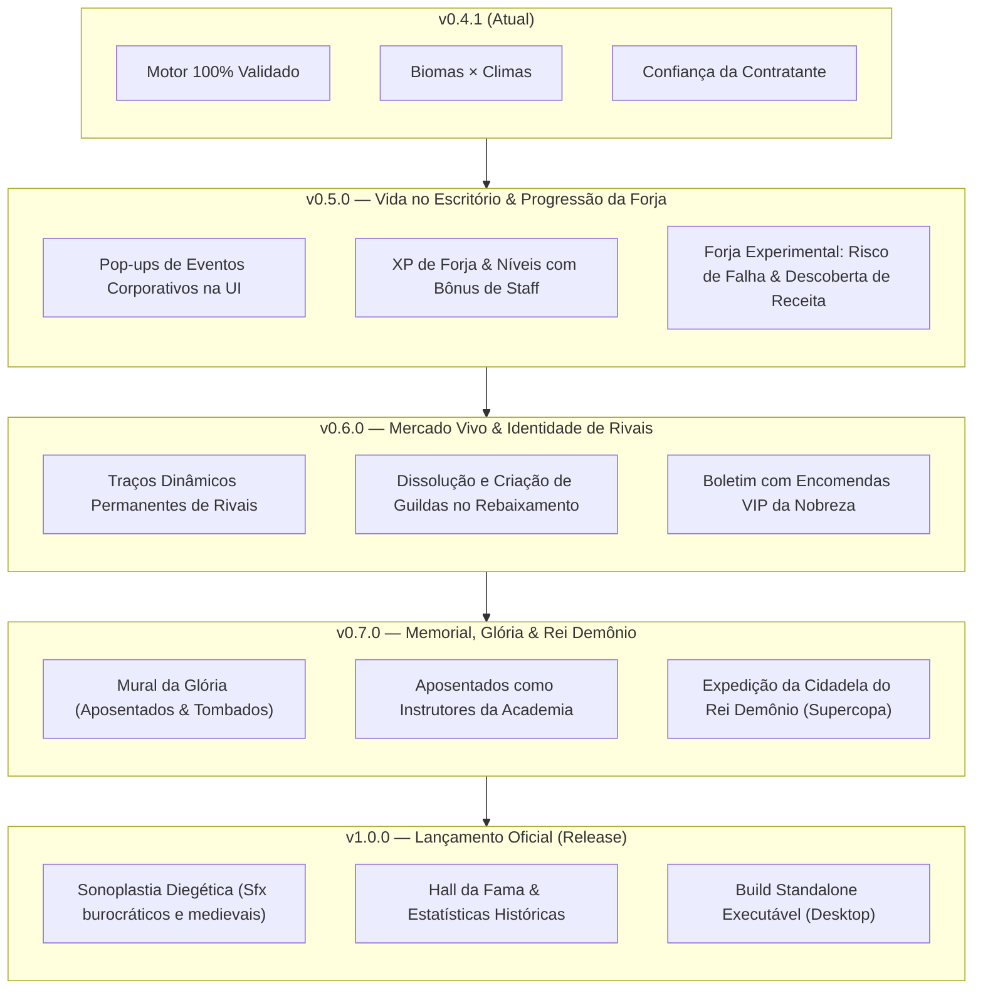

# 📋 HeroFoot — Documento Oficial de Roadmap & To-Do até o 1.0

> **Classificação:** Planejamento Estratégico, Backlog Arquitetural & Regras de Design  
> **Versão Vigente:** v0.4.1  
> **Tom:** Fantasia Corporativa 7/10 (Mundo medieval sério, frieza burocrática e sátira mercantil)  
> **Conformidade:** [CONTRACT.md](file:///c:/Users/Rafael/Documents/herofoot/docs/CONTRACT.md) & [LORE_BIBLE.md](file:///c:/Users/Rafael/Documents/herofoot/docs/LORE_BIBLE.md)  

---

## 🏗️ 1. Pilares & Features Aprovadas para o 1.0

### ⚒️ 1.1 Progressão Real das Lojas: XP de Forja & Bônus de Staff Intercalados
Em vez de upgrades que apenas aumentam a porcentagem de itens raros ou menus soltos de funcionários, a progressão das lojas (Ferragem, Alquimia, Joalheria, Culinária) se torna uma jornada empresarial completa:
- **Barra de Experiência (XP de Bancada):**
  - Cada item forjado gera XP para a respectiva oficina (itens mais complexos geram mais XP).
  - A curva de XP para subir de nível é exponencial leve ($XP_{req} \approx Base \times 1.5^{nível}$).
  - Subir de nível consome a XP acumulada + taxa de modernização em ouro da Câmara.
  - Para balancear o valor econômico, os preços dos insumos sobem em camadas de complexidade.
- **Árvore de Benefícios Intercalados por Nível:**
  - **Nível 1 (Bancada Básica):** Produção de receitas comuns (Tier 1), qualidades Fraco/Normal.
  - **Nível 2 (Processos Padronizados):** Desbloqueio da qualidade *Ótimo* e primeiro boost de probabilidades.
  - **Nível 3 (Economia de Escala / Aprendiz de Apoio):** Reduz em 15% o consumo de materiais principais das receitas deste ramo.
  - **Nível 4 (Expansão de Linha):** Desbloqueio de receitas Tier 2 (itens mais pesados/complexos) e novos afixos.
  - **Nível 5 (Mestre de Bancada Residente / Staff):**
    - *Ferragem:* Mestre Armeiro — Permite forjar itens de Tier 3 e concede chance de afixo duplo.
    - *Alquimia:* Mestre Boticário — Concede +1 carga operacional máxima a todas as poções e consumíveis forjados.
    - *Joalheria:* Mestre Lapidador — Aumenta em +20% a tolerância dos compradores no balcão para joias/inscrições.
    - *Culinária:* Chefe de Intendência — Rações restauram +15 de energia extra na expedição.
  - **Nível 6 (Ateliê Imperial de Referência):** Acesso a receitas e afixos Lendários exclusivos + selo de grife que eleva o valor de venda em +25%.

---

### 🧪 1.2 Forja Experimental & Descoberta com Risco (*Tinkering*)
- **Mecânica:** O jogador pode tentar forjar combinações livres e colocar materiais mais nobres ou não-catalogados na receita para buscar itens de qualidade superior.
- **Risco Técnico:** Se o jogador tentar forjar uma receita de nível muito superior ao nível atual de sua bancada, **o craft falha** (produzindo uma *Gororoba* ou refugo comercializável).
- **O Ganho Permanente:** Mesmo falhando fisicamente no resultado imediato, **o jogador homologa a receita no seu catálogo**. Ele terá a fórmula registrada e guardada para quando sua oficina atingir o nível necessário!

---

### 📜 1.3 Boletim de Mercado Expandido: Encomendas da Nobreza & Contratos VIP
- **Mecânica:** Evolução direta do Boletim de Mercado existente.
- Além do multiplicador de demanda geral de um slot (ex: *Armaduras x2.2*), o Boletim passa a sortear **Ordens de Serviço Especiais da Câmara ou da Nobreza**:
  - Exemplo: *"A Guarda Ducal abriu edital de compra prioritária: 1 Cota de Malha de qualidade Ótima. Pagamento: 2.5x o valor de tabela + 10 pontos de Confiança da Contratante."*
  - O jogador pode atender diretamente a essa cota prioritária no Balcão para faturar prêmios corporativos de prestígio.

---

### ⚔️ 1.4 Perfis Permanentes de Rivais & Dissolução de Guildas Rebaixadas
- **Identidade Genética no Nascimento:**
  - Cada guilda rival recebe, no momento de sua geração no mundo, uma **combinação fixa de traços táticos e corporativos** que definem sua filosofia:
    - *Exemplos Táticos:* Paredão de Aço (foco defensivo), Ofensiva Imprudente (alto dano, desgaste rápido), Mestre de Pântanos (especialistas em biomas tóxicos).
    - *Exemplos Corporativos:* Guilda Nobre Aristocrática (orçamento farto, inflaciona lances no mercado), Cooperativa Operária (foco em aprendizes e folha salarial magra), Predadores do Balcão (compram itens fortes do jogador para se reforçar).
- **Rebaixamento com Liquidação Judicial:**
  - As 2 guildas que caírem na lanterna da **Divisão de Acesso** são **dissolvidas por falência** no final da temporada!
  - Para a temporada seguinte, **duas novas guildas são fundadas pela Câmara dos Mercadores**, com novos nomes heráldicos, novos heróis e novos traços sorteados, garantindo dinamismo e renovação perpétua no campeonato.

---

### 🏛️ 1.5 Mural da Glória & Memorial Corporativo
- **Heróis Aposentados:**
  - Atletas que atingem 34+ anos e encerram contratos entram no *Quadro de Honra*.
  - Podem ser recontratados pela guilda como **Instrutores da Academia de Base**, transferindo bônus passivo para as novas gerações de aprendizes.
- **Heróis Tombados (Memorial de Baixas em Serviço):**
  - Registro solene dos que caíram em combate em masmorras de alto risco ou contra o Rei Demônio.
  - Exibe prontuário de serviço: expedições completadas, pontos de expedição conquistados e causa jurídica da baixa (*"Sinistro em Incursão sem Cobertura Securitária"*).

---

### 👑 1.6 O Desafio Máximo: Cidadela do Rei Demônio (Endgame)
- Apenas o campeão da **Divisão Nobre da Coroa** ganha a autorização corporativa para o confronto anual contra o Rei Demônio.
- Conclusão triunfal com Certificado Imperial da Coroa, prêmio milionário de fomento e entrada no Hall da Fama das Guildas.

---

## 🗺️ Roadmap de Versões até o 1.0

---

## 📋 Como Ficamos: Resumo dos Próximos Passos Imediatos

| Marco | Foco Principal | Entregáveis Chave |
| :--- | :--- | :--- |
| **v0.5.0** *(Próximo)* | **Vida no Escritório & Forja v3** | • Interface de Eventos Corporativos interativos na Fase 1. • Barra de XP para cada bancada com bônus de Staff intercalados (1 a 6). • Sistema de Tinkering (falha técnica com homologação permanente da receita). |
| **v0.6.0** | **Rivais Vivos & Contratos VIP** | • Sorteio de características permanentes dos times NPC. • Dissolução e geração de novas guildas ao rebaixar na Divisão de Acesso. • Encomendas VIP no Boletim de Mercado. |
| **v0.7.0** | **Memorial & O Rei Demônio** | • Mural da Glória e Memorial de baixas. • Aposentados como instrutores de base. • Incursão da Cidadela do Rei Demônio para o campeão da Divisão Nobre. |
| **v1.0.0** | **Polimento Audiovisual & Lançamento** | • Efeitos sonoros (carimbo, moedas, forja, cornetas). • Hall da Fama definitivo. • Empacotamento Desktop executável. |
