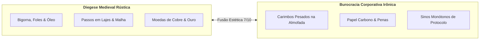

# 🔊 HeroFoot — Documento Oficial de Identidade Sonora & Catálogo de Áudio v1.0

> **Classificação:** Diretriz Artística, Especificação Técnica & Catálogo Acústico  
> **Versão Vigente:** v1.0.0-draft  
> **Autoridade Emissora:** Departamento de Sonoplastia & Conselho Regulador de Frequências da Coroa  
> **Tom Obrigatório:** Fantasia Medieval Diegética + Burocracia Corporativa Irônica (Nível 7/10)  
> **Conformidade Normativa:** [CONTRACT.md](file:///c:/Users/Rafael/Documents/herofoot/docs/CONTRACT.md) & [LORE_BIBLE.md](file:///c:/Users/Rafael/Documents/herofoot/docs/LORE_BIBLE.md)  
> **Regra de Ouro Acústico-Léxica:** Proibição irrestrita de termos esportivos modernos (*gol*, *gramado*, *estádio*, *escanteio*, *bilheteria*, *pênalti*). O ambiente sonoro traduz a frieza dos registros contábeis combinada ao peso artesanal das oficinas e ao perigo calculado das masmorras.

---

## 1. Tom Sonoro do HeroFoot

### 1.1 Conceito Central: Fantasia Medieval + Burocracia Corporativa Irônica
O universo sonoro do **HeroFoot** repousa sobre uma contradição proposital e bem-humorada: o heroísmo romântico medieval faliu e foi substituído por uma impiedosa engrenagem de produtividade cartorária.

Cada evento no jogo precisa soar simultaneamente como um ato físico tangível (o martelo atingindo o ferro incandescente, as botas enlameadas sobre a laje fria da cripta, o tilintar de moedas cunhadas) e um protocolo administrativo (o carimbo pesado na celulose amarelada, o arquivamento de um atestado médico, o rasgar de recibos glosados pela auditoria).

A sonoplastia não busca simular um épico de fantasia grandiloquente e glorioso; ela traduz a rotina de uma empresa de aventureiros onde até o abate de uma besta infernal é acompanhado pelo preenchimento de formulários de baixa patrimonial.



---

### 1.2 A Dualidade Sonora
A assinatura de áudio do HeroFoot é erguida sobre dois pilares indissociáveis:

1. **Sons Medievais Diegéticos:**
   - **Oficinas:** O tinir metálico e reverberante de bigornas antigas, o borbulhar denso de caldeirões alquímicos, o corte limpo de gemas na joalheria e o chiado de gordura de javali nas frigideiras de ferro da culinária de campanha.
   - **Masmorras:** O eco cavernoso de corredores subterrâneos, o atrito de cotas de malha e couro endurecido, cornetas de bronze rústicas anunciando início de incursões e rosnados distantes que reverberam por galerias úmidas.
   - **Comércio:** O choque orgânico de moedas de metal pesado derramadas sobre pranchões de carvalho maciço.

2. **Sons Burocráticos Irônicos:**
   - **Cartório & Fiscalização:** O impacto seco, emborrachado e autoritário de carimbos de madeira em almofadas de tinta escarlate, seguido do baque sobre pergaminhos grossos.
   - **Protocolo:** O deslizar de papel carbono triplo, o rasgar de vias anexas, o tilintar de pequenos sinos de balcão (estilo recepção cartorária feudal) e o folhear apressado de livros de razão contábil da Fase 5.
   - **RH & Enfermagem:** O raspar incisivo de penas de ganso assinando rescisões, acompanhado pelo som rúnico e desdenhoso de atestados de "Apto com Restrições" emitidos pela perícia médica.

---

### 1.3 Referências Acústicas Detalhadas

| Obra de Referência | Elementos Sonoros Absorvidos | Aplicação Direta no HeroFoot |
|---|---|---|
| **Dwarf Fortress** | Texturas minerais, atrito rústico, foles pesados de forja, mecanismos de pedra e alavancas mecânicas. | Sons de manufatura nas 4 bancadas, ambiente de extração de minério e colapso de salas em masmorras. |
| **Recettear: An Item Shop's Tale** | O prazer mercantil do tilintar de moedas, balcão de vendas animado, contrapropostas e aprovação de clientes. | Fase 2 (Balcão de Vendas): dinamismo na negociação (Promoção 0.8x, Preço Justo 1.0x, Preço Abusivo 1.35x). |
| **Papers, Please** | O peso mecânico e impiedoso do carimbo institucional, aprovação/rejeição com timbres opressivos e rítmicos. | Auditoria Fiscal da Fase 5 com Dona Eustáquia Grin, deferimento e indeferimento de contratos e glosas orçamentárias. |
| **Darkest Dungeon** | Tensão de masmorra claustrofóbica, passos em lajes de pedra, batimentos cardíacos contidos e fadiga. | Fase 4 (Marcha e Incursão): sensação tática de escassez de Suprimentos (100 cotas) e confronto de Boss na sala 10. |
| **Football Manager** | Cliques tácteis e discretos de interface gerencial, menus ágeis, sensação de controle executivo. | Interface do usuário (UI): transição de abas de relatórios, navegação por painéis e escalação tática da Party de 6. |

---

### 1.4 O que ESTRITAMENTE EVITAR (Regras Negativas de Sonoplastia)

> [!CAUTION]
> A identidade de áudio não deve quebrar a suspensão de descrença corporativo-feudal. As seguintes diretrizes são inegociáveis:

1. **Sons Anacrônicos e Modernos:**
   - Totalmente proibidos bipes eletrônicos sintetizados (*beeps*, *8-bit arpeggios*, lasers, sintetizadores futuristas).
   - Proibido o som de caixas registradoras motorizadas modernas (*cha-ching* elétrico moderno com engrenagens de shopping center). O som de venda deve ser o choque físico de moedas cunhadas + carimbo de quitação fiscal.
2. **Fanfarras Gloriosas e Épicas Excessivas:**
   - O aventureiro não é um semideus salvador profetizado; é um prestador de serviços terceirizado sujeito a desconto em folha e atestado do Dr. Klaus Hollen.
   - Vitórias não devem soar como a Batalha dos Campos do Pelennor de *O Senhor dos Anéis*, mas como uma entrega de metas trimestrais bem-sucedida celebrada com trombetas comedidas e carimbos de homologação régia.
3. **Violência Visceral e Gore Gratuito:**
   - HeroFoot é um jogo de gestão e simulação mercantil. Os confrontos na masmorra são disputas de produtividade sala a sala por Pontos de Expedição (PE).
   - Sons de ossos se estilhaçando grotescamente, tripas ou decapitações explícitas devem ser banidos. Ferimentos são tratados como "sinistros ocupacionais" e "fadiga metabólica".
4. **Jargão Esportivo e Alusões Modernas:**
   - Respeito integral ao cânone da [LORE_BIBLE.md](file:///c:/Users/Rafael/Documents/herofoot/docs/LORE_BIBLE.md) e do [CONTRACT.md](file:///c:/Users/Rafael/Documents/herofoot/docs/CONTRACT.md).
   - Sem apitos de árbitro, coros de arquibancada com vuvuzelas ou cantos de torcida organizada. A audiência feudal assiste em praça pública através de arautos municipais ou postos de transmissão mística da Coroa.

---

## 2. Catálogo de Assets por Prioridade

### 2.1 Prioridade 1 — Assets Obrigatórios para o v1.0 (Core Loop)

Estes 15 assets cobrem todos os eventos críticos das 5 fases de jogo, feedback mercantil e ciclo regulatório.

| ID do Asset | Evento / Gatilho | Caráter Sonoro Detalhado | Duração | LUFS / Vol | Camadas Acústicas (Layering) | Notas de Design |
|---|---|---|---|---|---|---|
| `sfx_forge_success` | Forja bem-sucedida na bancada | Martelo rústico em bigorna pesada, seguido por sibilar de vapor em água fria e leve sino de balcão | ~1.5s | -14 LUFS (1.0) | 1. Golpe de ferro em bigorna<br>2. Chie de têmpera em salmoura<br>3. Tilintar sutil de sino de oficina | Transmite satisfação artesanal e precisão técnica. Usado ao forjar armas, armaduras e joias. |
| `sfx_forge_fail` | Gororoba / Falha de Forja | Martelo batendo torto em sucata metálica oca, rangido de mola frouxa e suspiro contido | ~1.2s | -16 LUFS (0.85) | 1. Batida desajeitada com eco metálico<br>2. Rangido de madeira ou ferro trincado<br>3. Baque surdo de matéria descartada | Irônico, frustrante sem ser punitivo. Indica item de qualidade Fraca ou refugo. |
| `sfx_sale_complete` | Venda concluída no Balcão | Moedas de ouro e prata deslizando em madeira nobre + carimbo firme de nota quitada | ~1.0s | -14 LUFS (1.0) | 1. Tintilar de 6–8 moedas em prancha<br>2. Batida de carimbo em almofada e papel | Sensação imediata de lucro mercantil. Gatilho direto de dopamina do comerciante. |
| `sfx_sale_counter` | Contraproposta do comprador | Murmúrio pensativo (*"hum..."* abafado) + dobrar rápido de pergaminho amarelado | ~0.8s | -15 LUFS (0.9) | 1. Voz mercantil murmurada baixa<br>2. Fricção de papiro/pergaminho sendo dobrado | Comunica hesitação e negociação. O cliente quer negociar a margem abusiva. |
| `sfx_sale_rejected` | Venda recusada no Balcão | Carimbo seco de recusa (*thump*) + arrastar de moedas sendo recolhidas da mesa | ~0.8s | -15 LUFS (0.85) | 1. Carimbo opaco em papel<br>2. Moedas sendo puxadas de volta em couro | Levemente constrangedor. O cliente se ofendeu com o preço abusivo e foi embora. |
| `sfx_audit_pass` | Auditoria aprovada na Fase 5 | Fanfarra curta de corneta de arauto + carimbo duplo de conformidade fiscal e alívio | ~2.0s | -14 LUFS (0.95) | 1. Duas notas de clarim de bronze<br>2. Sequência rápida de 2 carimbos secos<br>3. Suspiro formal de chanceler | Alívio corporativo. O fomento régio foi liberado sem retenções de Dona Eustáquia. |
| `sfx_audit_fail` | Auditoria reprovada / Glosa | Sino grave e monótono de aviso fiscal + batida única e pesadíssima de carimbo "GLOSADO" | ~1.5s | -13 LUFS (1.0) | 1. Sino de igreja/chancelaria monótono<br>2. Carimbada estrondosa na mesa | Tensão regulatória fria. O jogador sentiu a perda de subsídio ou a aplicação da multa. |
| `sfx_expedition_start` | Início da Incursão (Fase 4) | Toque de marcha de corneta medieval + passos cadenciados de botas e cota de malha | ~2.0s | -14 LUFS (0.9) | 1. Trompa de caça/marcha militar rústica<br>2. Marcha curta em cascalho e pedra | Início de jornada profissional. Não é heroísmo sagrado, é cumprimento de escala. |
| `sfx_expedition_boss` | Encontro com o Boss na Sala 10 | Rugido abafado ecoando em catacumba + sino de emergência da guilda | ~1.5s | -13 LUFS (1.0) | 1. Clamor abissal grave em reverb longo<br>2. Badalo de alarme metálico em alerta | Alerta de risco e rentabilidade máxima. Hora de gastar os Consumíveis restantes. |
| `sfx_league_promoted` | Promoção de divisão (Acesso -> Nobre) | Acorde triunfante de cornetas de corte + pena assinando pergaminho com chancela real | ~3.0s | -13 LUFS (1.0) | 1. Fanfarra de bronze cerimonial<br>2. Pena riscando pergaminho com autoridade<br>3. Aplauso protocolar contido de nobres | Vitória institucional. A guilda alcançou a elite corporativa da Coroa. |
| `sfx_league_relegated` | Rebaixamento de divisão | Toque fúnebre de sino de guilda + som de papéis sendo amassados e descartados | ~2.0s | -15 LUFS (0.85) | 1. Sino fúnebre solitário com ressonância<br>2. Amassar seco de folhas de registro | Derrota burocrática. A diretoria e os credores estão decepcionados. |
| `sfx_hero_tired` | Herói atinge status Fatigado (>70) | Suspiro de exaustão + rangido de articulação de armadura sobrecarregada | ~0.8s | -16 LUFS (0.8) | 1. Respiração ofegante curta<br>2. Rangido metálico de cota de malha frouxa | Alerta de gestão de RH. O combatente precisa de rodízio ou de visita à enfermaria. |
| `sfx_weekly_advance` | Avanço de semana / Ciclo fechado | Batida de carimbo de protocolo semanal + deslizar rápido de lote de formulários | ~0.5s | -15 LUFS (0.9) | 1. Impacto amortecido de sinete/carimbo<br>2. Passada de páginas de livro de ponto | Sensação táctil de progressão no calendário feudal-fiscal. |
| `sfx_craft_tinkering` | Forja experimental iniciada | Sopros ritmados de foles de forja + crepitar misterioso de cinzas arcanas | ~1.0s | -15 LUFS (0.9) | 1. Foles de couro empurrando ar quente<br>2. Faíscas crepitantes com tom enigmático | Tensão de aposta técnica: tentativa de homologação de nova receita ou refugo. |
| `sfx_recipe_discovered` | Nova receita homologada | Tintilar cristalino de sino de revelação + desdobrar cerimonial de pergaminho rúnico | ~1.5s | -14 LUFS (0.95) | 1. Sino harmônico brilhante em afinação límpida<br>2. Abertura vigorosa de rolo de pergaminho | Recompensa de engenhosidade e persistência dos mestres de ofício. |

---

### 2.2 Prioridade 2 — Assets Desejáveis para o v1.0 (Polimento e Imersão)

Estes assets complementam a experiência do usuário, expandindo o refinamento sensorial da interface, do ambiente de fundo e da gestão de recursos humanos armados.

#### A. Trilha Sonora Ambiente (BGM Loops Contínuos — 2 a 3 minutos cada)
As trilhas devem ser arranjadas com instrumentos diegéticos (alaúde, viola de gamba, flauta doce, percussão de couro cru, cravo rústico) e mixadas em volume discreto para sustentar sessões prolongadas de contabilidade sem cansar o ouvido do jogador.

1. **`bgm_workshop_office` (A Sede Administrativa & As Oficinas):**
   - **Ambiente:** Fases 1, 2 e 3 (Escritório, Forja e Táticas).
   - **Clima:** Relaxante, metronômico, focado no expediente. Notas de alaúde pontilhadas por toques discretos de relógios de água, rascunhos de penas de ganso e o eco distante de foles soprando.
   - **Duração:** Loop de 2m30s | **Volume de Mixagem:** -20 LUFS.
2. **`bgm_dungeon_march` (A Marcha da Incursão Subterrânea):**
   - **Ambiente:** Fase 4 (Avanço sala a sala nas Masmorras Concessionadas).
   - **Clima:** Tensão rítmica, percussão de tambores de madeira e couro cru, cordas graves em pizzicato, respiração abafada e gotejar de água mineral. Ritmo metronômico de avanço e contagem de Suprimentos.
   - **Duração:** Loop de 2m45s | **Volume de Mixagem:** -18 LUFS.
3. **`bgm_audit_dre` (A Deliberação Fiscal & Demonstração de Resultados):**
   - **Ambiente:** Fase 5 (Auditoria de Dona Eustáquia & Fechamento Semanal).
   - **Clima:** Cravo barroco irônico e flauta em staccato cínico. Um tom ligeiramente tenso que lembra uma comissão parlamentar de inquérito ou uma sessão de apuração de impostos régios.
   - **Duração:** Loop de 2m15s | **Volume de Mixagem:** -19 LUFS.

#### B. Sons de Interface do Usuário (UI Burocrática Feudal)
1. **`ui_button_hover`:** Toque táctil levíssimo de pergaminho seco (~0.08s, -22 LUFS).
2. **`ui_button_click`:** Estalo seco de ficha de madeira/marfim batendo em balcão encerado (~0.12s, -16 LUFS).
3. **`ui_modal_open`:** Desdobramento de pasta de arquivos de couro cru com estalo de fecho de latão (~0.25s, -16 LUFS).
4. **`ui_modal_close`:** Fechamento de pasta de arquivos ou gaveta de arquivo de madeira encaixando (~0.20s, -17 LUFS).
5. **`ui_tab_switch`:** Folhear rápido de folha pesada de livro-razão contábil (~0.15s, -18 LUFS).
6. **`ui_error_alert`:** Batida oca de carimbo sem tinta ou pequeno estalo de giz quebrado (~0.30s, -15 LUFS).

#### C. Sons de Recursos Humanos (Departamento Pessoal Armado)
1. **`sfx_hero_hire`:** Assinatura vigorosa com pena de ganso + tilintar de bolsa de moedas adiantada como soldo inicial (~1.2s, -14 LUFS).
2. **`sfx_hero_injured`:** Estalo contido de atadura sendo esticada + carimbo burocrático de "Apto com Restrições" emitido pela junta médica do Dr. Klaus (~1.0s, -15 LUFS).
3. **`sfx_hero_retired`:** Suspiro de alívio de veterano de 31 anos + tilintar de medalha de lata batendo em diploma de rescisão amigável (~1.8s, -15 LUFS).
4. **`sfx_academy_grad`:** Badalo tímido de sino de dormitório da guilda + entrega solene de carta de recomendação de aprendiz (~1.4s, -15 LUFS).

---

## 3. Especificação Técnica e Padrões de Áudio

### 3.1 Padrões de Arquivo e Codificação
- **Formato Principal:** `.ogg` (Codec Vorbis / Opus).
  - *Justificativa:* Alta compressão com excelente fidelidade harmônica, suporte universal em navegadores modernos e suporte nativo a loops contínuos sem *gaps* de decodificação.
- **Formato de Fallback:** `.mp3` (MPEG Layer 3, LAME encoder).
  - *Justificativa:* Compatibilidade máxima com ambientes restritos ou versões antigas de WebViews.
- **Taxa de Amostragem:** 44.100 Hz (44.1 kHz).
- **Canais:** Stereo (2.0) para BGM e ambiência; Mono ou Stereo com pan central para SFX curtos de UI e cliques.
- **Bitrate:**
  - SFX (efeitos curtos): 128 kbps CBR ou VBR Q5.
  - BGM (trilhas musicais contínuas): 160 kbps a 192 kbps CBR.
- **Normalização de Volume (Mastering Standard):**
  - Efeitos Sonoros de Destaque (SFX P1): **-14 LUFS** integrado (pico máximo: -1.0 dBFS).
  - Sons de Interface (UI): **-18 a -22 LUFS** integrado (para evitar saturação mental em uso repetitivo).
  - Trilha de Fundo (BGM): **-19 a -21 LUFS** integrado (para garantir inteligibilidade dos SFX sobre a música).

---

### 3.2 Estrutura de Pastas no Repositório

Os arquivos binários de áudio serão alocados exclusivamente sob o diretório `frontend/public/` para acesso estático via URL relativa do Vite:

```
frontend/
└── public/
    ├── sfx/
    │   ├── forge_success.ogg
    │   ├── forge_fail.ogg
    │   ├── sale_complete.ogg
    │   ├── sale_counter.ogg
    │   ├── sale_rejected.ogg
    │   ├── audit_pass.ogg
    │   ├── audit_fail.ogg
    │   ├── expedition_start.ogg
    │   ├── expedition_boss.ogg
    │   ├── league_promoted.ogg
    │   ├── league_relegated.ogg
    │   ├── hero_tired.ogg
    │   ├── weekly_advance.ogg
    │   ├── craft_tinkering.ogg
    │   └── recipe_discovered.ogg
    └── music/
        ├── workshop_office.ogg
        ├── dungeon_march.ogg
        └── audit_dre.ogg
```

---

### 3.3 Arquitetura de Integração no Frontend

- **Biblioteca Recomendada:** `howler` + `@types/howler`
  - *Vantagens:* Gerencia automaticamente nós da Web Audio API com fallback gracioso para HTML5 Audio, trata desbloqueio de áudio no primeiro clique do usuário (*user gesture policy* dos navegadores), suporta pooling de instâncias e oferece controle independente de canais de volume (Master, SFX, BGM).
- **Hook Centralizador:** `frontend/src/hooks/useSound.ts`
  - Encapsula o ciclo de vida dos áudios, expõe a função tipada `play(sfxId, options?)`, integra persistência de preferências de volume (`localStorage`) e permite modo de depuração para quando os assets binários ainda estiverem em fase de aquisição.

---

## 4. Recomendações e Plano de Obtenção de Assets

Para suprir o catálogo do v1.0 sem custos de licenciamento e com segurança jurídica total, recomenda-se a seguinte estratégia combinada:

### 4.1 Fontes de Domínio Público e Licença Livre (Royalty-Free)
1. **Freesound.org (Licenças CC0 e CC-BY 4.0):**
   - *Termos de Busca Recomendados:*
     - Carimbos burocráticos: `"rubber stamp"`, `"stamp on paper"`, `"heavy office stamp"`.
     - Moedas: `"coins drop on wood"`, `"coins pouch"`, `"gold coins counter"`.
     - Forja: `"blacksmith anvil"`, `"hammer on iron"`, `"quench water metal"`.
     - Papéis e cartório: `"parchment page turn"`, `"quill scratching"`, `"paper rustle"`.
     - Cornetas: `"medieval trumpet fanfare"`, `"hunting horn"`.
2. **Soniss GDC Audio Archives (Royalty-Free Comercial sem Atribuição):**
   - Coleções gigantescas disponibilizadas anualmente pela Soniss com gravações de estúdio profissionais de Foley mecânico, madeira, armas rústicas e texturas orgânicas de masmorra.
3. **OpenGameArt.org (CC0):**
   - Pacotes de sonoplastia de RPG medieval com bigornas, poções, passos em masmorras e sinos de taberna.

### 4.2 Fóley Doméstico e Síntese Artesanal (Método "Low-Budget Autêntico")
Muitos dos melhores sons corporativo-feudais podem ser capturados com um microfone de smartphone ou condensador caseiro em 15 minutos de gravação:
- **Carimbos Oficiais:** Comprar um carimbo comum de borracha em papelaria e bater com firmeza sobre um caderno grosso com almofada de tinta real.
- **Moedas da Coroa:** Moedas reais de 1 Real e 50 centavos derramadas sobre uma mesa de madeira maciça ou dentro de uma caneca cerâmica.
- **Forja Diegética:** Bater de colheres pesadas de ferro fundido ou martelo de ferramentas contra um bloco de aço pequeno, desacelerado com leve reverb de sala.
- **Rescisões e Pergaminhos:** Rasgar e dobrar papel craft amarelado perto do microfone.

---

## 5. Próximos Passos de Implementação (Roadmap de Áudio)

1. **v0.5.0 (Branch Atual):** Especificação completa aprovada + scaffold de `useSound.ts` tipado com mapa de áudios.
2. **v0.7.0:** Curadoria, corte e masterização dos 15 arquivos `.ogg` de Prioridade 1; instalação do pacote `howler` e injeção do hook nos componentes React (bancadas de forja, balcão de vendas, botão de avanço semanal e tela de auditoria).
3. **v1.0.0:** Produção das 3 faixas de BGM em loop contínuo, mixagem final de volumes no painel de configurações (Settings) e testes de latência no navegador.
