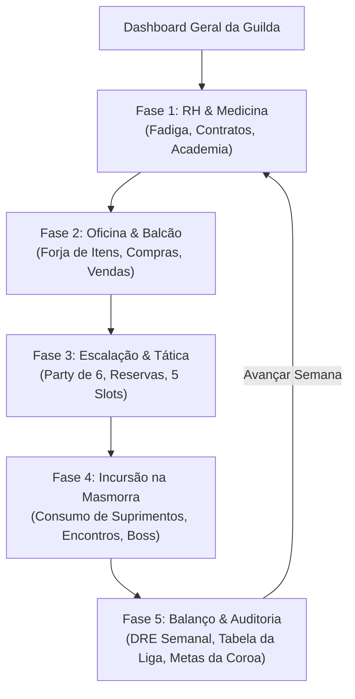

# 🖥️ HeroFoot — Relatório de Auditoria de UX & Onboarding v0.5.0

> **Classificação:** Pesquisa de Usabilidade, Arquitetura de Informação & Guia de Interface  
> **Versão Vigente:** v0.5.0  
> **Autoridade:** UX Design (`ux_agent`)  
> **Stack:** React + TypeScript + Tailwind CSS  
> **Conformidade:** [CONTRACT.md](file:///c:/Users/Rafael/Documents/herofoot/docs/CONTRACT.md) & [ROADMAP_TODO.md](file:///c:/Users/Rafael/Documents/herofoot/docs/ROADMAP_TODO.md)  

---

## 1. Mapeamento do Fluxo de Navegação Atual

---

## 2. Pain Points Identificados & Soluções Implementadas

| ID | Área / Fase | Ponto de Fricção (Pain Point) | Severidade | Solução de UX Implementada |
| :---: | :--- | :--- | :---: | :--- |
| **UX-01** | Header Global | O jogador não tinha visibilidade imediata de em qual das 5 etapas da semana se encontrava. | Média | **Componente `PhaseProgress`**: Stepper visual integrado no Header exibindo "Semana X — Fase Y/5" com status de concluído, ativo e futuro. |
| **UX-02** | Todas as Fases | Jargões corporativos da Liga (Fadiga, Suprimentos, Boletim, Confiança) podiam gerar dúvida inicial no jogador iniciante. | Média | **Componente `Tooltip` & `GLOSSARY`**: Tooltips contextuais flutuantes acionadas por hover nos termos-chave em tom de memorando corporativo medieval. |
| **UX-03** | Fases 1 a 5 | Falta de introdução didática da rotina semanal na primeira vez em que a tela é aberta. | Alta | **Componente `OnboardingBanner`**: Faixas de aviso corporativo discretas no topo de cada fase, dispensáveis pelo usuário e persistidas via `localStorage`. |
| **UX-04** | Fase 2 (Balcão) | Inventário vazio não exibia feedback de como obter novos itens para comercialização. | Baixa | **Componente `EmptyState`**: Exibe ícone estilizado e instrução objetiva para navegar até a bancada de manufatura. |
| **UX-05** | Fase 3 (Táticas) | Nenhum titular escalado deixava a tela estática sem alerta explícito de impedimento de marcha. | Alta | **Componente `EmptyState`**: Alerta tático de bloqueio com instrução para selecionar ao menos 1 combatente apto. |

---

## 3. Guia de Componentes de UX Adicionados

1. **`src/components/Tooltip.tsx`:**
   - Dicionário `GLOSSARY` centralizado.
   - Detecção e exibição com borda pontilhada âmbar (`border-dashed border-amber-600/60`).
2. **`src/components/OnboardingBanner.tsx`:**
   - Suporte a dispensar aviso com chave de armazenamento local (`herofoot_onboarding_dismissed_*`).
3. **`src/components/EmptyState.tsx`:**
   - Card padronizado em tons de pedra e ouro velho, com chamada de ação clara.
4. **`src/components/PhaseProgress.tsx`:**
   - Stepper em formato mini-badges com ícones de verificação para as fases concluídas.
